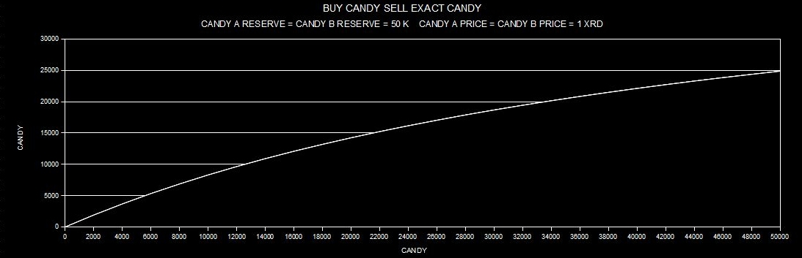
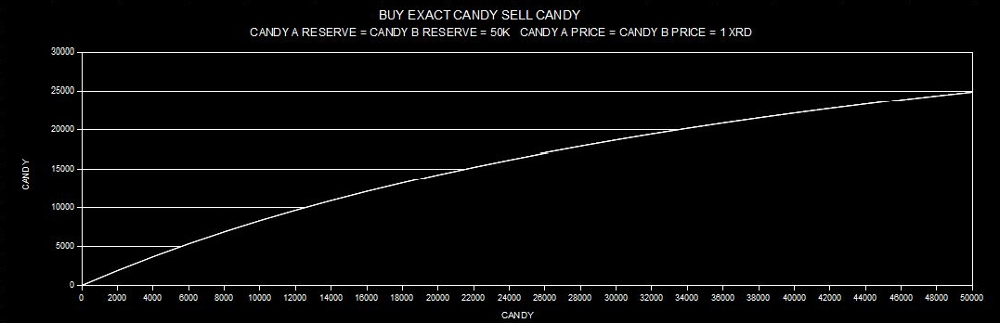
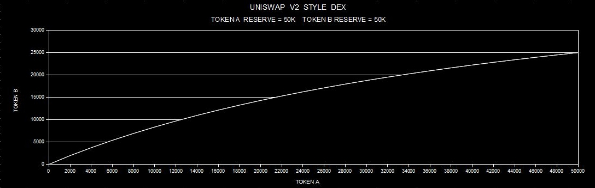
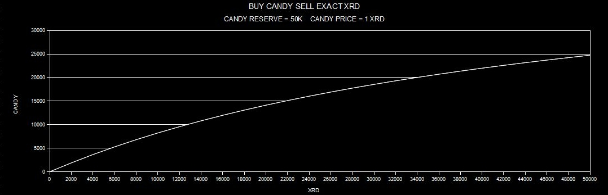
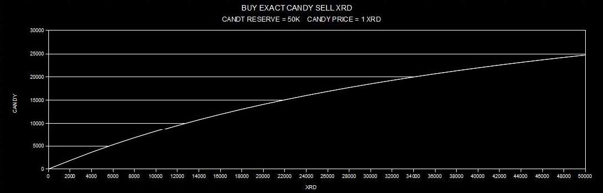
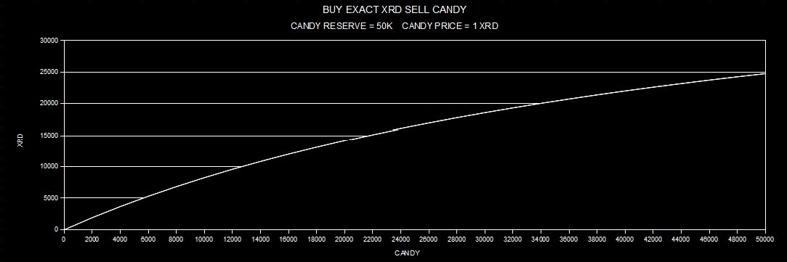
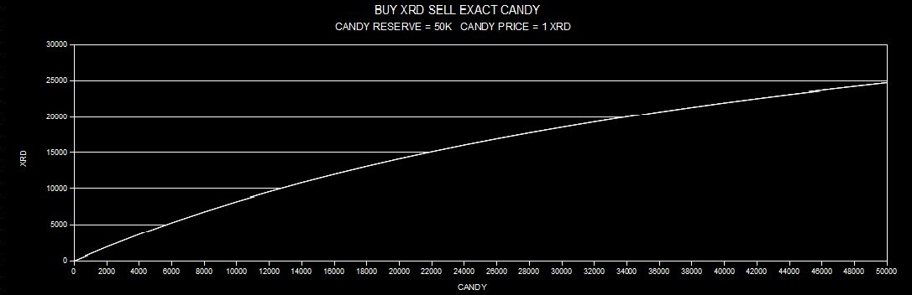

[](https://www.apache.org/licenses/LICENSE-2.0.html)

	
[](https://www.pexels.com/@akshat-soni-1170605)

-------------------------------------------------------------------------------------------
### Index  
-------------------------------------------------------------------------------------------	
> [Part_1](#part_1) . What and Where
> 
> [Part_2](#part_2) . Overview operational description
>
> [Part_3](#part_3) . Math formulas and output charts
>
> [Part_4](#part_4) . Callable methods and brief description
>
> [Part_5](#part_5) . Final considerations
#

### Part_1 
What CandyDex is intended for and where code is developed from
-----------------------------------------------------------------------

CandyDex is an experimental decentralized exchange as well as an automated market maker, end users can benefit the option to request flashloans by fulfilling the condition
 to repay them with protocol determined fee in addiction .

It's developed starting from Rock Howard's CandyStore Blueprint available here:

[](https://github.com/RadGuild/scrypto-tutorial/blob/main/candy-store/src/lib.rs)

#
### Part_2
Overview operational description
-----------------------------------------------------------------------

CandyDex allows end users to provide liquidity throught single token stocking trying to avoid recurrent hassle involving impermanent loss due to double token 
liquidity providing method. Devs wishing to finance their brand new own project are at same time entitled to list their tokens without the hassle of having 
to provide a counterpart in other tokens.   

First liquidity provider of a candy token to the protocol is also required to settle relative token initial price referred to $XRD countervalue.

Swaps within protocol are allowed between different candies tokens or between candy tokens and XRD.

When an end user provides a certain amount of candy tokens to the protocol, the latter mint in exchange a related amount of metaCandy token along with a 
metaCandy Badge, the latter aimed to insure a correct redistribution of protocol fees accrued in candy tokens by pointing to a determinaed entry fee level,
once providers will claim their liquidity back.
  
Once a provider claim his liquidity back in candy tokens, he's required to return back metaCandy tokens and metaCandy Badge received when stoke function was performed, whom
 are finally burnt by protocol. If the protocol doesn't own requested candies amount during an unstock request event, it repays backs the user with an equivalent amount 
of $XRD the difference between candy requested amount and owned candy amount in protocol reserve. 

Protocol fees are collected within buyed token amount, its percentage is the same for candy as well as for $XRD.

Protocol fees accrued in candy tokens, derivating from candy tokens buying operations, are then equally redistribuited between protocol's liquidity providers 
once they'll withdrawal their initially provided liquidity in candy tokens, reimbursing to the protocol minted metaCandy tokens in exchange.  

On other hand protocol fees accrued in XRD tokens, derivating from XRD tokens buying operations, are retained by the protocol and at disposal of protocol's 
owner who can withdrawal them throught a specific function authenticating himself passing the correct owner's badge. 
  
There's a unique percentage fee, it's firstly determined within CandyDex implementation and then it's variable by protocol's 
owner who can redetermine it throught a specific function authenticating himself passing the correct owner's badge.  

To facilitate swaps executions by human end users and bots, there's a set of callable functions returning, respectively:
price and reserve amount of a specific candy token.
Protocol's candies menu within a list of swappable candy tokens and relative charateristics.
Amount of tokens returned in exchange for selling an exact amount of tokens.
Amount of tokens required in exchange for buying an exact amount of tokens.
A set of swap functions to perform exchanges between candy tokens and XRD tokens and viceversa.
A set of swap functions to perform exchanges between candy tokens and candy tokens and viceversa.
Flashswap function to perform flashloans with either $XRD or candy tokens.

[Back Up](#index)
#
### Part_3
Math formulas and output charts
----------------------------------------------------------------------------
>1. Swaps between different Candy tokens.

Let's buy A Candy token amount as output and sell B Candy token amount as input :
```
A_output_amount_ideal = B_input_amount * B_price/A_price 

A_output_amount_real = [A_reserve/(A_reserve + A_output_amount_ideal)] * A_output_amount_ideal 

A_output_amount_real = [A_reserve/(A_reserve + A_output_amount_ideal)] * B_input_amount * B_price/A_price
```
Swaps within different Candy tokens doesn't affect their prices vs $XRD, but the amount of output candy is stricly connected to the protocol reserve amount.

>1.1. Output curve details of CandyDex swap methods whom exchange Candy tokens for Candy tokens :

	
	

>1.2. Output curve detail of Uniswap v2 style Dexes ruled by formula ```x * y = ( x + dx) * ( y - dy )``` :

	
---------------------------------
>2. Buy Candy tokens and sell $XRD.

Let's buy A Candy token amount as output and sell B $XRD token amount as input : 
```
A_output_amount_ideal = XRD_input_amount/A_price 

A_update_price = (A_reserve * A_price)/(A_reserve - A_output_amount_ideal)

A_output_amount_real = XRD_input_amount/[(A_reserve * A_price)/(A_reserve - A_output_amount_ideal)]
```

>2.1. Output curve details of CandyDex swap methods whom buy Candy tokens and sell XRD tokens :

	


---------------------------------
>3. Buy $XRD tokens and sell Candy.

Let's buy A $XRD token amount as output and sell B Candy token amount as input :
```
B_update_price = (B_reserve * B_price)/(B_reserve + B_input_amount)

A_output_amount_real = B_input_amount * B_update_price

A_output_amount_real = B_input_amount * (B_reserve * B_price)/(B_reserve + B_input_amount)
```
Swaps between $XRD and Candy tokens affects their prices vs $XRD, updated price is stricly connected to the protocol reserve amount.

>3.1. Output curve details of CandyDex swap methods whom buy XRD tokens and sell Candy tokens :

	


[Back Up](#index)
#
### Part_4
Callable methods and brief description
----------------------------------------------------------------------------
>1. set_fee

Set protocol fee function whom only protocol owner can succesfully call.

>2. claim_xrd_fee

Claim accrued XRD fee function whom only protocol owner can succesfully call.

>3. stock_candy

Stock candy function callable by an end user wishing to supply unpresent liquidity to protocol.
Protocol returns an equivalent number of metaCandy and a metaBadge to allow the correctness of the accrued fee calculation in reference to the entry position.

>4. restock_candy

Restock candy function callable by an end user wishing to supply present liquidity to protocol.
Protocol returns an equivalent number of metaCandy and a metaBadge to allow the correctness of the accrued fee calculation in reference to the entry position.

>5. unstock_candy

Unstock candy function callable by an end user wishing to withdraw owned candy liquidity amount from protocol.
Protocol returns an equivalent number of Candy plus the accrued fee calculated in reference to the entry position. 
If there isn't enough candy in protocol's vault the latter will reimburse an equivalent amount of $XRD as difference. 
Supplied metaCandy are then burned and once all supplied candy are withdrawal metaBadge is burned also.

>6. stock_position

Retrieve liquidity provider position providing a relative metaBadge as reference. 
       
>7. get_price

Get price, name, symbol of a determinated candy giving his resource address.

>8. get_reserve

Get reserve amount of a determinated candy giving his resource address.
        
>9. menu

Get protocol's candies menu.
        
>10. get_candy_sell_amount_bexsc

Get candy sell amount providing an exact number of $XRD to buy. 
Aimed to use coupled with function "buy_exact_xrd_sell_candy" (bexsc).

>11. get_xrd_buy_amount_bxsec

Get XRD buy amount providing an exact number of candy to sell. 
Aimed to use coupled with function "buy_xrd_sell_exact_candy" (bxsec).
       
>12. get_candy_buy_amount_bcsex 

Get candy buy amount providing an exact number of $XRD to sell. 
Aimed to use coupled with function "buy_candy_sell_exact_xrd" (bcsex).
         
>13. get_xrd_sell_amount_becsx

Get XRD sell amount providing an exact number of candy to buy.
Aimed to use coupled with function "buy_exact_candy_sell_xrd" (becsx).
        
>14. get_candy_sell_amount_becsc

Get candy sell amount providing an exact number of candy to buy.
Aimed to use coupled with function "buy_exact_candy_sell_candy" (becsc).
        
>15. get_candy_buy_amount_bcsec	

Get candy buy amount providing an exact number of candy to sell.
Aimed to use coupled with function  "buy_candy_sell_exact_candy"(bcsec).                             
        
>16. buy_candy_sell_exact_xrd	

Obtain a minimum candy amount in exchange of an exact XRD amount.
Function swap exact XRD for candy.
        
>17. buy_candy_sell_exact_candy

Obtain a minimum candy amount in exchange of an exact candy amount.
Function swap exact candy for candy.

>18. buy_xrd_sell_exact_candy

Obtain a minimum XRD amount in exchange of an exact candy amount.
Function swap exact candy for XRD.
        
>19. buy_exact_candy_sell_xrd

Obtain an exact candy amount in exchange of a maximum XRD amount.
Function swap XRD for exact candy.    
             	
>20. buy_exact_candy_sell_candy	

Obtain an exact candy amount in exchange of a maximum candy amount. 
Function swap candy for exact candy.
        
>21. buy_exact_xrd_sell_candy

Obtain an exact XRD amount in exchange of a maximum candy amount.
Function swap candy for exact XRD.
        	
>22. flashswap

Request a flashswap performing a call to an external Component address.
Loan must be reimbursed with protocol determined fee in addiction.
Protocol allows the loan of candies as well as $XRD and for reimburse are usable 
either candies and $XRD.

Function testable with a Dummy DEX Blueprint findable here:

[](https://github.com/alanci17/radix-scrypto/blob/main/dummydex/src/lib.rs)

[Back Up](#index)
#
### Part_5	
Final considerations
----------------------------------------------------------------------------	
A mechanism of further revenue distribution revolving with epochs, for instance bonus tokens minting and so on, lacks in the protocol.
User recognizing mechanism also lacks.

Protocol's code is untested aside simulator environment.	

[Back Up](#index)

	
	
	
  