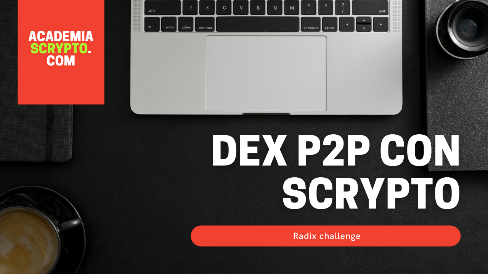

# DEX P2P for fungible and non fungible.

This Dex P2P was born to teach Scrypto to the students of [www.academiaScrypto.com](https://academiascrypto.com/). It has been evolving with the versions of Scrypto, its new design patterns and finally with the transaction manifest.

## Dex P2p evolution

### DEX P2P - Episodio 1
- Date: 26/01/2022
- Code: [Github](https://github.com/noelserdna/Tutoria-Dex-P2P---Scrypto-Tutoria-1)
- Video: [Youtube](https://www.youtube.com/watch?v=LG0BmIIdih8)

### DEX P2P - Episodio 2
- Date: 02/02/2022
- Code: [Github](https://github.com/noelserdna/Tutoria-Dex-P2P---Scrypto-Tutoria-2)
- Video: [Youtube](https://www.youtube.com/watch?v=LG0BmIIdih8)

### DEX P2P - Episodio 3
- Date: 09/02/2022
- Code: [Github](https://github.com/noelserdna/Tutoria-Dex-P2P---Scrypto-Tutoria-3)

### DEX P2P - Episodio 4 (Design patterns)
- Date: 23/02/2022
- Code: [Github](https://github.com/noelserdna/Tutoria-Dex-P2P---Scrypto-Tutoria-4)
- Video: [Youtube](https://youtu.be/sr5Vbw9Fehw)

### DEX P2P - Episodio 5 (Transaction Manifest)
- Date: 17/03/2022
```
# Extraemos de nuestra cuenta los XRD y los ponemos encima de la mesa
CALL_METHOD Address("<Address cuenta>") "withdraw" Decimal("10001") Address("<XRD Address>") BucketRef(1u32);
# Tomamos del la mesa los XRD y los guardamos en un contenedor temporal
TAKE_FROM_WORKTOP Decimal("10000") Address("<XRD Address>") Bucket("pago");
# Tomamos de nuestra cuenta los XRD para la pagar la fee y la guardamos en un contenedor temporal
TAKE_FROM_WORKTOP Decimal("1") Address("<XRD Address>") Bucket("fee");
# Llamamos al método ejecutar_orden y le pasamos el id del NFT y los contenedores de pago y fee y se pone sobre la mesa el NFT resultante para la posterior retirada
CALL_METHOD Address("<Componente Address>") "ejecutar_orden" NonFungibleKey("<id nft>") Bucket("pago") Bucket("fee");
# Tomamos el nft de la mesa
TAKE_ALL_FROM_WORKTOP Address("<nft Address>") Bucket("retirar");
CREATE_BUCKET_REF Bucket("retirar") BucketRef("retirar_def");
# Ejecutamos el método retirar_orden pasandole el nft de retirada
CALL_METHOD Address("<Componente Address>") "retirar_orden" BucketRef("retirar_def");
# Finalmente tomamos todo los recursos encima de la mesa y los depositamos en la cuenta.
CALL_METHOD_WITH_ALL_RESOURCES Address("<direccion cuenta>") "deposit_batch";
```

Pasos:
```
resim new-account
set acct 0293c502780e23621475989d707cd8128e4506362e5fed6ac0c00a
set pub 005feceb66ffc86f38d952786c6d696c79c2dbc239dd4e91b46729d73a27fb57e9
resim publish .
set pack 01ff3eae9463d913a0dba37b78896414eadf59ce144a9143c8018f
resim call-function $pack Dexp2p new 1 
set comp 0213facd4ad953d11fd4201b424e1de382a8f4e1ac073424f97c5b
resim show $acct
set xrd 030000000000000000000000000000000000000000000000000004
set admin 03afe53b9981dddb1b4ae44ff09deeae68f5bf42b360d88eaeb077
resim new-token-fixed 1000000 --description "The American dollar" --name "dollar" --symbol "USD"
set usd 03ad8ad4fa972bca8ee488458f0c67a1dc95e91ced95e3e0e70634
resim call-method $comp nueva_orden $xrd 1000,$usd 0.5 1,$xrd
resim call-method $comp ejecutar_orden afbdb1bccf11f11c4df0a2281bb1efb1 10000,$xrd 1,$xrd
resim call-method $comp retirar_orden "#5fb3609e8e98973516885c65469b7a12,034486cb926e3608d63429a08ed8a61122d70c7bd71d5db9880782" 
```


