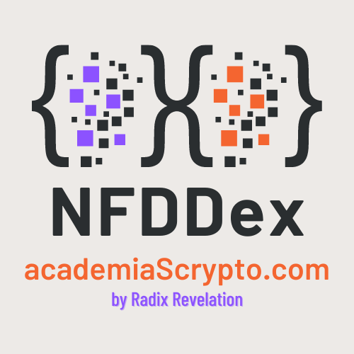

# Non Fungible Data DEX

[Versión Español](README_ES.md)

## The problem:

(It is based on real events, we have changed some names)
A startup for sustainable, ecological and environmental development, created by two Biologists, wants to help companies achieve the 2030 objectives (ODS) set by the European Union. To do this, you want to maintain and create ecosystems by generating excess CO2 that you later want to sell, allowing your potential customers to reduce their carbon footprint. Unlike other similar projects, planting trees will not be their priority, but rather, seek the maintenance, conservation and regeneration of existing ecosystems. In order to effectively guarantee their work, they wish to support the available CO2 surpluses with digital certificates and allow, to the extent of the regulatory possibilities, the market of said surpluses.

Currently, the European and Spanish regulations (CNMV) recognize the difficulties of fitting the creation of "Utility Tokens" and "Security Tokens" within the current regulation of the stock market.

Recently the Spanish project Potion.fi revealed that "non-fungible tokens" somehow skirt regulation allowing them to be used in imaginative ways.

Although initially the idea is to create, as a metaverse, a series of "non-fungible" related to a geometric area of land and in turn to a specific amount of C02. The idea that users can easily trade with them is still strong. For this we have been making various market prototypes.

## Prototype of data exchange between "non-fungible"

We have had three ideas in mind when thinking about this initial prototype:
1. Allow trading of C02
2. Simplify resources, minting only one "non-fungible" per person/company/institution.
3. Meet both conceptually and technically the EU 2030 objectives.

### Prototype Characteristics

1. Issue "non fungible" that contains a numeric type field to store the purchased C02. (Everyone)
2. Include liquidity of C02 (Admin)
3. Change the sales ratio of C02 with respect to XRD, it will start with a 1:1 ratio (Admin)
4. Buy C02 in exchange for XRD taking into account the established ratio and adding data in our "non fungible". (Everyone)
5. Allow users to sell C02 in exchange for XRD taking into account the established ratio and subtracting the data from the "non-fungible" (All)

We have not taken into account, commissions, expiration of the purchase, relationship of C02 with the place where it is consumed, etc...

Thoughts: The idea of a single "non-fungible" and not multiples is given by two concepts:
1. Save money and simplify user interaction. (project + ecological)
2. Relate the future SSI with the CO2 reduction it has.

## Getting Started
0. Clean simulator:
```
resim reset
```
1. Create an account:
```
resim new-account
```
2. Save address (windows)
```
set acct <address>
```
3. Publish packages
```
resim publish .
```
4. Save package address (windows)
```
set pack <address>
```
5. Instantiate Component
```
resim call-function $pack Ddex new
```
6. Save component address, xrd, admin badge (windows)
```
set comp <address>
set xrd 030000000000000000000000000000000000000000000000000004
set admin <resource_def>
```
7. Provide liquidity of "Data"
```
resim call-method $comp data_transfer 10000 1,$admin
```
8. Mint a Nft
```
resim call-method $comp mint
```
9. Buy "Data"
```
resim call-method $comp buy 100,$xrd 1,<nft def>
```
10. Sell "Data"
```
resim call-method $comp sell 50,$xrd 1,<nft def>
```
### Change ratio
```
resim call-method $comp ratio 10000 1,$admin
```

### Transaction Manifest, to mint and buy "Data" in the same transaction
CALL_METHOD Address("<component address>") "mint";
TAKE_FROM_WORKTOP Decimal("1") Address("<nft reference>") Bucket("NFT");

CALL_METHOD Address("<my account address>") "withdraw" Decimal("100") Address("030000000000000000000000000000000000000000000000000004") BucketRef(1u32);

TAKE_FROM_WORKTOP Decimal("100") Address("030000000000000000000000000000000000000000000000000004") Bucket("XRD");

CREATE_BUCKET_REF Bucket("NFT") BucketRef("NFT_ref");
CALL_METHOD Address("<component address>") "buy" Bucket("XRD") BucketRef("NFT_ref");

CALL_METHOD_WITH_ALL_RESOURCES Address("<my account address>") "deposit_batch";


