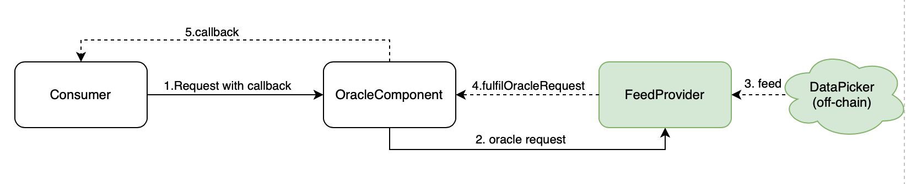

# DeXianOracle

## Oracle Basic Request Model

#### roles
###### Consumer
是消费/使用预言机数据的Radix Engine组件。它产生一个请求向明确的预言机组件发出某个数据消费请求，这个请求中还携带了可以透传回来的一些参数数据。

###### OracleComponent
预言机组件，它是整个架构的中枢，它负责记录消费者的请求，管理对数据提供者的授权和撤销，也接受数据提供者推送过来的数据，并向相联的消费者发起回调同时传递其需要的数据，如：价格，比赛结果等。

它通过badge设计模式实现权限管理，拥有指定badge的地址才能向预言机推送数据。

###### DataProvider
数据提供者，它是链外数据向链上预言机喂送数据的功能单元，需要出示拥有特定的badge才将数据推送到预言机组件里面。

#### process
1. Request with callback

2. Oracle request

3. Feed

4. Fulfil oracle request

5. callback

#### 安全问题
1. 数据提供者身份验证, 提供可信数据。

2. 授权与取消授权管理

基于scrypto的badge设计模式实现的

## Decentralized Model

Each data feed is updated by a decentralized oracle network. Each oracle in the set publishes data during an aggregation round. 

## VFC

