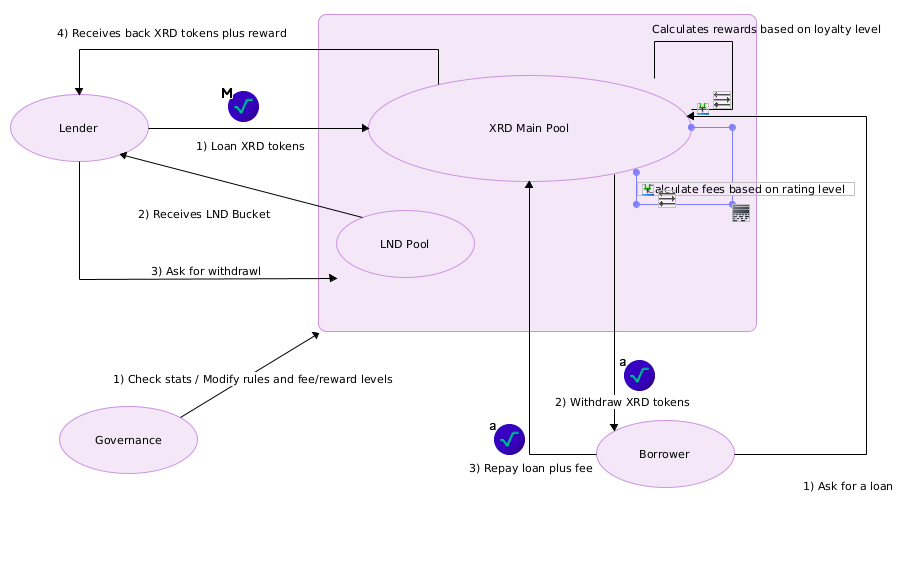
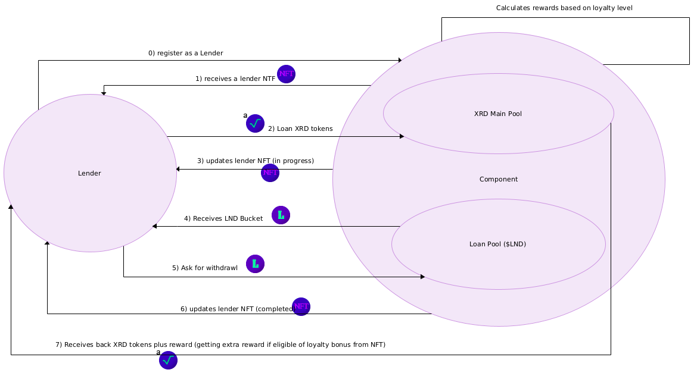
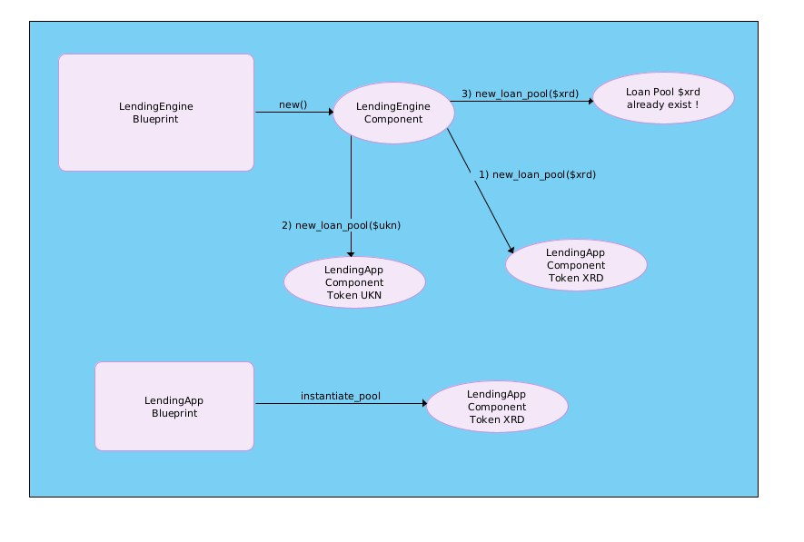
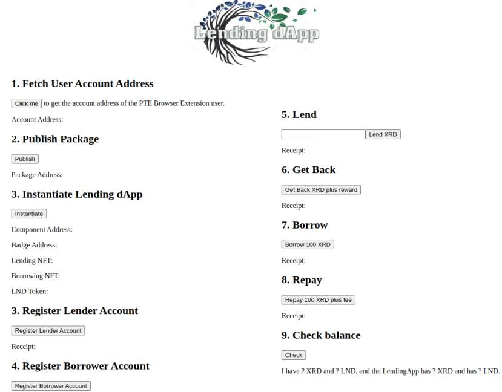
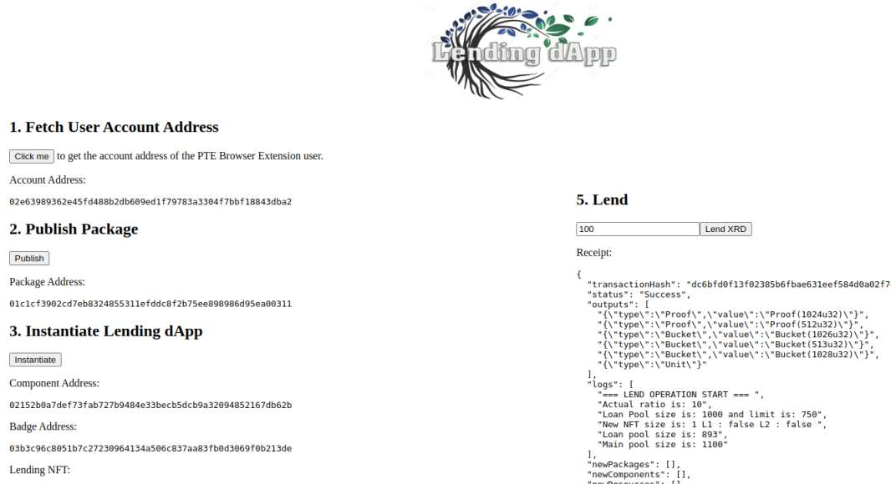

# Lending dApp


[](https://opensource.org/licenses/Apache-2.0)

LendingApp is a proof-of-concept protocol of an uncollateralized Lending Application built on the Radix ledger using v0.4.0 of Scrypto: the smart contract language of the Radix ledger.

## Table of Content

  * [Abstract](#abstract)
  * [Motivations](#motivations)
  * [Features](#features)
  * [Details of Design](#details-of-design)
  * [Lending dApp Architecture](#lending-dapp-architecture)
    + [LendingApp blueprint](#lendingapp-blueprint)
    + [LendingEngine blueprint](#lendingengine-blueprint)
  * [Examples](#examples)
    + [Quick Examples](#quick-examples)
    + [Examples: Getting Started](#examples-getting-started)    
    + [Example 1: Lending tokens and getting back](#example-1-lending-tokens-and-getting-back)
    + [Example 2: Borrow tokens and repay](#example-2-borrow-tokens-and-repay)
    + [Example 3: Multiple operation with different accounts](#example-3-multiple-operation-with-different-accounts)
    + [Integration test 1: Single account](#integration-test-1-single-account)
    + [Integration test 2: Multiple accounts](#integration-test-2-multiple-accounts)
    + [Integration test 3: Multiple accounts where borrowers prevail](#integration-test-3-multiple-accounts-where-borrowers-prevail)
    + [PTE Browser extension test: web page](#pte-browser-extension-test-web-page)   
    + [Blueprints Example](#blueprints-example)   
  * [Future Work and Improvements](#future-work-and-improvements)
  * [License](#license)


## Abstract

Lending as a decentralized applications (dApps) is a functionality expected to rise in the near future in layer 1 blockchains, such applications are very demanding because they ask no collateral and they may handle up to millions or billions of dollars worth of tokens in a single day. 
Uncollateralized LendingdApp aim to incentivizes rewards to lenders granting them a great 7% reward on each lend, it also aim to incentivizes borrower without asking for a collateral but instead asking them a 10% fee on each borrowing. At this time this is a proof-of-concept and no epoch are used while calculate this fee/reward. Any lender/borrower is allow to put in place a single operation at any time. Lender/borrower are allowed to partially close the in progress operation.

 When lenders start their loan they are given an amount of 'loan tokens'($lnd) that is equivalent to the amount of xrd tokens given plus the reward (eg. a lend of 100xrd get back to the lender 107lnd), lenders are given the oppurtunity to get back the tokens at anytime, lenders are also assigned loyalty bonus when they reach a predefined numbers of loans (eg. level1 after 20 loans, level2 after 50 loans).
 On the other side are the debtors that are allowed to ask for borrowing whitout presenting anything. Borrowers are given the amount of xrd tokens they request and have to pay back the same plus a fee (eg. a loan of 100xrd token has to be repaid with 110xrd tokens). Borrowers too are assigned loyalty bonus when they reach a predefined numbers of repaid loans (eg. level1 after 20 fully repaid loans, level2 after 50 fully repaid loans).
 Levels are assigned to accounts using soulbound-tokens.

 The Lending Engine has some rules designed so that it can remain efficient, solvent and profitable for itself and for the parties involved:
 - No more loans are approved if the main xrd vaults is below 50% of its initial capacity (to prevent from debtors not repaying back their loans)
 - No more loans are accepted if the loan vaults is below 75% of its initial capacity (to prevent from creditors from consuming the main vault)
 - No lending is allowed if it is below 5% or above 20% of the main vault
 - No borrowing is allowed if it is below 3% or above 12% of the main vault
 - Loyalty bonus for lenders: l1 level is 0,4%, l2 level is 0,8%
 - Loyalty bonus for borrowers: l1 level is 0,4%, l2 level is 0,8%

 The Lending Engine rules are fixed and in a subsequent rework of this proof of concept they should become dynamic with respect to the size of the vaults and the number of debtors/creditors.

 High level overview 

 


## Motivations

This Lending dApp is a proof of concept written in Scrypto where tokens are natively supported as a core feature of the network and its aim is to better understand the asset oriented design pattern.

## Features

In this example, we will create an uncollateralized loan application. Everyone can lend or borrow after registering. 
Level badges are assigned based on usage.

These are the main key features:

* Accept lendings from lenders.
* Allow lenders to get back the loan along with a reward.
* Implements rules for preventing from debtors not repaying back their loans and from creditors from consuming the main vault.
* Allow borrowings to borrowers.
* Allow borrowers to repay loans.
* Forbid to anyone to have multiple loans at the same time (but an account could lend and then borrow some xrd tokens).
* Assign a bonus fee/extra reward for any borrower/lender reaching a certain level of successfull completed operations

## Details of Design

To help explain the concept of the lending app, let's begin by giving an example for a person who wants to lend their tokens. 
Let's say that a guy called Leo wants to lend 100 XRD. Leo goes to the Lending dApp and lends this bucket of XRD getting back a bucket of LND token plus a soulbound token. Two question arises: **Where will go this XRD given from Tim ? Where does the LND token comes from and are to be used for ?**

The XRD that Leo gives to the Lending dApp goes in the main pool of XRD tokens where creditors will draw their uncollateralized loan. 
The LND that Leo receives comes from the Loan pool and are to used to claim back the XRD tokens, LND tokens are not transferable and not updatable and are inclusive of the reward.

Let's continue with an example for a person who wants instead to borrow some tokens. 
Let's say that a guy called Lory wants to borrow 100 XRD. Lory goes to the Lending dApp and ask for a bucket of XRD, if the engine rules are met the loan gets approved and Lory gets back a bucket of XRD token plus a soulbound token where where the number of tokens due is recorded. Two question arises: **Where this XRD token comes from ? How could Lory repay the full amount ?**

The XRD that Lory gets from the Lending dApp comes from the main pool of XRD tokens that grows thanks to the difference between rewards and fees. 
The soulbound token that Lory receives is not transferable, not updatable and contains the amount to be repaid back, credit level can be awarded only when the full loan is repaid and could take to better fees.

## Lending dApp Architecture

Let's briefly touch back on the rules of the dApp.
There needs to be an incentive for all the actors:
- lenders
- borrowers
- the app itself

The LendingdApp gets reward from the difference payed by borrowers to what it has to pay to lenders (eg. 10% - 7% result in a 3%).
The net result is put back into the main pool. The LendingdApp's profit will decrease according to the loyalty bonuses awarded to the two types of accounts, the profit ratio lower limit in this blueprint would be (10% - l2 bonus fee) - (7% + l2 extra) = 1,4%.

The Lending Engine rules can be rendered to better evaluate the profitability of the model.

The incentive may help encourage the actors to stay honest. The lenders should find it profitable, the borrowers should find it convenient because of its uncollateralized nature, it should be more profitable for everyone to play by the rules than to undermine the system.

Lending dApp is composed by two blueprint:
- LendingEngine blueprint
- LendingApp blueprint

### LendingApp blueprint

`LendingApp` is a blueprint from which components may be instantiated and created. The pools defined in this blueprint contain all of the methods needed to accept and approve loan, to pay back and repay and other functionality required. This is the first and the main blueprint that was using only $xrd tokens for the main pool, after that a new blueprint has been developed to allow different kind of token for the main pool.

The key role or functionality is as follows:

* Manages the two vaults that store the two token types, the XRD vault (main pool) and the loan vault (loan pool).
* Creates and stores an admin badge that has the authority to mint and burn the loan tokens, and to mint and burn the soulbound tokens

* Contains an `register` method which each lender has to use for registering and getting back a soulbound-token that from there on will be used to record the number of completed lendings, the level of loyalty achieved and if a lend is already in progress
* Contains an `register_borrower` method which each borrower has to use for registering and getting back a soulbound-token that from there on will be used to record the number of completed lendings, the level of loyalty achieved, if a borrow is already in progress and most important the amount of token to be given back.

* Contains an `lend_money` methods which takes in a bucket of XRD tokens and the LendingNFT, then check if the lend is acceptable (the bucket size has to be between 5% and 20% of the main vault size) and if the ratio lenders/borrowers is appropriate (loan pool vault size needs over 75%). The method then gives back a bucket of LND tokens with a reward, that bucket could be used later to claim back the original XRD tokens. Finally the LendingNFT gets updated setting that a lend is running to avoid concurrent operation from the same account.
* Contains an `take_money` method that takes the LND bucket and the LendingNFT. The LND tokens are divided in two parts, the fee gets burned and the original amount goes back in the loan pool, then the XRD tokens to be sent to the account are taken from the main pool and sent back to the lender so the lender receives the reward. Finally the LendingNFT gets updated adding to the counter, updating the level and setting that a lend is not anymore running.
* Contains an `borrow_money` methods which takes in the number of XRD tokens requested, then check if the borrow is acceptable (the requested bucket size has to be between 3% and 12% of the main vault size) and if the main pool vault size is suitable (it needs over 50%). The method then gives back a bucket of XRD tokens without asking for collateral and also the BorrowingNFT that contains the amount of XRD token that would close the borrowing (fee included). 
* Contains an `repay_money` method that takes the XRD bucket and the BorrowingNFT. The XRD tokens received are checked along the number contained in the BorrowingNFT to verify if the correct amount has been sent, if the borrower has sent more tokens he receives back the remainder, otherwise the borrower operation cannot be declared as closed and he can't ask for a new borrow anymore. Finally the BorrowingNFT gets updated with the counter values, the level achieved and with the operation state (in progress/completed)

In addition to the above mentioned functionalities, the blueprint also contains a number of helper methods.

 High level overview with detail about the lender side (borrower side is similar but opposite)

 


### LendingEngine blueprint

The `LendingApp` blueprint can be instantiated directly by using `LendingApp::instantiate_pool()`, instead it is possible to use the `LendingEngine` to create the new loan pools.
The `LendingEngine` has been created to decompose the architecture and its main job is to contains a registry of all of the lending app and the token used to create it.
The user can create the package using `LendingEngine::new()` and later on you can create components using different tokens by using `LendingEngine::new_loan_pool()` so that the LendingEngine could check that the lending app pool does not already exist in the HashMap before it is created.




## Examples

Here we list all the test that have been performed over the blueprint:
* Quick examples using Resim from command line on a single account
* Examples with multiple accounts using the Transaction Manifest files
* Component test over PTE Browser plugin
* Integration test using Resim and bash script assuming real scenario
* Quick examples using Resim from bash script using both Blueprints.

### Quick Examples

All of the commands and transactions discussed in this readme file can also be verified directly using the resim tool that you can use with the LendingApp blueprint. 
For this example, we will build a transaction that will first lend some tokens to the pool, then take the tokens back. We will also build a reverse of it, meaning that we will first borrow some tokens to the pool, then take the tokens back

#### How to run
0. Export xrd resource: `export xrd=030000000000000000000000000000000000000000000000000004` -> save into **$xrd**
1. Reset your environment: `resim reset`
2. Create a new account: `resim new-account` -> save into **$account**
3. Build and deploy the blueprint on the local ledger: `resim publish .` -> save into **$package**
4. Call the `instantiate_pool` function to instantiate a component: `resim call-function $package LendingApp instantiate_pool 1000,$xrd 1000 10 7` -> save component[0] into **$component**, resources[1] -> into **$lend_nft**, resources[2]  -> into **$borrow_nft**, resources[3]  -> into **$lnd**

#### How to run for lenders example
6. Call the `register` method on the component: `resim call-method $component register` to get the `lending nft`
7. Call `resim show $account` to look at the received nft
8. Call the `lend_money` method on the component: `resim call-method $component lend_money 100,$xrd 1,$lend_nft`
9. Call the `take_money_back` method on the component: `resim call-method $component take_money_back 107,$lnd 1,$lend_nft`
10. Verify that you received a reward for the lending `resim show $account`

#### How to run for borrower example
11. Call the `register_borrower` method on the component: `resim call-method $component register_borrower` to get the `borrower nft`
12. Call `resim show $account` to look at the received nft
13. Call the `borrow_money` method on the component: `resim call-method $component borrow_money 100  1,$borrow_nft`
14. Call the `repay_money` method on the component: `resim call-method $component repay_money 110,$xrd  1,$borrow_nft`
15. Verify that you paied a fee for the borrowing `resim show $account`


Script is here [`lending_dapp.sh`](lending_dapp.sh) 


### Examples: Getting Started

THe following example make use of the transaction manifest files. These examples involve multiple account holders interacting with the Lending dApp.
In order to start we need to first reset resim by doing the following:

```sh
$ resim reset
Data directory cleared.
```

The first thing that we need to do now is to create four different accounts to use for the testing. We can do that by using the following command which creates these four accounts and assigns their addresses and public keys to appropriate environment variables:

```sh
OP1=$(resim new-account)
export PRIV_KEY1=$(echo "$OP1" | sed -nr "s/Private key: ([[:alnum:]_]+)/\1/p")
export PUB_KEY1=$(echo "$OP1" | sed -nr "s/Public key: ([[:alnum:]_]+)/\1/p")
export ACC_ADDRESS1=$(echo "$OP1" | sed -nr "s/Account component address: ([[:alnum:]_]+)/\1/p")
OP2=$(resim new-account)
export PRIV_KEY2=$(echo "$OP2" | sed -nr "s/Private key: ([[:alnum:]_]+)/\1/p")
export PUB_KEY2=$(echo "$OP2" | sed -nr "s/Public key: ([[:alnum:]_]+)/\1/p")
export ACC_ADDRESS2=$(echo "$OP2" | sed -nr "s/Account component address: ([[:alnum:]_]+)/\1/p")
OP3=$(resim new-account)
export PRIV_KEY3=$(echo "$OP3" | sed -nr "s/Private key: ([[:alnum:]_]+)/\1/p")
export PUB_KEY3=$(echo "$OP3" | sed -nr "s/Public key: ([[:alnum:]_]+)/\1/p")
export ACC_ADDRESS3=$(echo "$OP3" | sed -nr "s/Account component address: ([[:alnum:]_]+)/\1/p")
OP4=$(resim new-account)
export PRIV_KEY4=$(echo "$OP4" | sed -nr "s/Private key: ([[:alnum:]_]+)/\1/p")
export PUB_KEY4=$(echo "$OP4" | sed -nr "s/Public key: ([[:alnum:]_]+)/\1/p")
export ACC_ADDRESS4=$(echo "$OP4" | sed -nr "s/Account component address: ([[:alnum:]_]+)/\1/p")
```

With the four accounts created, let's give some context as to what we will be doing next. 
The first thing that we wish to do is to lend and take back some token to the dApp, then we wish to borrow and repay with the same account, later we wish to interact with the dApp with all the accounts at the same time but every time in a different role.

```sh
$ resim set-default-account $ACC_ADDRESS1 $PRIV_KEY1
Default account updated!
```
We have to publish and create the package that we will use for creating the component

```sh 
$ resim publish . 
    Finished release [optimized] target(s) in 0.58s
    Success! New Package: 012899b03a2aa1fdcf1df883c820934ba9b089f88a1850249636fa
$ export package=012899b03a2aa1fdcf1df883c820934ba9b089f88a1850249636fa
```
Then we can produce the component and the resources needed:

```sh 
$ resim call-function $package LendingApp instantiate_pool 1000,$xrd 1000 10 7
Logs: 5
├─ [INFO ] My start amount is: 1000
├─ [INFO ] My fee for borrower is: 10
├─ [INFO ] My reward for lenders is: 7
├─ [INFO ] Loan pool size is: 1000
└─ [INFO ] Main pool size is: 1000
New Entities: 5
└─ Component: 0296a6bed1c65f7d3e29f9f880f6ca17a8402ff180ced054050f2b
├─ Resource: 0364529170a265ba94bd4c6b932a04e6406bb4797e655cd371f60d
├─ Resource: 03101176511a0f44db8f5d33d10985c163aaf642ab779bee697dc4
├─ Resource: 030ce6b265aeab99a94aa57bf3b6086255dd4a3e0b2f262229848f
└─ Resource: 03c20299928dc86cb3f8571b8843e4e10e38931f977b5ac47e4610
$ export component=03101176511a0f44db8f5d33d10985c163aaf642ab779bee697dc4
$ export lend_nft=03101176511a0f44db8f5d33d10985c163aaf642ab779bee697dc4
$ export borrow_nft=030ce6b265aeab99a94aa57bf3b6086255dd4a3e0b2f262229848f
$ export lnd=03c20299928dc86cb3f8571b8843e4e10e38931f977b5ac47e4610
```
### Example 1: Lending tokens and getting back 

Now we can register the account and then finally start using the Dapp.
The 'register' method gives the account non-fungible token that contains:
* the number_of_lendings the account has successfully completed
* if the l1 level has been reached
* if the l2 level has been reached
* if an operation is in progress

```sh 
$ resim call-method $component register
$ resim show $account
[CUT]
Resources:
├─ { amount: 999000, resource address: 030000000000000000000000000000000000000000000000000004, name: "Radix", symbol: "XRD" }
└─ { amount: 1, resource address: 03101176511a0f44db8f5d33d10985c163aaf642ab779bee697dc4, name: "Lending NFTs" }
   └─ NonFungible { id: b5d7571f8ddfd21b3db40abf1ba34479dcaac58e1a9e1e72b48a2091aef90903, immutable_data: Struct(), mutable_data: Struct(0u16, false, false, false) }
```

Then we can execute the first lending operation from account, this operation moves 80XRD to the LendingApp and the receives LND tokens (the same amount plus the reward).
Herein you can check the vault of both the account and the component.

Transaction Manifest is here [`lend1.rtm`](./transactions/lend1.rtm) 

```sh 
$ export account=$ACC_ADDRESS1
$ resim run transactions/lend1.rtm
$ resim show $account
[CUT]
Resources:
├─ { amount: **85.6**, resource address: 03d3f4664be91fe88c6155f025090dfe7b25b9a372ddebd1c3c38e, name: "Loan token", symbol: "LND" }
├─ { amount: **998920**, resource address: 030000000000000000000000000000000000000000000000000004, name: "Radix", symbol: "XRD" }
└─ { amount: 1, resource address: 03b6ccc92abe889a4a9b8003f7b6a867d620ca7fc95c7d1902aea2, name: "Lending NFTs" }
   └─ NonFungible { id: 0b2ec0c0a413879b9148a76fc5a425dd8e7c1f8bc471b478a24020930509fefc, immutable_data: Struct(), mutable_data: Struct(1u16, false, false, **true**) }

$ ./comp.sh 
Component: 02078c8d2c66a18db7c6363afd2d8ab873756204818e5d68e993a4
Blueprint: { package_address: 0145fddf3be40fce31be8820da86bacfe2175054e006966ae9fd3c, blueprint_name: "LendingApp" }
[CUT]
Resources:
├─ { amount: 1, resource address: 0356acb2964de8fd035a1655bf23d0a50f27302190d1d03be43cd2, name: "Loan Token Auth" }
├─ { amount: **914.4**, resource address: 03d3f4664be91fe88c6155f025090dfe7b25b9a372ddebd1c3c38e, name: "Loan token", symbol: "LND" }
└─ { amount: **1080**, resource address: 030000000000000000000000000000000000000000000000000004, name: "Radix", symbol: "XRD" }
```

Later on the account holder ask to get its XRD tokens back from the Lending dApp.
As before, you can check the vault of both the account and the component.

Transaction Manifest is here [`take1.rtm`](./transactions/take1.rtm) 

```sh 
$ resim run transactions/take1.rtm
Resources:
├─ { amount: 0, resource address: 03d3f4664be91fe88c6155f025090dfe7b25b9a372ddebd1c3c38e, name: "Loan token", symbol: "LND" }
├─ { amount: **999005.6**, resource address: 030000000000000000000000000000000000000000000000000004, name: "Radix", symbol: "XRD" }
└─ { amount: 1, resource address: 03b6ccc92abe889a4a9b8003f7b6a867d620ca7fc95c7d1902aea2, name: "Lending NFTs" }
   └─ NonFungible { id: 0b2ec0c0a413879b9148a76fc5a425dd8e7c1f8bc471b478a24020930509fefc, immutable_data: Struct(), mutable_data: Struct(1u16, false, false, **false**) }

$ ./comp.sh 
Component: 02078c8d2c66a18db7c6363afd2d8ab873756204818e5d68e993a4
Blueprint: { package_address: 0145fddf3be40fce31be8820da86bacfe2175054e006966ae9fd3c, blueprint_name: "LendingApp" }
[CUT]
Resources:
├─ { amount: **994.4**, resource address: 03d3f4664be91fe88c6155f025090dfe7b25b9a372ddebd1c3c38e, name: "Loan token", symbol: "LND" }
├─ { amount: **994.4**, resource address: 030000000000000000000000000000000000000000000000000004, name: "Radix", symbol: "XRD" }
└─ { amount: 1, resource address: 0356acb2964de8fd035a1655bf23d0a50f27302190d1d03be43cd2, name: "Loan Token Auth" }
```

We can see that the reward has gone from the main vault of the Lending dApp to the one of the account holder.

All of the following can also be executed on the other accounts that have been created, for this purpose you only need to change the default account

```sh
$ resim set-default-account $ACC_ADDRESS2 $PRIV_KEY2
Default account updated!
```

### Example 2: Borrow tokens and repay

The behaviour described can be described also for the borrower, where methods behaves similarly.
We can register the account and then finally start using the Dapp.
The 'register_borrower' method gives the account non-fungible token that contains:
    - the number_of_borrowings the account has successfully completed
    - if the l1 level has been reached
    - if the l2 level has been reached
    - if an operation is in progress
    - the amount of xrd to give back if an operation has been partially closed

```sh 
$ resim call-method $component register_borrower
$ resim show $account
[CUT]
├─ { amount: 1, resource address: 0311f8ca67b517a66bd13c424008124c4a2ef516f5e545d3b39030, name: "Borrowing NFTs" }
│  └─ NonFungible { id: a72ddf870dd4af58443b70263107da13566510e39ea4464a5c4feb81df516b3e, immutable_data: Struct(), mutable_data: Struct(0u16, Decimal("0"), false, false, false) }
└─ { amount: 1000000, resource address: 030000000000000000000000000000000000000000000000000004, name: "Radix", symbol: "XRD" }

$ resim show $component
[CUT]
Resources:
├─ { amount: 1, resource address: 03c6853abbb0f73456282ddf70fa70fb3a3a876c75b0318e293fe5, name: "Loan Token Auth" }
├─ { amount: 960.8, resource address: 0358891194be6f9a01b8ada83f4c0b83331344feb046c07d8f1fad, name: "Loan token", symbol: "LND" }
└─ { amount: **960.8**, resource address: 030000000000000000000000000000000000000000000000000004, name: "Radix", symbol: "XRD" }
```

Then we can execute the first borrowing operation from account, this operation ask 80XRD to the LendingApp and the receives XRD tokens.
Herein you can check the vault of both the account and the component.

Transaction Manifest is here [`borrow.rtm`](./transactions/borrow.rtm) 

```sh 
$ export account=$ACC_ADDRESS1
$ resim run transactions/borrow.rtm

$ ./comp.sh 
[CUT]
Resources:
├─ { amount: 960.8, resource address: 0358891194be6f9a01b8ada83f4c0b83331344feb046c07d8f1fad, name: "Loan token", symbol: "LND" }
├─ { amount: 1, resource address: 03c6853abbb0f73456282ddf70fa70fb3a3a876c75b0318e293fe5, name: "Loan Token Auth" }
└─ { amount: **860.8**, resource address: 030000000000000000000000000000000000000000000000000004, name: "Radix", symbol: "XRD" }

$ resim show $account
[CUT]
Resources:
├─ { amount: **1000100**, resource address: 030000000000000000000000000000000000000000000000000004, name: "Radix", symbol: "XRD" }
└─ { amount: 1, resource address: 0311f8ca67b517a66bd13c424008124c4a2ef516f5e545d3b39030, name: "Borrowing NFTs" }
   └─ NonFungible { id: a72ddf870dd4af58443b70263107da13566510e39ea4464a5c4feb81df516b3e, immutable_data: Struct(), mutable_data: Struct(2u16, Decimal("110"), false, false, true) }
```

Later the account holder repays the loan to the Lending dApp.
As before, you can check the vault of both the account and the component.

Transaction Manifest is here [`repay.rtm`](./transactions/repay.rtm) 

```sh 
$ resim run transactions/repay.rtm
$ ./comp.sh 
[CUT]
Resources:
├─ { amount: 960.8, resource address: 0358891194be6f9a01b8ada83f4c0b83331344feb046c07d8f1fad, name: "Loan token", symbol: "LND" }
├─ { amount: 1, resource address: 03c6853abbb0f73456282ddf70fa70fb3a3a876c75b0318e293fe5, name: "Loan Token Auth" }
└─ { amount: **970.8**, resource address: 030000000000000000000000000000000000000000000000000004, name: "Radix", symbol: "XRD" }

$ resim show $account
[CUT]
Resources:
├─ { amount: **999990**, resource address: 030000000000000000000000000000000000000000000000000004, name: "Radix", symbol: "XRD" }
└─ { amount: 1, resource address: 0311f8ca67b517a66bd13c424008124c4a2ef516f5e545d3b39030, name: "Borrowing NFTs" }
   └─ NonFungible { id: a72ddf870dd4af58443b70263107da13566510e39ea4464a5c4feb81df516b3e, immutable_data: Struct(), mutable_data: Struct(2u16, Decimal("0"), false, false, false) }
```

We can see that the fee has been paid from the account holder to the main vault of the Lending dApp.


### Example 3: Multiple operation with different accounts

When multiple accounts holders are not repaying back the tokens it could happen that the main vault could go down its limit, at this point the engine stops new borrowing until the level will be restored.

```
$ resim run transactions/borrow.rtm 

Logs: 1
└─ [ERROR] Panicked at 'Main pool is below limit, borrowings are suspendend ', src/lib.rs:291:13
```

The opposite can happen when the engine get used only by lenders, the engine will stop new lendings until new borrowers came in. This is to avoid that the main vault could be consumed only in paying rewards to lenders.

```
$ resim run transactions/lend1.rtm 

Logs: 1
└─ [ERROR] Panicked at 'Pool size is below its limit, no more lendings are accepted now', src/lib.rs:205:13
```

### Integration test 1: Single account

This test runs, in sequence, a lend, a take back, a borrow and a repay for 30 times.

Script is here [`single_account_loop.sh`](single_account_loop.sh) 

Result will be that the main vault of engine will contain 90xrd tokens more

```
Resources:
├─ { amount: 1, resource address: 03cd02f4198d28ebb6d62872b76fec8706c00d6d7242b6443be129, name: "Loan Token Auth" }
├─ { amount: 1090, resource address: 030000000000000000000000000000000000000000000000000004, name: "Radix", symbol: "XRD" }
└─ { amount: 1078, resource address: 03d10151048f2f0777aff6a8036a50a976e4c60ad4887f8301b821, name: "Loan token", symbol: "LND" }
```

then the account holder instead will contain 12lnd tokens caming from the extra l1/l2 loyalty reward

```
Resources:
├─ { amount: 1, resource address: 03bed7c65824ea5378ee31a0f00dba68a3e1059a62531699cec8ec, name: "Lending NFTs" }
│  └─ NonFungible { id: 239326fd8851a6f424b63cdaa66b0b5fcf671a486cadf63026f8292d190cf26c, immutable_data: Struct(), mutable_data: Struct(30u16, true, true, false) }
├─ { amount: 998910, resource address: 030000000000000000000000000000000000000000000000000004, name: "Radix", symbol: "XRD" }
├─ { amount: 12, resource address: 03d10151048f2f0777aff6a8036a50a976e4c60ad4887f8301b821, name: "Loan token", symbol: "LND" }
```

### Integration test 2: Multiple accounts

This test runs, in sequence, a lend, a take back, a borrow and a repay for 5 times using 4 different accounts.

Script is here [`multiple_accounts.sh`](multiple_accounts.sh) 

Result will be that the main vault will contain x72rd tokens more

```
Resources:
├─ { amount: 1, resource address: 033f96b270e9b42711093a47c66a5d35770e114ded7f2a7335d31e, name: "Loan Token Auth" }
├─ { amount: 1072, resource address: 038e3d929e400b17a9ecdfb7365aece688a6872c9b982e939ef150, name: "Loan token", symbol: "LND" }
└─ { amount: 1072, resource address: 030000000000000000000000000000000000000000000000000004, name: "Radix", symbol: "XRD" }
```

### Integration test 3: Multiple accounts where borrowers prevail

This test uses 7 account where the first 4 ask a lend, a take back, a borrow and a repay and the last 3 accounts instead ask only for borrowings.

Script is here [`multiple_accounts_mixed.sh`](multiple_accounts_mixed.sh) 

Result will be that the main vault will contain x118rd tokens more

```
Resources:
├─ { amount: 1138.06, resource address: 0337210fb74867e591c0fbbc859dd8432e1c434fbd6e8b945565ba, name: "Loan token", symbol: "LND" }
├─ { amount: 1, resource address: 0353cd87489840a6b7cf96dl1e5a1051fb9f0bac4cfd81203092358b, name: "Loan Token Auth" }
└─ { amount: 1138, resource address: 030000000000000000000000000000000000000000000000000004, name: "Radix", symbol: "XRD" }
```

Looping around these same operations 50 times instead of 5 would show the greatest potential of the dApp.
Main pool would contains 2026xrd token, doubling its value from the beginning.

Script is here [`multiple_accounts_max.sh`](multiple_accounts_max.sh) 

```
Resources:
├─ { amount: 1, resource address: 03912e2e662b2693b36e9ba073f6e9765c006f5f46e8ca014249c5, name: "Loan Token Auth" }
├─ { amount: 2057.799999999999999949, resource address: 03a868a3e6fb30ed466d23b2734b72104641e5f097ac398fb58ad4, name: "Loan token", symbol: "LND" }
└─ { amount: 2026.12, resource address: 030000000000000000000000000000000000000000000000000004, name: "Radix", symbol: "XRD" }
```

### PTE Browser extension test: web page

The PTE extension has been given a try since it is very useful for testing, the operations already described and verified with resim and the transaction manifest files are here again verifiable in a simple way.
You need to install the PTE Browser Extension and start the dApp

Start Lending dApp [`build-pte.sh`](build-pte.sh) 



here is the dApp running



### Blueprints Example

The following test show the lendingEngine blueprint creates two LendingApp components that are than used for lendings.
Herein we present some outputs of the bash script.

Default account contains both the XRD and the UKN token
```
Resources:
├─ { amount: 1000000, resource address: 030000000000000000000000000000000000000000000000000004, name: "Radix", symbol: "XRD" }
└─ { amount: 2000, resource address: 037c88b2f3a6e7f1455cd9ba55d44c8b877e1b6b3367f4bb388b85, name: "Unknown", symbol: "UKN" }
```

First component with main vault full of 'XRD' token
```
Resources:
├─ { amount: 1, resource address: 039a90eae0d644f5f252c3352e6fec3fecf6d9bc413071e0320b1a, name: "Loan Token Auth" }
├─ { amount: 1000, resource address: 030000000000000000000000000000000000000000000000000004, name: "Radix", symbol: "XRD" }
└─ { amount: 1000, resource address: 03d44e98b7b9146cf6e765c2a3760fa1c8568427eea8b375c07ba4, name: "Loan token", symbol: "LND" }
```

Second component with main vault full of 'UKN' token
```
Resources:
├─ { amount: 1000, resource address: 037c88b2f3a6e7f1455cd9ba55d44c8b877e1b6b3367f4bb388b85, name: "Unknown", symbol: "UKN" }
├─ { amount: 1000, resource address: 036498ed890665a924d6d0d5aae6a0717270d3196f2f5c6974592e, name: "Loan token", symbol: "LND" }
└─ { amount: 1, resource address: 03dc51d4bd2c9e55efd67be95d3e62489badd8e5f4da5fe08b1b6a, name: "Loan Token Auth" }
```

Account balances after lendings
```
Resources:
├─ { amount: 107, resource address: 036498ed890665a924d6d0d5aae6a0717270d3196f2f5c6974592e, name: "Loan token", symbol: "LND" }
├─ { amount: 900, resource address: 037c88b2f3a6e7f1455cd9ba55d44c8b877e1b6b3367f4bb388b85, name: "Unknown", symbol: "UKN" }
├─ { amount: 1, resource address: 03120189a8a91b805ced1a8ba6e199e8221cf26d2f8e8a963c7841, name: "Lending NFTs" }
│  └─ NonFungible { id: 1a02a5f9636a1615211d39e1b7f9d662f39833c304626eab58767e56637b0785, immutable_data: Struct(), mutable_data: Struct(1i32, false, false, true) }
├─ { amount: 998900, resource address: 030000000000000000000000000000000000000000000000000004, name: "Radix", symbol: "XRD" }
├─ { amount: 1, resource address: 03c53e9aa4de50cc394aed08510e60c4a7da2e231a7c1b8c7c58f5, name: "Lending NFTs" }
│  └─ NonFungible { id: c98f002c60da870e06c8f4ee027fea388a6ffa7723baa18464adaa3a89b39dd5, immutable_data: Struct(), mutable_data: Struct(1i32, false, false, true) }
└─ { amount: 107, resource address: 03d44e98b7b9146cf6e765c2a3760fa1c8568427eea8b375c07ba4, name: "Loan token", symbol: "LND" }
```

First component with main vault full of 'XRD' token after lend operation
```
Resources:
├─ { amount: 1100, resource address: 030000000000000000000000000000000000000000000000000004, name: "Radix", symbol: "XRD" }
├─ { amount: 893, resource address: 03d44e98b7b9146cf6e765c2a3760fa1c8568427eea8b375c07ba4, name: "Loan token", symbol: "LND" }
└─ { amount: 1, resource address: 039a90eae0d644f5f252c3352e6fec3fecf6d9bc413071e0320b1a, name: "Loan Token Auth" }
```

Second component with main vault full of 'UKN' token after lend operation
```
Resources:
├─ { amount: 893, resource address: 036498ed890665a924d6d0d5aae6a0717270d3196f2f5c6974592e, name: "Loan token", symbol: "LND" }
├─ { amount: 1100, resource address: 037c88b2f3a6e7f1455cd9ba55d44c8b877e1b6b3367f4bb388b85, name: "Unknown", symbol: "UKN" }
└─ { amount: 1, resource address: 03dc51d4bd2c9e55efd67be95d3e62489badd8e5f4da5fe08b1b6a, name: "Loan Token Auth" }
```

Engine contains the registry of all the pool created
```
Logs: 3
├─ [INFO ] How many loan pools does exist ? 
├─ [INFO ] ResourceAddress of token managed by pool is 037c88b2f3a6e7f1455cd9ba55d44c8b877e1b6b3367f4bb388b85
└─ [INFO ] ResourceAddress of token managed by pool is 030000000000000000000000000000000000000000000000000004
```

New pool are forbidden if requested in the same token
```
Logs: 2
├─ [INFO ] Check if it already exists
└─ [ERROR] Panicked at '[037c88b2f3a6e7f1455cd9ba55d44c8b877e1b6b3367f4bb388b85]: A Loan pool with the given address already exists.', src/lending_engine.rs:111:13
```

Script is here [`engine_multiple_app.sh`](engine_multiple_app.sh) 

## Future Work and Improvements

There is a lot that could be improved about the current implementation of LendingApp. Some of the key points which require improvement are:

* Adding the concept of time passing to the calculation of fee and rewards.
* Add a penalty fee for borrowers repaying late  
* Additional analisys on the business model to make sure it will be successful.
* Deposit idle liquidity to a third-party yield provider until the funds are not used by borrowers
* Researching methods to ensure that the precision of the calculations and math done by the engine to calculate fees and rewards is as accurate and precise as it can be.
* Writing additional examples as well as tests. 
* (for borrowers) Add a form to collect the necessary data and a way to see own loan history including active and completed loans
* (for lenders) Add a way to see own lendings history including active and completed
* (for engine) Add a way to show statistics (pool size, total loans, number of lenders/borrowers)
* Write a white-paper with mathematical functions and a business plan with assumptions about the business model
* Removing 'money' from all methods name 

## License 

This work is licensed under Apache 2.0 and the license file is provided [here](./LICENSE).