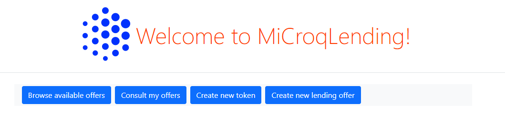
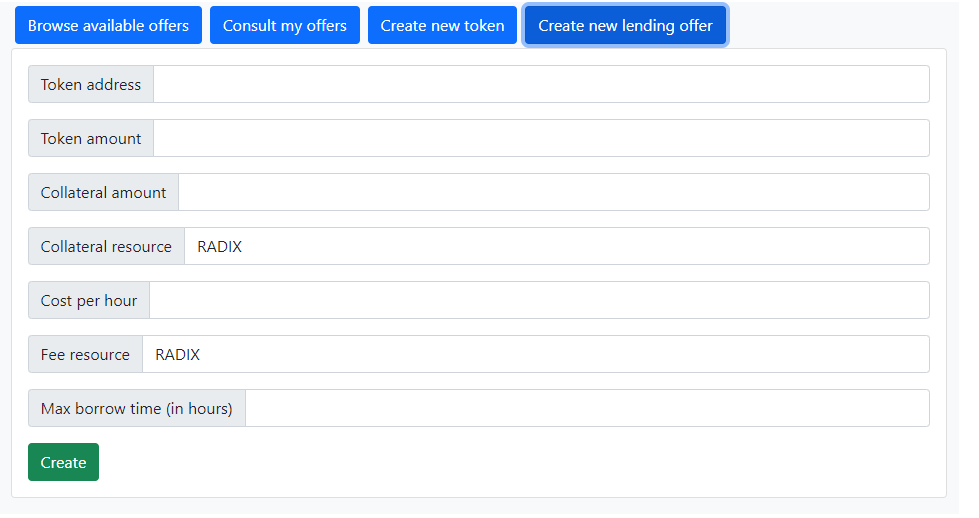
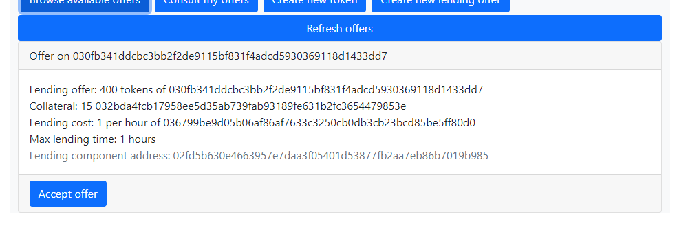
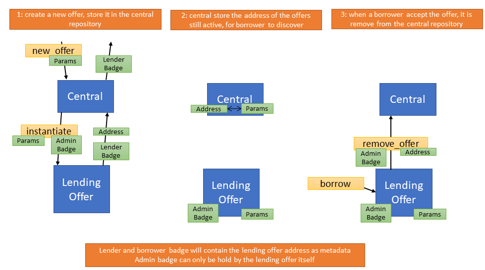
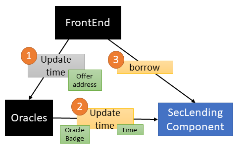

# MicroqLending

Security lending component from the team composed of Miro and Croq

important features:

- time oracle (we're using real human time, no radix epoch)
- no database (we have a central component to keep the list of offers)
- fully functional UI
- backend communication with the PTE (compile manifest, build and sign)

# What's inside the box ?

- the central component which is in charge of listing and creating security lending offer
- the security lending component
- the oracles which update the time
- the frontend which interract with all of that

# Limitation

- The oracles can be call without any cost, which will create a problem when the transaction fees are introduced.
We're hoping that Radix team will instroduce the multi-signature and integrate it in the PTE and browser extension,
it will allow us to build the message in backend side, sign it by the oracle, then send it to the client for
additional signature and the client will send to the ledger and pay the transaction fee.
- it's slow to retrieve multiple information from the ledger.
We're hoping that Radix will introduce a way of retrieving multiple resource/component information in a single request

# Workflow

## landing page



## creation of a new offer



## list of offers



## own offers


# Technical details

no database used, we retrieve the list of offers from the central component, and retrieve the owned offers from retrieving info on the token you own

## lending process



## oracle



# Setup the environment on the PTE

first you will want to recompile the scrypto packages, to do so go in both blueprint directory and do:
```
scrypto build
```
you should now find the wasm file in `target\wasm32-unknown-unknown\release`

publish it with [resim-client](https://github.com/radixdlt/babylon-pte/releases)

using

```
./resim-client.exe --address "pte02-socket.radixdlt.com:8010"

resim publish centralRepo.wasm
resim publish secLending.wasm
```

keep the package addresses, you'll need them soon

the config file

```
{
  "badgeAddress": "0335a65e15d5b29080454eb9b49753a37fa5bd0d4f905f8642fab4",
  "accountAddress": "02575cecb0e72626fae946e9f4ec6ea62dff2583d34cd68303be7b",
  "privateKey": "516464dd9a9537da68cc416d1818a70c6cc75291ab19429eb561d467a6392eaa",
  "ledger": "https://pte02.radixdlt.com",
  "centralComponentAddress": "021f3524855fb893cb4de3f154956fc3f5e33c7768940a41babadf"
}
```

- `badgeAddress` is the badge address of the oracles, it need to be own by the `accountAddress`
- `accountAddress` is the address of the wallet of the oracle
- `privateKey` is the privateKey you can get yours by right clicking on the pinned browser extension, click on `Inspect pop-up`, and in the browser console you type: `chrome.storage.local.get(null, console.log)` you'll get your private key here
- `ledger` is the address of the PTE which we'll use for testing
- `centralComponentAddress` is the address of the instance central component
- `port` you can specify a port to change the port used by the server

don't worry about `badgeAddress` nor `centralComponentAddress` they will all be generated when you `instantiate`

first, you'll need to go in the directory of the backend, then:
```
npm install
```
to install all the modules needed, then
```
node . instantiate <central package address> <seclending package address>
```
it'll update the config file with everything needed

if you just want to run the server with the currently configured config file without create a new instance:
```
node .
```

then you'll need to modify the config file of the webapp (`src\lib\config.js`)
```
export const config = {
  ledger: "https://pte02.radixdlt.com",
  centralComponentAddress: "021f3524855fb893cb4de3f154956fc3f5e33c7768940a41babadf",
  secLendingPackageAddress: {
    "015dab2dbaf03e585f54179689f36aac00a80cac820088ef67bb9a": true
  }, 
  backendAddress: "http://localhost:8080",
};
```
- `ledger` is the address of the PTE which we'll use for testing
- `centralComponentAddress` is the address of the instance central component
- `backendAddress` is where you're running the oracle
- `secLendingPackageAddress` is a list of `seclending package address` it's used by the frontend to detect fake

run the frontend by moving to `webapp` directory, and type:
```
npm run dev
```


