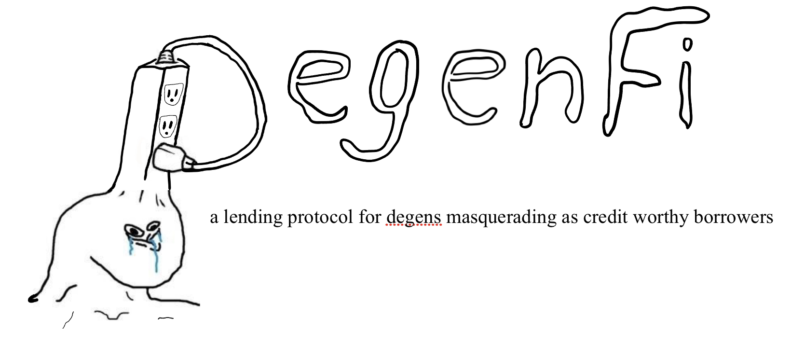

## Table of Content

  * [Abstract](#abstract)
  * [Motivations](#motivations)
  * [Basic Features](#basic-features)
  * [Advanced Features](#advanced-features)
    + [Folded Leverage](#folded-leverage)
    + [Flash Liquidation](#flash-liquidation)
    + [Credit Score System](#credit-score-system)
  * [Misc. Features](#misc-features)
  * [Design Details](#design-details)
    + [User/Credit Report/SBT](#usercredit-reportsbt)
    + [Loan NFT](#loan-nft)
    + [Pool Design](#pool-design)
    + [Blueprint Overview](#pool-design)
      - [DegenFi Blueprint](#degenfi-blueprint)
      - [LendingPool Blueprint](#lendingpool-blueprint)
      - [CollateralPool Blueprint](#collateralpool-blueprint)
      - [UserManagement Blueprint](#usermanagement-blueprint)
      - [Radiswap Blueprint](#radiswap-blueprint)
      - [PseudoPriceOracle Blueprint](#pseudopriceoracle-blueprint)
  * [Examples](#examples)
    + [Getting Started](#getting-started)
    + [Example 1: Creating pools & depositing supply](#example-1-creating-pools-&-depositing-supply)
    + [Example 2: Leverage 1x](#example-2-leverage-1x)
    + [Example 3: Leverage 2x](#example-3-leverage-2x)
    + [Example 4: Leverage 3x](#example-4-leverage-3x)
    + [Example 5: Flash Liquidation](#example-5-flash-liquidation)
    + [Example 6: Closing out a leveraged position](#example-6-closing-out-a-leveraged-position)
  * [Future Work and Improvements](#future-work-and-improvements)
  * [Conclusion](#conclusion)
  * [License](#license)


## Abstract
DegenFi is a lending protocol for degens masquerading as credit worthy borrowers. 

## Motivations
The motivation for this project started with an introduction to one of the developers I met at [Fodl](https://fodl.finance/) who explained to me the concept of folded leverage. Folded leverage is where a user deposits collateral on a lending platform, borrows against their collateral, re-deposits what they borrowed as additional collateral, borrows against the newly added collateral etc etc until the desired leverage is achieved. Due to my interest in Scrypto and the Radix Engine which I've [written a few articles about](https://publish.obsidian.md/jake-mai/The+Biggest+Innovation+in+Crypto+Since+Smart+Contracts), I was curious to know how much easier it would be to design a similar protocol in an asset-oriented approach. Being that I didn't have any developer experience, I was hoping someone would build a prototype of this where I can study the process. When I didn't find anyone, I decided to take it into my own hands. My Rust was rusty (no pun intended), although some of the syntax was still familiar to me when I began this project. I spent a couple of months learning Rust (and Scrypto a few months after) as a personal project last year at the start of the pandemic but have yet to touch it for over a year. While this project took a couple of months to build, much of the hurdle was me learning Rust & Scrypto along the way. I faced a lot of design questions I had no experience in when architecting the system. Should depositors receive LP tokens? Should it be fungible or non-fungible? Should the liquidity supply and collateral be in the same pool or in a shared pool? What access controls should be implemented to prevent any mishaps? My perspective was attempting to solve it from a user's perspective. Is it easy to use the features? How much do they have to think? What is the experience like? While some of the design questions have still been left unanswered, I feel like I've built a pretty interesting prototype to continue tinkering with and exploring the mechanics and design to be iterated. Suffice to say, for someone like me who couldn't get past the "Hello World" chapter when I attempted to learn C++ a few years ago to be able to build something remotely close to this, I think this is a testament to how powerful Scrypto and the Radix Engine is.  

## Basic Features:

* **Create user** - Allows people to create users to use the protocol. An SBT will be received which will track interactions of the protocol.
* **Multi collateral support** - Allows for the creation of multiple pools and borrow against multiple collaterals.
* **Deposit** - Allows users to deposit liquidity into the lending pool and earn protocol fees.
* **Add collateral** - Allows users to deposit collateral into the pool to be (currently) locked away and used to overcollaterize their loan(s).
* **Add additional collateral** - Allows users to top off on collateral towards their open loan position.
* **Borrow** - Allows users to borrow from the liquidity pool with a (currently) static max borrow of 75%.
* **Borrow additional** - Allows users to top off on their open loan position.
* **Repay** - Allows users to repay their loan in partial or in full.
* **Flash loan borrow** - Allows users to perform flash loans.
* **Floasn loan repay** - Allows users to complete their flash loan transaction by having the transient tokens burnt after repaying the flash loan within one transaction.
* **Convert deposit to collateral** - Allows user to convert their deposits to be collateralized for their loans. User (currently) do not earn protocol fees for any collateral
deposited.
* **Convert collateral to deposit** - Allows user to convert their unused collateral to be used as supply liquidity to earn protocol fees.
* **Liquidate** - Allows users to liquidate any loans that have a Health Factor of 1 or below.
* **Find bad loans** - Allows users to query loans that have below a Health Factor of 1 or below.
* **Check liquidity** - Allows users to view the liquidity available to borrow or withdraw deposits from the protocol.
* **Check total supply** - Allows users to check the total that's been supplied to the pool.
* **Check total borrowed** - Allows users to check the total that's been borrowed from the pool.
* **Check utilization rate** - Allows users to check the rate that has been borrowed against the total supply of the pool.
* **Check total collaterization supply** - Allows user to check the total collaterization that's been supplied in the pool.
* **Check SBT information** - Allows users to review their own SBT data info. 
* **Check loan information** - Allows users to view loan information of the given loan ID. 

The new transaction model introduced with v0.3.0 of Scrypto allows for the creation of composable transactions; this means that a concept such flash loans no longer needs to be implemented in the smart contract itself and that it can instead be an assertion in the transaction manifest file that performs the flash loan. In the case of DegenFi, flash loan compatible methods are implemented on the lending pool components so that users have the choice of how they wish to use flash loans: either by using these dedicated methods in a later section or by writing their transaction manifest files for their flash loans.

## Advanced Features:

* **Folded leverage** - Folded leverage is where a user deposits collateral on a lending platform, borrows against their collateral, re-deposits what they borrowed as additional collateral, borrows against the newly added collateral etc etc until the desired leverage is achieved.
* **Flash liquidation** - Users can liquidate a position even if they do not have the funds to repay the loan by using flash loans.
* **Credit Score System** - Users can earn a credit rating by continuously showing good borrowing habits by paying off their loans. Borrowers who demonstrate a proven borrowing track record can earn interest rate coupons and collateralization adjustments. 

#### Folded Leverage

As mentioned Folded leverage is where a user deposits collateral on a lending platform, borrows against their collateral, re-deposits what they borrowed as additional collateral, borrows against the newly added collateral etc etc until the desired leverage is achieved. 

This is possible through flash loans which are capable of opening the folded leveraged position in a single transaction, effectively allowing the users to leverage their principal beyond the limits of the underlying lending platform.

Here are the steps to open a leveraged position:

1. You have 1,000 XRD
2. You do a flash loan to borrow 3,000 XRD
3. You deposit 4,000 XRD as collateral
4. You borrow 3,000 USD (75% of XRD collateral assuming XRD is $1)
5. You swap 3,000 USD for 3,000 XRD using Radiswap
6. You pay back your 3,000 XRD flash loan you took out in step 2.

Users do this to earn a multiple of COMP tokens than they would have if they used the protocol normally. I've immitated this mechanic by creating a supply of protocol
tokens called "Degen Tokens" with a similar mechanic of how COMP tokens are rewarded to users by interacting with the protocol.

To close your position
1. You take out a flash loan to cover the USD your entire loan balance. 
2. You repay all your 3,000 USD loan balance (+ plus fees).
3. You redeem your 4,000 XRD collateral.
4. You swap your XRD to USD just enough to repay the flash loan in step 1.
5. You've now exited your position.

### Flash Liquidation

In the event that there is a loan with a Health Factor below 1 that you may wish to liquidate but do not have the funds to liquidate the position. You may use flash loans to compose
together a series of transaction in which repays the loan the loan, receive that value + liquidation fee, and repay the flash loan within one transaction.

To perform a flash loan liquidation:
1. You do a flash loan to borrow the amount you wish to repay back the loan.
2. You liquidate the loan
3. You receive the collateral value + liquidation fee.
4. You swap enough of the collateral asset to the asset you repaid the loan with.
5. You pay back the flash loan you took in step 1.

### Credit Score System

The design of the credit score hasn't been fully thought out, but more so for demonstration purposes as to how easy it is to have this type of capability on Radix. Currently, to have one metric to underwrite creditworthiness is see how many times a borrower has paid off their loans as this will provide a track record of their borrowing history. The borrower will receive a 5 credit score increment starting from 20, 25, 30, 35, 40 everytime they pay off their loan and have a remaining paid off balance of 75% or below, 50% or below, 25% or below, and 0%. Certainly, there are ways for people to game this system by simply only taking $100 worth of loans for example and paying it off in 25% increments to get a full credit score of 150 received. As of now, it is only a demonstration of features rather than engineering a credit system.

The credit system is primitive at this point. Users who have 100, 200, and 300 credit score will receive a discount of 1%, 2%, and 3% on their interest rate respectively. Likewise, users who have 100, 200, or 300 credit score will also be allowed to decrease their collaterization requirement by 5%, 10%, and 15% respectively. 

## Misc. features:

* **Get price** - Retrieves the price of a given asset using a pseudo price oracle.
* **Set price** - Sets the price of a given asset to demonstrate how liquidations work.
* **Set credit score** - Sets the desired credit score to demonstrate how the credit score system works.

## Design details

There are a few notable Non Fungible Tokens ("Non Fungible Token) and Soul Bounded Tokens ("SBT") that are implemented in this prototype. I've went back and forth to how
loans and users should be represented in this lending protocol and even still, I don't think I've arrived at a final conclusion yet. Albeit, this is current approach to how I envisioned it in my head.

### User/Credit Report/SBT

User NFT is an NFT that represents users for this protocol. This NFT contains all the records of the user interacting with this protocol. It can be seen as a credit report for the user. It is also used for authorization that this user belongs to the protocol and access protocol features. Users themselves do not have permission to change the data contained within the NFT. It is a non-transferable token or otherwise known as a "Soul Bound Token" or "SBT" for short. I've implemented HashMaps to contain deposit, collateral, and borrow balance is for better flexibility and user experience. I'd like to have the user be able to view all their loans, deposit, borrow balance, etc. easily. Also, especially when it comes to repaying loans. When a loan is paid off, users do not have to worry about sending the wrong NFT, the protocol will simply look at the SBT token and find the loan that the user wants to pay off. 

### Loan NFT

This is an NFT that represents the loan terms. We can consider this NFT as loan documents and hopefully in the future can be represented as legal documents or a digital representation of a legal document. This NFT is given to the borrower. For now its purpose is to simply tract the health factor of the loan, collaterization, etc. If the loan is in bad health, liquidators can query the liquidation component to evaluate bad loans and liquidate the loan's collateral. Another purpose is to track the status of the loan to update the user's credit report. In the future, given the nature that, unlike the SBT; these loan NFTs can be transferrable to which there may be interesting use cases that we can explore to securitize the loans or package them together.

### Liquidation

The liquidation mechanic in this protocol is a simplified imitaiton of AAVE's liquidation mechanics which can be viewed [here](https://docs.aave.com/faq/liquidations#:~:text=A%20liquidation%20is%20a%20process,in%20value%20against%20each%20other).

A liquidation is a process that occurs when a borrower's health factor goes below 1 due to their collateral value not properly covering their loan/debt value. This might happen when the collateral decreases in value or the borrowed debt increases in value against each other. This collateral vs loan value ratio is shown in the health factor.

In a liquidation, up to 50% of a borrower's debt is repaid and that value + liquidation fee is taken from the collateral available, so after a liquidation that amount liquidated from your debt is repaid.

In the even that the loan reaches a Health Factor of 0.5 or below, liquidators can now pay up to 100% of a borrower's debt and that value + liquidation fee is taken from the collateral available.

The liquidation fee or liquidation bonus is currently a static 5% attirubtion to the liquidator.

### Pool Design

Each asset supported has two pools, one to provide liquidity supply and one to lock collateral. In this way, this design can support multiple assets while risk between assets should be contained within each pool(s). I have yet to research different pool designs or develop or a way to model risk. This was just something I thought was intuitive. 

### Blueprints Overview
The DegenFi Protocol is made up of 6 core blueprints. These blueprints are `DegenFi`, `LendingPool`, `CollateralPool`, `UserManagement`, `Radiswap`, and `PseudoPriceOracle`.

#### DegenFi Blueprint
The `DegenFi` blueprint is acts more as a registry of all of the liquidity pools that belong to the protocol where it keeps a `HashMap` of all the pools and maps them to the correct lending and collateral pools. When a user requests the creation of a new lending pool, DegenFi checks to ensure that the lending pool does not already exist in the HashMap before it is created. This design is inspired by Omar's [RaDEX](https://github.com/radixdlt/scrypto-challenges/tree/main/1-exchanges/RaDEX) submission in the DEX challenge. 

`DegenFi` can essentially be thought of as an interface for users to interact through in which it will route the method calls to the other blueprints. Because `DegenFi` has visibility of all the pools it can assist in facilitating liquidation, ensuring the liquidations are handled seamlessly (repayments are sent back to the correct lending pool and collateral is redeemed from the correct collateral pool). Thus, `DegenFi` also has a registry of (at least) all the bad loans that are fed through from each respective lending pools.

#### LendingPool Blueprint
The `LendingPool` as the name suggest is where the lending market can be managed. All the method calls to add deposit, withdraw deposit, converting deposits to collateral, borrowing funds, redeeming deposits, and calculation of fees are contained here.

The purpose of the `LendingPool` blueprint are:
* Managing the liquidity supply of the pool.
* Tracks the supply, liquidity, borrowing amounts, fees, and health of the loans.
* Mints Loan NFT and manage its data as users interact with the pool.
* Manages the data of the loans being lent from the lending pool.
* Facilitates the conversion between the deposit supply to collateral supply.

Majority of the methods here are enforced by Access Rules and can only be accessed through in the `DegenFi` blueprint.

#### CollateralPool Blueprint

Similarly, the `CollateralPool` blueprint has identical responsibilities as the `LendingPool` blueprint, but much more limited in functionality as it does not currently perform any other responsibilities other than to manage the collateral and perform liquidations.

* Managing the collateral supply of the pool.
* Tracks the collateral supply.
* Facilitates the conversion between collateral supply to deposit supply.
* Liquidates the collateral in the pool.

The majority of the methods in this blueprint are also enforced by Access Rules and can only be accessed by the `DegenFi` blueprint.

#### UserManagement Blueprint
The `UserManagement` blueprint plays a unique role in the protocol. Because SBT's plays such a critical role in the protocol it has its own component that manages User SBT data in the protocol. 

The role of the `UserManagement` blueprint are to:
* Manage User SBT data. `LendingPool` and `CollateralPool` performs permissioned method calls to increase deposit balance, decrease deposit balance, increase collateral balance, decrease collateral balance, increase borrow balance, decrease borrow balance, increase credit score, decrease credit score,
*  

#### Radiswap Blueprint
While not as performative as Omar's RaDEX, the `Radiswap` blueprint provides a simple and straightforward set of methods to show case extended use of flash loans in this protocol.
Its functions are simple and its role is to simply facilitate swapping of assets.

#### PseudoPriceOracle Blueprint
The `PseudoPriceOracle` blueprint is a very primitive blueprint, mainly serving as a function to have a basic way of pulling price data and calculating time for interest accruals.

## Examples

### Getting Started

To get started let's make sure to have any data cleared.

```
resim reset
```

Firstly, we need to create our accounts. We can easily do this by pasting the follow commands and creating our environment variables.

```
OP1=$(resim new-account)
export PRIV_KEY1=$(echo "$OP1" | sed -nr "s/Private key: ([[:alnum:]_]+)/\1/p")
export PUB_KEY1=$(echo "$OP1" | sed -nr "s/Public key: ([[:alnum:]_]+)/\1/p")
export ACC_ADDRESS1=$(echo "$OP1" | sed -nr "s/Account component address: ([[:alnum:]_]+)/\1/p")
OP2=$(resim new-account)
export PRIV_KEY2=$(echo "$OP2" | sed -nr "s/Private key: ([[:alnum:]_]+)/\1/p")
export PUB_KEY2=$(echo "$OP2" | sed -nr "s/Public key: ([[:alnum:]_]+)/\1/p")
export ACC_ADDRESS2=$(echo "$OP2" | sed -nr "s/Account component address: ([[:alnum:]_]+)/\1/p")
OP3=$(resim new-account)
export PRIV_KEY3=$(echo "$OP3" | sed -nr "s/Private key: ([[:alnum:]_]+)/\1/p")
export PUB_KEY3=$(echo "$OP3" | sed -nr "s/Public key: ([[:alnum:]_]+)/\1/p")
export ACC_ADDRESS3=$(echo "$OP3" | sed -nr "s/Account component address: ([[:alnum:]_]+)/\1/p")
OP4=$(resim new-account)
export PRIV_KEY4=$(echo "$OP4" | sed -nr "s/Private key: ([[:alnum:]_]+)/\1/p")
export PUB_KEY4=$(echo "$OP4" | sed -nr "s/Public key: ([[:alnum:]_]+)/\1/p")
export ACC_ADDRESS4=$(echo "$OP4" | sed -nr "s/Account component address: ([[:alnum:]_]+)/\1/p")
OP5=$(resim new-account)
export PRIV_KEY5=$(echo "$OP5" | sed -nr "s/Private key: ([[:alnum:]_]+)/\1/p")
export PUB_KEY5=$(echo "$OP5" | sed -nr "s/Public key: ([[:alnum:]_]+)/\1/p")
export ACC_ADDRESS5=$(echo "$OP5" | sed -nr "s/Account component address: ([[:alnum:]_]+)/\1/p")
```

Let's publish our package and create our environment variable for our component and flash loan (which will be used in the later examples.

```
PK_OP=$(resim publish ".")
export PACKAGE=$(echo "$PK_OP" | sed -nr "s/Success! New Package: ([[:alnum:]_]+)/\1/p")
CP_OP=$(resim run "./transactions/component_creation.rtm")
export COMPONENT=$(echo "$CP_OP" | sed -nr "s/.* Component: ([[:alnum:]_]+)/\1/p" | sed '3q;d')
export FLASH=$(echo "$CP_OP" | sed -nr "s/.* Resource: ([[:alnum:]_]+)/\1/p" | sed '2q;d')
```


### Example 1: Creating pools & depositing supply

To illustrate the features of this protocol let's follow a narrative of 5 different people. Joe, Bob, Sally, Beth, and John who have different motivations when interacting when interacting with the protocol. 

In this example, we'll follow Joe, who is the owner of ACC_ADDRESS1. Let's make sure that we set his account as the default. We can do this by pasting the following command.

```
resim set-default-account $ACC_ADDRESS1 $PRIV_KEY1
```

Joe wants to be the first liquidity provider of this protocol and he wants to create two pools: USD Pool and an XRD Pool. To do so, let's fund Joe's account with $1,000,000 of USD. By default, Joe already has 1,000,000 of XRD.

```
M_OP=$(resim run "./transactions/mint_usd.rtm")
export USD=$(echo "$M_OP" | sed -nr "s/└─ Resource: ([[:alnum:]_]+)/\1/p")
```

Before interacting with the protocol, we must first create a user for Joe. Let's paste the transaction below.

```
resim run ./transactions/new_user.rtm
```

Creating a user in this protocol will provide Joe with a "Soul Bound Token" (SBT) which essentially is a Non-Fungible Token (NFT) that can't be withdrawn. The Radix Engine easily allows us to do this as tokens are native to the platform providing developers with quick, easy, and customizable token creations. The SBT token will track Joe's activities in the protocol. 

```sh
Logs: 2
├─ [INFO ] User created! Your SBT resource address is 031fe1f483ddda32168b4c0ad0be7a2e565442cb50a967f75129ca
└─ [INFO ] Thank you for registering an account at DegenFi, here are 1 Degen Tokens for you to start!
New Entities: 0
```

Let's also create an environment variable for Joe's SBT. We can do this by pasting the following code below. Keep in mind that your resource address will likely be different from what's shown in this example.


```sh
export PROOF=031fe1f483ddda32168b4c0ad0be7a2e565442cb50a967f75129ca
```

Now, Joe is ready to create and supply the initial lending pool for DegenFi! We can do this by running the following Transaction Manifest.

[`./transactions/create_xrd_pool.rtm`](./transactions/create_xrd_pool.rtm)
[`./transactions/create_usd_pool.rtm`](./transactions/create_xrd_pool.rtm)

```sh
resim run ./transactions/create_xrd_pool.rtm && resim run ./transactions/create_usd_pool.rtm
```

We can see our logs below that our pools have been created. We also received 5 Degen Tokens for creating the first lending pool for `030000000000000000000000000000000000000000000000000004` or otherwise XRD. Degen Tokens are utility/governance tokens for DegenFi. For this prototype, it does not have any use cases, but will be used for demonstration purposes later.

```sh
Logs: 3
├─ [INFO ] [DegenFi]: New lending pool for 030000000000000000000000000000000000000000000000000004 created!
├─ [INFO ] [DegenFi]: Depositing 1000 of 030000000000000000000000000000000000000000000000000004 as liquidity
└─ [INFO ] [DegenFi]: You've received 5 Degen Tokens
New Entities: 4
├─ Component: 02e3049aa40e5fd9de7cc432dc5ff8031d7bc7982efba0807c4be5
└─ Component: 02a7c643b30f8b2ef7411a28dd212adc74e09182d41d5ef8d66a5f
├─ Resource: 03462b6817cacfd3f14d6ec9d6a52e523904c02eb9f94b51a6fe54
└─ Resource: 032c76dc0822dfb9fa5439233e0a1024defa1a15071c470424edb8
```
```sh
Logs: 3
├─ [INFO ] [DegenFi]: New lending pool for 03612c739a20344116aa67cd53479986c0228ea3e46d7dbb1a57ed created!
├─ [INFO ] [DegenFi]: Depositing 1000 of 03612c739a20344116aa67cd53479986c0228ea3e46d7dbb1a57ed as liquidity
└─ [INFO ] [DegenFi]: You've received 5 Degen Tokens
New Entities: 4
├─ Component: 02714bf9e6c074033d3e892f8a715e2139e143399799618aa29461
└─ Component: 026065577e3d7bb4942f00553e0d57753a4af3aade9546f03be8a7
├─ Resource: 03306c573c884642ed2632f083e09260a2e322b2e439f0bbf8e587
└─ Resource: 03dc104ed22ecf77e2fb2473485558e2fcc60b206b2118eac94311
```

Joe later wants to supply an additional 19,000 of XRD and USD. We can do this by pasting the following transaction manifest files below. 

[`./transactions/deposit_supply_xrd.rtm`](./transactions/deposit_supply_xrd.rtm) 
[`./transactions/deposit_supply_usd.rtm`](./transactions/deposit_supply_usd.rtm)

```
resim run ./transactions/deposit_supply_xrd.rtm && resim run ./transactions/deposit_supply_usd.rtm
```

```sh
Logs: 1
└─ [INFO ] [DegenFi]: Depositing 19000 of 030000000000000000000000000000000000000000000000000004 as liquidity.
```
```sh
Logs: 1
└─ [INFO ] [DegenFi]: Depositing 19000 of 03612c739a20344116aa67cd53479986c0228ea3e46d7dbb1a57ed as liquidity.
```

We can view the amount that's supplied for each pool by running the [`./transactions/check_total_supplied_usd`](./transactions/check_total_supplied_usd.rtm).
```
resim run ./transactions/check_total_supplied_usd.rtm
```
```sh
Logs: 1
└─ [INFO ] The total supplied in this pool is 20000
```

Check total supplied for XRD Pool [`./transactions/check_total_supplied_xrd`](./transactions/check_total_supplied_xrd.rtm)

```
resim run ./transactions/check_total_supplied_xrd.rtm
```
```sh
Logs: 1
└─ [INFO ] The total supplied in this pool is 20000
```

And we're all done! Joe has successfully supplied liquidity for XRD and USD lending pools so that Bob, Sally, Beth, and John can begin borrowing from the lending pools. Before we get there, Joe wants to them a favor and also instantiate the Radiswap component. This will extend the protocol's features to allow for swapping assets. Let's do that by pasting the following transaction manifest files below. 

Instantiate Radiswap [`./transactions/instantiate_radiswap.rtm`](./transactions/instantiate_radiswap.rtm)
```
resim run ./transactions/instantiate_radiswap.rtm
```
```sh
New Entities: 3
└─ Component: 02e08179347d4692d39f3a5ccf64bda61982cf319856ce4a93f685
├─ Resource: 034a1f5b3826c1c0a48ff2d645799c14c5faa70972e3ec73e53431
└─ Resource: 03b0910a36f42dfd6fd2b6e0231936d55b1988a06d11f73df263fb
```
```sh
resim show 02e08179347d4692d39f3a5ccf64bda61982cf319856ce4a93f685
```
```sh
Resources:
├─ { amount: 200000, resource address: 030000000000000000000000000000000000000000000000000004, name: "Radix", symbol: "XRD" }
├─ { amount: 1, resource address: 034a1f5b3826c1c0a48ff2d645799c14c5faa70972e3ec73e53431, name: "LP Token Mint Auth" }
└─ { amount: 200000, resource address: 03612c739a20344116aa67cd53479986c0228ea3e46d7dbb1a57ed }
```

So Joe has now also supplied 200,000 USD and XRD in the liquidity pool for Radiswap so that Bob, Sally, Beth, and John can begin swapping between assets.

### Example 2: Leverage 1x

In this example, we're starting with Bob, the owner of ACC_ADDRESS2. He wants to open a 1x leveraged position on his XRD. He will be putting up 1,000 XRD as his principal investment and taking out a flash loan to borrow an additional 1,000 XRD to supply a total of 2,000 XRD as collateral. With, currently, a maximum collateralization factor of 75%, Bob's max borrowing limit would be $1,500 USD. If Bob were to max out his borrowing capacity, this would bring his Borrow Limit Usage to 100% defined by `Borrowing Value / (Supply Value * Supply Collateral Factor)`. The closer Bob is to 100% Borrow Limit Usage, the position could be liquidated by anyone. Therefore, Bob as an avid degen and practicing prudent risk management, will only borrow 50% of his total collateral value.

Let's make sure that we have Bob's account as default by running the command below.

```sh
resim set-default-account $ACC_ADDRESS2 $PRIV_KEY2
```

Bob will also need an SBT before he can interact with the protocol so we'll create one for him by running the following below.

```sh
resim run ./transactions/new_user2.rtm
```
```sh
Logs: 2
├─ [INFO ] User created! Your SBT resource address is 031fe1f483ddda32168b4c0ad0be7a2e565442cb50a967f75129ca
└─ [INFO ] Thank you for registering an account at DegenFi, here are 1 Degen Tokens for you to start!
```
```sh
export PROOF2=031fe1f483ddda32168b4c0ad0be7a2e565442cb50a967f75129ca
```

Now it's time to demonstrate how folded leverage works on Radix. Let's run the following Transaction Manifest file.

```sh
resim run ./transactions/degen_1x_leverage.rtm
```
```sh
Transaction Status: SUCCESS
Execution Time: 622 ms
Instructions:
├─ CallMethod { component_address: 0254e252892cb31e9ac96064d0d09d6823d0c7f8c266fcbad47747, method: "flash_borrow", args: [ResourceAddress("030000000000000000000000000000000000000000000000000004"), Decimal("1000")] }
├─ CallMethod { component_address: 02e0905317d684478c275540e2ed7170f217e0c557805f7fd2a0d3, method: "create_proof_by_amount", args: [Decimal("1"), ResourceAddress("031fe1f483ddda32168b4c0ad0be7a2e565442cb50a967f75129ca")] }
├─ PopFromAuthZone
├─ CallMethod { component_address: 02e0905317d684478c275540e2ed7170f217e0c557805f7fd2a0d3, method: "withdraw_by_amount", args: [Decimal("2000"), ResourceAddress("030000000000000000000000000000000000000000000000000004")] }
├─ TakeFromWorktopByAmount { amount: 2000, resource_address: 030000000000000000000000000000000000000000000000000004 }
├─ CallMethod { component_address: 0254e252892cb31e9ac96064d0d09d6823d0c7f8c266fcbad47747, method: "deposit_collateral", args: [Proof(512u32), Bucket(513u32)] }
├─ CallMethod { component_address: 02e0905317d684478c275540e2ed7170f217e0c557805f7fd2a0d3, method: "create_proof_by_amount", args: [Decimal("1"), ResourceAddress("031fe1f483ddda32168b4c0ad0be7a2e565442cb50a967f75129ca")] }
├─ PopFromAuthZone
├─ CallMethod { component_address: 0254e252892cb31e9ac96064d0d09d6823d0c7f8c266fcbad47747, method: "borrow", args: [Proof(514u32), ResourceAddress("03612c739a20344116aa67cd53479986c0228ea3e46d7dbb1a57ed"), ResourceAddress("030000000000000000000000000000000000000000000000000004"), Decimal("1000")] }
├─ TakeFromWorktopByAmount { amount: 1000, resource_address: 03612c739a20344116aa67cd53479986c0228ea3e46d7dbb1a57ed }
├─ CallMethod { component_address: 0254e252892cb31e9ac96064d0d09d6823d0c7f8c266fcbad47747, method: "swap", args: [Bucket(515u32)] }
├─ CallMethod { component_address: 02e0905317d684478c275540e2ed7170f217e0c557805f7fd2a0d3, method: "withdraw_by_amount", args: [Decimal("1000"), ResourceAddress("030000000000000000000000000000000000000000000000000004")] }
├─ TakeFromWorktopByAmount { amount: 1000, resource_address: 030000000000000000000000000000000000000000000000000004 }
├─ TakeFromWorktopByAmount { amount: 1, resource_address: 03391ee849d71872cd7f2e2e46c2b11d0c4bfb21193a354288223a }
├─ CallMethod { component_address: 0254e252892cb31e9ac96064d0d09d6823d0c7f8c266fcbad47747, method: "flash_repay", args: [Bucket(516u32), Bucket(517u32)] }
└─ CallMethodWithAllResources { component_address: 02e0905317d684478c275540e2ed7170f217e0c557805f7fd2a0d3, method: "deposit_batch" }
Instruction Outputs:
├─ Tuple(Bucket(1025u32), Bucket(1029u32), Bucket(1031u32))
├─ Proof(1032u32)
├─ Proof(512u32)
├─ Bucket(1034u32)
├─ Bucket(513u32)
├─ Bucket(1040u32)
├─ Proof(1041u32)
├─ Proof(514u32)
├─ Tuple(Bucket(1056u32), Bucket(1046u32), Bucket(1058u32))
├─ Bucket(515u32)
├─ Bucket(1060u32)
├─ Bucket(1061u32)
├─ Bucket(516u32)
├─ Bucket(517u32)
├─ Bucket(1068u32)
└─ ()
Logs: 21
├─ [INFO ] [DegenFi]: Depositing 2000 of 030000000000000000000000000000000000000000000000000004 as collateral.
├─ [INFO ] [DegenFi]: Borrowing: 03612c739a20344116aa67cd53479986c0228ea3e46d7dbb1a57ed, Amount: 1000
├─ [INFO ] The utilization rate of this pool is 0.05
├─ [INFO ] [Lending Pool]: Loan NFT created.
├─ [INFO ] [Lending Pool]: Origination fee: 0.01
├─ [INFO ] [Lending Pool]: Origination fee charged: 10
├─ [INFO ] [Loan NFT]: Asset: 03612c739a20344116aa67cd53479986c0228ea3e46d7dbb1a57ed
├─ [INFO ] [Loan NFT]: Collateral: 03612c739a20344116aa67cd53479986c0228ea3e46d7dbb1a57ed
├─ [INFO ] [Loan NFT]: Principal Loan Amount: 1000
├─ [INFO ] [Loan NFT]: Interest Rate: 0.08
├─ [INFO ] [Loan NFT]: Origination Fee: 0.01
├─ [INFO ] [Loan NFT]: Origination Fee Charged: 10
├─ [INFO ] [Loan NFT]: Owner: 7c355f4bd3794183a664677da1902ce7
├─ [INFO ] [Loan NFT]: Remaining Balance: 1090
├─ [INFO ] [Loan NFT]: Collateral amount: 2000
├─ [INFO ] [Loan NFT]: Health Factor: 1.376146788990825688
├─ [INFO ] [Loan NFT]: Interest Expense: 80
├─ [INFO ] You were able to increase your max collateralization by 0 due to your credit!
├─ [INFO ] You were able to reduce your interest rate by 0 percent due to your credit!
├─ [INFO ] The utilization rate of this pool is 0.05
└─ [INFO ] Your original interest rate was 0.08
New Entities: 0
```

As you can see, Radix's asset-oriented approach allows us to string together a series of transactions that must happen all at once or else none of the individual transactions happens at all. The flash loan design is very elegant and flexible to use. Due to the Radix Engine's asset oriented approach, we can create what are called "[transient tokens](https://github.com/radixdlt/scrypto-examples/tree/main/defi/basic-flash-loan)" which are tokens that can never be deposited, only burnt. In this way, we can submit several transactions using the Transaction Manifest that allows Bob to:

1. Take out a flash loan to borrow 1,000 XRD.
2. Deposit 2,000 XRD as collateral.
3. Borrow $1,500 USD.
4. Swap $1,500 USD for 1,500 XRD using Radiswap.
5. Pay back the 1,500 XRD flash loan in step 1.

All within one transaction! The transient token used to carry out the flash loan design essentially allows Bob to borrow any amount without supplying any collateral. This creates a dangling resource, hence transient token, which needs to be burnt. The method call to pay back the flash loan ensures that the loan that Bob took out in step 1 has to be repaid in full or else the transient token won't be burnt. 

With this, Bob is now able to have an additional 1,000 exposure to XRD that he wouldn't have otherwise been able to do. This is the power of atomic composability. 

```sh
├─ { amount: 5, resource address: 0385e64b569439f95a01b816d7be0504ccd67e667d012214d0772b, name: "Degen Token", symbol: "DT" }
```

We can review Bob's SBT data by running the following command.

```sh
resim run ./transactions/get_sbt_info_acc2.rtm
```
```sh
Logs: 8
├─ [INFO ] [User SBT]: Credit Score: 0
├─ [INFO ] [User SBT]: Deposit Balance: {}
├─ [INFO ] [User SBT]: Collateral Balance: {030000000000000000000000000000000000000000000000000004: 2000}
├─ [INFO ] [User SBT]: Borrow Balance: {03612c739a20344116aa67cd53479986c0228ea3e46d7dbb1a57ed: 1090}
├─ [INFO ] [User SBT]: Open Loans: {03612c739a20344116aa67cd53479986c0228ea3e46d7dbb1a57ed: 7e79c4f725374bc6496485f1bcff3c8d}
├─ [INFO ] [User SBT]: Closed Loans: {}
├─ [INFO ] [User SBT]: Number of times liquidated: 0
└─ [INFO ] [User SBT]: Number of loans paid off: 0
```

### Example 3: Leverage 2x

This example will be more straightforward as it's mostly an extension of the previous example. Here, we have Beth who wants to open a 2x leveraged position her XRD. Like Bob, Beth will also be only be putting up 1,000 XRD as her principal investment, but now taking out a flash loan to borrow an additional 2,000 XRD to supply a total of 3,000 XRD as collateral. Beth will be borrowing $2,000 USD in this example representing a 66% Borrow Limit Usage. So Beth's degen appetite is stronger than Bob's, but still practices some measure of risk management.

Let's make sure that we are on Beth's account.

```sh
resim set-default-account $ACC_ADDRESS3 $PRIV_KEY3
```

Likewise, we will need to create an SBT for Beth.

```sh
resim run ./transactions/new_user3.rtm
```
```sh
Logs: 2
├─ [INFO ] User created! Your SBT resource address is 031fe1f483ddda32168b4c0ad0be7a2e565442cb50a967f75129ca
└─ [INFO ] Thank you for registering an account at DegenFi, here are 1 Degen Tokens for you to start!
```
```sh
export PROOF3=031fe1f483ddda32168b4c0ad0be7a2e565442cb50a967f75129ca
```

To perform a 2x leveraged position, we can run the following transaction manifest file.

```sh
resim run ./transactions/degen_2x_leverage.rtm
```
```sh
Transaction Status: SUCCESS
Execution Time: 627 ms
Instructions:
├─ CallMethod { component_address: 0254e252892cb31e9ac96064d0d09d6823d0c7f8c266fcbad47747, method: "flash_borrow", args: [ResourceAddress("030000000000000000000000000000000000000000000000000004"), Decimal("2000")] }
├─ CallMethod { component_address: 02b61acea4378e307342b2b684fc35acf0238a4accb9f91e8a4364, method: "create_proof_by_amount", args: [Decimal("1"), ResourceAddress("031fe1f483ddda32168b4c0ad0be7a2e565442cb50a967f75129ca")] }
├─ PopFromAuthZone
├─ CallMethod { component_address: 02b61acea4378e307342b2b684fc35acf0238a4accb9f91e8a4364, method: "withdraw_by_amount", args: [Decimal("3000"), ResourceAddress("030000000000000000000000000000000000000000000000000004")] }
├─ TakeFromWorktopByAmount { amount: 3000, resource_address: 030000000000000000000000000000000000000000000000000004 }
├─ CallMethod { component_address: 0254e252892cb31e9ac96064d0d09d6823d0c7f8c266fcbad47747, method: "deposit_collateral", args: [Proof(512u32), Bucket(513u32)] }
├─ CallMethod { component_address: 02b61acea4378e307342b2b684fc35acf0238a4accb9f91e8a4364, method: "create_proof_by_amount", args: [Decimal("1"), ResourceAddress("031fe1f483ddda32168b4c0ad0be7a2e565442cb50a967f75129ca")] }
├─ PopFromAuthZone
├─ CallMethod { component_address: 0254e252892cb31e9ac96064d0d09d6823d0c7f8c266fcbad47747, method: "borrow", args: [Proof(514u32), ResourceAddress("03612c739a20344116aa67cd53479986c0228ea3e46d7dbb1a57ed"), ResourceAddress("030000000000000000000000000000000000000000000000000004"), Decimal("2000")] }
├─ TakeFromWorktopByAmount { amount: 2000, resource_address: 03612c739a20344116aa67cd53479986c0228ea3e46d7dbb1a57ed }
├─ CallMethod { component_address: 0254e252892cb31e9ac96064d0d09d6823d0c7f8c266fcbad47747, method: "swap", args: [Bucket(515u32)] }
├─ CallMethod { component_address: 02b61acea4378e307342b2b684fc35acf0238a4accb9f91e8a4364, method: "withdraw_by_amount", args: [Decimal("2000"), ResourceAddress("030000000000000000000000000000000000000000000000000004")] }
├─ TakeFromWorktopByAmount { amount: 2000, resource_address: 030000000000000000000000000000000000000000000000000004 }
├─ TakeFromWorktopByAmount { amount: 1, resource_address: 03391ee849d71872cd7f2e2e46c2b11d0c4bfb21193a354288223a }
├─ CallMethod { component_address: 0254e252892cb31e9ac96064d0d09d6823d0c7f8c266fcbad47747, method: "flash_repay", args: [Bucket(516u32), Bucket(517u32)] }
└─ CallMethodWithAllResources { component_address: 02b61acea4378e307342b2b684fc35acf0238a4accb9f91e8a4364, method: "deposit_batch" }
Instruction Outputs:
├─ Tuple(Bucket(1025u32), Bucket(1029u32), Bucket(1031u32))
├─ Proof(1032u32)
├─ Proof(512u32)
├─ Bucket(1034u32)
├─ Bucket(513u32)
├─ Bucket(1040u32)
├─ Proof(1041u32)
├─ Proof(514u32)
├─ Tuple(Bucket(1056u32), Bucket(1046u32), Bucket(1058u32))
├─ Bucket(515u32)
├─ Bucket(1060u32)
├─ Bucket(1061u32)
├─ Bucket(516u32)
├─ Bucket(517u32)
├─ Bucket(1068u32)
└─ ()
Logs: 21
├─ [INFO ] [DegenFi]: Depositing 3000 of 030000000000000000000000000000000000000000000000000004 as collateral.
├─ [INFO ] [DegenFi]: Borrowing: 03612c739a20344116aa67cd53479986c0228ea3e46d7dbb1a57ed, Amount: 2000
├─ [INFO ] The utilization rate of this pool is 0.15
├─ [INFO ] [Lending Pool]: Loan NFT created.
├─ [INFO ] [Lending Pool]: Origination fee: 0.01
├─ [INFO ] [Lending Pool]: Origination fee charged: 20
├─ [INFO ] [Loan NFT]: Asset: 03612c739a20344116aa67cd53479986c0228ea3e46d7dbb1a57ed
├─ [INFO ] [Loan NFT]: Collateral: 03612c739a20344116aa67cd53479986c0228ea3e46d7dbb1a57ed
├─ [INFO ] [Loan NFT]: Principal Loan Amount: 2000
├─ [INFO ] [Loan NFT]: Interest Rate: 0.08
├─ [INFO ] [Loan NFT]: Origination Fee: 0.01
├─ [INFO ] [Loan NFT]: Origination Fee Charged: 20
├─ [INFO ] [Loan NFT]: Owner: 9266c381b18c6b038a25900f9c06f39b
├─ [INFO ] [Loan NFT]: Remaining Balance: 2180
├─ [INFO ] [Loan NFT]: Collateral amount: 3000
├─ [INFO ] [Loan NFT]: Health Factor: 1.032110091743119266
├─ [INFO ] [Loan NFT]: Interest Expense: 160
├─ [INFO ] You were able to increase your max collateralization by 0 due to your credit!
├─ [INFO ] You were able to reduce your interest rate by 0 percent due to your credit!
├─ [INFO ] The utilization rate of this pool is 0.15
└─ [INFO ] Your original interest rate was 0.08
New Entities: 0
```
```
Resources:
├─ { amount: 5, resource address: 0385e64b569439f95a01b816d7be0504ccd67e667d012214d0772b, name: "Degen Token", symbol: "DT" }
```
```
resim run ./transactions/get_sbt_info_acc3.rtm
```
```
Logs: 8
├─ [INFO ] [User SBT]: Credit Score: 0
├─ [INFO ] [User SBT]: Deposit Balance: {}
├─ [INFO ] [User SBT]: Collateral Balance: {030000000000000000000000000000000000000000000000000004: 3000}
├─ [INFO ] [User SBT]: Borrow Balance: {03612c739a20344116aa67cd53479986c0228ea3e46d7dbb1a57ed: 2180}
├─ [INFO ] [User SBT]: Open Loans: {03612c739a20344116aa67cd53479986c0228ea3e46d7dbb1a57ed: 523ad2f961a9665e7653148211b47241}
├─ [INFO ] [User SBT]: Closed Loans: {}
├─ [INFO ] [User SBT]: Number of times liquidated: 0
└─ [INFO ] [User SBT]: Number of loans paid off: 0
```
This is all very similar to Bob, but a 2x position. 

### Example 4: Leverage 3x

Beth, the owner of account 4, is who you would consider a final form of degeneracy. Beth wants to open a 3x leveraged position on her XRD. Like Bob and Sally, she will also only be putting up 1,000 XRD as her principal investment and now taking out a flash loan to borrow an additional 3,000 XRD to supply a total of 4,000 XRD as collateral. Because Beth likes to catch falling knives, Beth will be maxing out her borrowing capacity at 75% collaterization with this example, taking out $3,000 USD; which represents a 100% Borrow Limit Usage.

Let's get started and make sure that the default account is set correctly.

```sh
resim set-default-account $ACC_ADDRESS4 $PRIV_KEY4
```

It's routine at this point. We will make an SBT for Beth.

```sh
resim run ./transactions/new_user4.rtm
```
```sh
Logs: 2
├─ [INFO ] User created! Your SBT resource address is 031fe1f483ddda32168b4c0ad0be7a2e565442cb50a967f75129ca
└─ [INFO ] Thank you for registering an account at DegenFi, here are 1 Degen Tokens for you to start!
```
```sh
export PROOF4=031fe1f483ddda32168b4c0ad0be7a2e565442cb50a967f75129ca
```

Now to run Beth's 3x leverage position.

```sh
resim run ./transactions/degen_3x_leverage.rtm
```
```sh
Transaction Status: SUCCESS
Execution Time: 640 ms
Instructions:
├─ CallMethod { component_address: 0254e252892cb31e9ac96064d0d09d6823d0c7f8c266fcbad47747, method: "flash_borrow", args: [ResourceAddress("030000000000000000000000000000000000000000000000000004"), Decimal("3000")] }
├─ CallMethod { component_address: 0200098f161a7691fa7ae380e41aed27ab5c4f969e8e563ce4275a, method: "create_proof_by_amount", args: [Decimal("1"), ResourceAddress("031fe1f483ddda32168b4c0ad0be7a2e565442cb50a967f75129ca")] }
├─ PopFromAuthZone
├─ CallMethod { component_address: 0200098f161a7691fa7ae380e41aed27ab5c4f969e8e563ce4275a, method: "withdraw_by_amount", args: [Decimal("4000"), ResourceAddress("030000000000000000000000000000000000000000000000000004")] }
├─ TakeFromWorktopByAmount { amount: 4000, resource_address: 030000000000000000000000000000000000000000000000000004 }
├─ CallMethod { component_address: 0254e252892cb31e9ac96064d0d09d6823d0c7f8c266fcbad47747, method: "deposit_collateral", args: [Proof(512u32), Bucket(513u32)] }
├─ CallMethod { component_address: 0200098f161a7691fa7ae380e41aed27ab5c4f969e8e563ce4275a, method: "create_proof_by_amount", args: [Decimal("1"), ResourceAddress("031fe1f483ddda32168b4c0ad0be7a2e565442cb50a967f75129ca")] }
├─ PopFromAuthZone
├─ CallMethod { component_address: 0254e252892cb31e9ac96064d0d09d6823d0c7f8c266fcbad47747, method: "borrow", args: [Proof(514u32), ResourceAddress("03612c739a20344116aa67cd53479986c0228ea3e46d7dbb1a57ed"), ResourceAddress("030000000000000000000000000000000000000000000000000004"), Decimal("3000")] }
├─ TakeFromWorktopByAmount { amount: 3000, resource_address: 03612c739a20344116aa67cd53479986c0228ea3e46d7dbb1a57ed }
├─ CallMethod { component_address: 0254e252892cb31e9ac96064d0d09d6823d0c7f8c266fcbad47747, method: "swap", args: [Bucket(515u32)] }
├─ CallMethod { component_address: 0200098f161a7691fa7ae380e41aed27ab5c4f969e8e563ce4275a, method: "withdraw_by_amount", args: [Decimal("3000"), ResourceAddress("030000000000000000000000000000000000000000000000000004")] }
├─ TakeFromWorktopByAmount { amount: 3000, resource_address: 030000000000000000000000000000000000000000000000000004 }
├─ TakeFromWorktopByAmount { amount: 1, resource_address: 03391ee849d71872cd7f2e2e46c2b11d0c4bfb21193a354288223a }
├─ CallMethod { component_address: 0254e252892cb31e9ac96064d0d09d6823d0c7f8c266fcbad47747, method: "flash_repay", args: [Bucket(516u32), Bucket(517u32)] }
└─ CallMethodWithAllResources { component_address: 0200098f161a7691fa7ae380e41aed27ab5c4f969e8e563ce4275a, method: "deposit_batch" }
Instruction Outputs:
├─ Tuple(Bucket(1025u32), Bucket(1029u32), Bucket(1031u32))
├─ Proof(1032u32)
├─ Proof(512u32)
├─ Bucket(1034u32)
├─ Bucket(513u32)
├─ Bucket(1040u32)
├─ Proof(1041u32)
├─ Proof(514u32)
├─ Tuple(Bucket(1056u32), Bucket(1046u32), Bucket(1058u32))
├─ Bucket(515u32)
├─ Bucket(1060u32)
├─ Bucket(1061u32)
├─ Bucket(516u32)
├─ Bucket(517u32)
├─ Bucket(1068u32)
└─ ()
Logs: 21
├─ [INFO ] [DegenFi]: Depositing 4000 of 030000000000000000000000000000000000000000000000000004 as collateral.
├─ [INFO ] [DegenFi]: Borrowing: 03612c739a20344116aa67cd53479986c0228ea3e46d7dbb1a57ed, Amount: 3000
├─ [INFO ] The utilization rate of this pool is 0.3
├─ [INFO ] [Lending Pool]: Loan NFT created.
├─ [INFO ] [Lending Pool]: Origination fee: 0.01
├─ [INFO ] [Lending Pool]: Origination fee charged: 30
├─ [INFO ] [Loan NFT]: Asset: 03612c739a20344116aa67cd53479986c0228ea3e46d7dbb1a57ed
├─ [INFO ] [Loan NFT]: Collateral: 03612c739a20344116aa67cd53479986c0228ea3e46d7dbb1a57ed
├─ [INFO ] [Loan NFT]: Principal Loan Amount: 3000
├─ [INFO ] [Loan NFT]: Interest Rate: 0.08
├─ [INFO ] [Loan NFT]: Origination Fee: 0.01
├─ [INFO ] [Loan NFT]: Origination Fee Charged: 30
├─ [INFO ] [Loan NFT]: Owner: 2b679b9c9514048cf22fb124f95c3b36
├─ [INFO ] [Loan NFT]: Remaining Balance: 3270
├─ [INFO ] [Loan NFT]: Collateral amount: 4000
├─ [INFO ] [Loan NFT]: Health Factor: 0.917431192660550458
├─ [INFO ] [Loan NFT]: Interest Expense: 240
├─ [INFO ] You were able to increase your max collateralization by 0 due to your credit!
├─ [INFO ] You were able to reduce your interest rate by 0 percent due to your credit!
├─ [INFO ] The utilization rate of this pool is 0.3
└─ [INFO ] Your original interest rate was 0.08
New Entities: 0
```


## Example 5: Flash liquidation

John is a pessimist and likes to ruin people's fun. John is the type that read the Terms of Service and declines. He wants to find bad loans to liquidate because it's an opportunity for him to catch other people's mistakes. 

To see how John would do this let's make sure we set his account as the default and create an SBT for him.
```sh
resim set-default-account $ACC_ADDRESS5 $PRIV_KEY5
```
```sh
resim run ./transactions/new_user5.rtm
```
```sh
Logs: 2
├─ [INFO ] User created! Your SBT resource address is 031fe1f483ddda32168b4c0ad0be7a2e565442cb50a967f75129ca
└─ [INFO ] Thank you for registering an account at DegenFi, here are 1 Degen Tokens for you to start!
```
```sh
export PROOF5=031fe1f483ddda32168b4c0ad0be7a2e565442cb50a967f75129ca
```

John queries a list of potential bad loans in the protocol and we can do this by running the following Transaction Manifest file.

```sh
resim run ./transactions/find_bad_loans_usd.rtm
```

Because Beth took 100% of her Borrow Limit Usage, Jogn notices that Beth's loan has a Health Factor below 1, allowing John (or anyone) to liquidate the position. 

```sh
Logs: 1
└─ [INFO ] "Loan ID: 9584a1c3d8f8a7b31b49cd38dbbaf132, Health Factor: 0.917431192660550458"
```
We will create an environment variable for the loan by doing the following.

```sh
export LOAN=9584a1c3d8f8a7b31b49cd38dbbaf132
```

So now that we have identified the loan that John wants to liquidate, we can begin performing the liquidation.

However, John actually doesn't have the funds to liquidate the loan. In order to liquidate, John has to pay down up Beth's debt in order to receive Beth's discounted collateral. Given Radix's asset-oriented environment and the Transaction Manifest, John is able to perform a flash loan liquidation at ease. 

John performs the flash loan liquidation by taking out a $1,500 USD flash loan. He will then use those proceeds to repay up to 50% of Beth's debt. In turn, he will receive 50% of Beth's collateral value + 5%, currently static, liquidation bonus for performing this liquidation. Since John took a flash loan to do this, he will have to swap the collateral value in order to pay back the loan he took. While John would have received more of the collateral had he used his own funds, he still received XX without having to use any of his own balance sheet!

```sh
resim run ./transactions/flash_liquidation.rtm
```
```sh
Transaction Status: SUCCESS
Execution Time: 561 ms
Instructions:
├─ CallMethod { component_address: 0265ddc1136eeeba77f09c5ca64e40cded661cd1b6cfd3c267e2ac, method: "flash_borrow", args: [ResourceAddress("03612c739a20344116aa67cd53479986c0228ea3e46d7dbb1a57ed"), Decimal("1500")] }
├─ TakeFromWorktopByAmount { amount: 1500, resource_address: 03612c739a20344116aa67cd53479986c0228ea3e46d7dbb1a57ed }
├─ CallMethod { component_address: 0265ddc1136eeeba77f09c5ca64e40cded661cd1b6cfd3c267e2ac, method: "liquidate", args: [NonFungibleId("f69e779e665370a01e5b70e4907035e6"), Bucket(512u32)] }
├─ CallMethod { component_address: 0204f0d4b3887be90714f1025f9df6d2d99fe26e5316bf1e9c58ba, method: "withdraw_by_amount", args: [Decimal("1841"), ResourceAddress("030000000000000000000000000000000000000000000000000004")] }
├─ TakeFromWorktopByAmount { amount: 1841, resource_address: 030000000000000000000000000000000000000000000000000004 }
├─ CallMethod { component_address: 0265ddc1136eeeba77f09c5ca64e40cded661cd1b6cfd3c267e2ac, method: "swap", args: [Bucket(513u32)] }
├─ TakeFromWorktopByAmount { amount: 1500, resource_address: 03612c739a20344116aa67cd53479986c0228ea3e46d7dbb1a57ed }
├─ TakeFromWorktopByAmount { amount: 1, resource_address: 036ba28b2ef86ac5e6553b043965cc9b8e8cba8ee377d23c74d5cf }
├─ CallMethod { component_address: 0265ddc1136eeeba77f09c5ca64e40cded661cd1b6cfd3c267e2ac, method: "flash_repay", args: [Bucket(514u32), Bucket(515u32)] }
└─ CallMethodWithAllResources { component_address: 0204f0d4b3887be90714f1025f9df6d2d99fe26e5316bf1e9c58ba, method: "deposit_batch" }
Instruction Outputs:
├─ Tuple(Bucket(1025u32), Bucket(1029u32), Bucket(1031u32))
├─ Bucket(512u32)
├─ Tuple(Bucket(1034u32), Bucket(1058u32))
├─ Bucket(1059u32)
├─ Bucket(513u32)
├─ Bucket(1061u32)
├─ Bucket(514u32)
├─ Bucket(515u32)
├─ Bucket(1068u32)
└─ ()
Logs: 0
New Entities: 0
```
```sh
Resources:
├─ { amount: 999734, resource address: 030000000000000000000000000000000000000000000000000004, name: "Radix", symbol: "XRD" }
├─ { amount: 4, resource address: 030c1c56abc45e9f35868e511a925763b2c7f45aeb5042a751c4f0, name: "Degen Token", symbol: "DT" }
├─ { amount: 1, resource address: 036360427525c72692de48798c117695d65267ab72533d4b7f0e3d }
│  └─ NonFungible { id: 08a3d60dbe4618215fe9d9227252f112, immutable_data: Struct(), mutable_data: Struct(0u64, HashMap<ResourceAddress, Decimal>(), HashMap<ResourceAddress, Decimal>(), HashMap<ResourceAddress, Decimal>(), HashMap<ResourceAddress, NonFungibleId>(), HashMap<ResourceAddress, NonFungibleId>(), 0u64, 0u64) }
└─ { amount: 434.575733973784988059, resource address: 03612c739a20344116aa67cd53479986c0228ea3e46d7dbb1a57ed }
```

### Example 6: Closing out a leveraged position

Noticing this mess, Bob wants to close out his leveraged position. To do this he will need to perform another flash loan maneuver by taking out $1,000 USD to repay the loan balance. After paying off the loan, he can redeem his collateral. Since John took out a flash loan to perform this action, he must pay it back by first swapping his XRD collateral that he received to USD using Radiswap. Then finally Bob pays back his flash loan, all within one transaction.

```sh
resim set-default-account $ACC_ADDRESS2 $PRIV_KEY2
```


```sh
resim call-method $COMPONENT get_loan_info $USD $LOAN2
```

```sh
Logs: 14
├─ [INFO ] [Loan NFT]: Loan ID: 7e79c4f725374bc6496485f1bcff3c8d
├─ [INFO ] [Loan NFT]: Asset: 03612c739a20344116aa67cd53479986c0228ea3e46d7dbb1a57ed
├─ [INFO ] [Loan NFT]: Collateral: 030000000000000000000000000000000000000000000000000004
├─ [INFO ] [Loan NFT]: Principal Loan Amount: 1000
├─ [INFO ] [Loan NFT]: Interest Rate: 0.08
├─ [INFO ] [Loan NFT]: Origination Fee: 0.01
├─ [INFO ] [Loan NFT]: Origination Fee Charged: 10
├─ [INFO ] [Loan NFT]: Loan Owner: 0e638582e2dcbc7d5b25d0a66189f6f7
├─ [INFO ] [Loan NFT]: Remaining Balance: 1090
├─ [INFO ] [Loan NFT]: Interest Expense: 80
├─ [INFO ] [Loan NFT]: Collateral Amount: 2000
├─ [INFO ] [Loan NFT]: Collateral Amount (USD): 2000
├─ [INFO ] [Loan NFT]: Health Factor: 1.376146788990825688
└─ [INFO ] [Loan NFT]: Loan Status: Current
New Entities: 0
```


```sh
resim run ./transactions/close_degen_1x_leverage.rtm
```

```sh
Transaction Status: SUCCESS
Execution Time: 637 ms
Instructions:
├─ CallMethod { component_address: 0265ddc1136eeeba77f09c5ca64e40cded661cd1b6cfd3c267e2ac, method: "flash_borrow", args: [ResourceAddress("03612c739a20344116aa67cd53479986c0228ea3e46d7dbb1a57ed"), Decimal("1090")] }
├─ CallMethod { component_address: 02e0905317d684478c275540e2ed7170f217e0c557805f7fd2a0d3, method: "create_proof_by_amount", args: [Decimal("1"), ResourceAddress("036360427525c72692de48798c117695d65267ab72533d4b7f0e3d")] }
├─ PopFromAuthZone
├─ TakeFromWorktopByAmount { amount: 1090, resource_address: 03612c739a20344116aa67cd53479986c0228ea3e46d7dbb1a57ed }
├─ CallMethod { component_address: 0265ddc1136eeeba77f09c5ca64e40cded661cd1b6cfd3c267e2ac, method: "repay", args: [Proof(512u32), NonFungibleId("7e79c4f725374bc6496485f1bcff3c8d"), ResourceAddress("03612c739a20344116aa67cd53479986c0228ea3e46d7dbb1a57ed"), Bucket(513u32)] }
├─ CallMethod { component_address: 02e0905317d684478c275540e2ed7170f217e0c557805f7fd2a0d3, method: "create_proof_by_amount", args: [Decimal("1"), ResourceAddress("036360427525c72692de48798c117695d65267ab72533d4b7f0e3d")] }
├─ PopFromAuthZone
├─ CallMethod { component_address: 0265ddc1136eeeba77f09c5ca64e40cded661cd1b6cfd3c267e2ac, method: "redeem_collateral", args: [Proof(514u32), ResourceAddress("030000000000000000000000000000000000000000000000000004"), Decimal("2000")] }
├─ TakeFromWorktopByAmount { amount: 2000, resource_address: 030000000000000000000000000000000000000000000000000004 }
├─ CallMethod { component_address: 0265ddc1136eeeba77f09c5ca64e40cded661cd1b6cfd3c267e2ac, method: "swap", args: [Bucket(515u32)] }
├─ TakeFromWorktopByAmount { amount: 1090, resource_address: 03612c739a20344116aa67cd53479986c0228ea3e46d7dbb1a57ed }
├─ TakeFromWorktopByAmount { amount: 1, resource_address: 036ba28b2ef86ac5e6553b043965cc9b8e8cba8ee377d23c74d5cf }
├─ CallMethod { component_address: 0265ddc1136eeeba77f09c5ca64e40cded661cd1b6cfd3c267e2ac, method: "flash_repay", args: [Bucket(516u32), Bucket(517u32)] }
└─ CallMethodWithAllResources { component_address: 02e0905317d684478c275540e2ed7170f217e0c557805f7fd2a0d3, method: "deposit_batch" }
Instruction Outputs:
├─ Tuple(Bucket(1025u32), Bucket(1029u32), Bucket(1031u32))
├─ Proof(1032u32)
├─ Proof(512u32)
├─ Bucket(513u32)
├─ Tuple(Bucket(1057u32), Bucket(1058u32))
├─ Proof(1059u32)
├─ Proof(514u32)
├─ Bucket(1066u32)
├─ Bucket(515u32)
├─ Bucket(1069u32)
├─ Bucket(516u32)
├─ Bucket(517u32)
├─ Bucket(1076u32)
└─ ()
Logs: 4
├─ [INFO ] [Lending Pool]: Credit Score increased by: 35
├─ [INFO ] [Lending Pool]: Your loan has been paid off!
├─ [INFO ] You have repaid 1090 of your loan
└─ [INFO ] [DegenFi]: Redeeming 2000 of 030000000000000000000000000000000000000000000000000004
New Entities: 0
```

## Future work and improvements

This prototype is not production ready yet. While there needs to be many more testing and iterations to do for this to be production, I certainly would not get anywhere this close without the ease of Scrypto, the Radix Engine, and the Transaction Manifest. Here are a few things I have in mind that I'd like to explore more with this prototype:

* Researching different pool designs to support flexible and robust lending markets that can support a plethora of assets.
* Researching a better user experience for the liquidation mechanism.
* Implement a more robust price oracle.
* Design better calculation mechanics to ensure accuracy.
* Research, implement, and experiment with securitization designs.
* Research and experiment more clever usage of flash loans.

## Conclusion

This is my first attempt of developing a lending protocol or developing anything at all for that matter on my own. Carrying out from design to implementation. It was a tremendous learning experience and incredibly fun visualizing assets being moved around in this protocol due its asset-orientedness. There may have been different parts of this design that could have been implemented better. I suppose you live and you learn. Major thanks to Florian, Omar, Peter Kim, Rock Howard, Clement and Miso for talking out ideas with me and helping me out along the way. 


