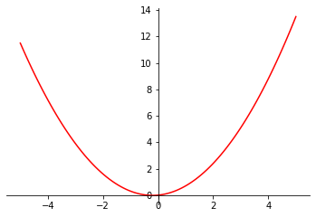
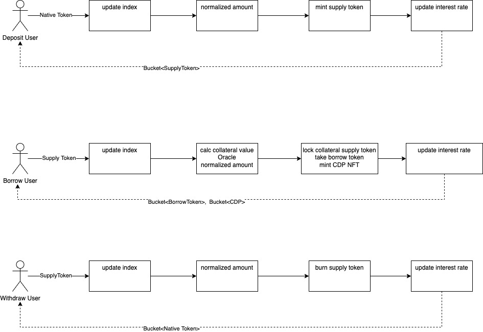

DeXian Lending Protocol
========================

DeXian is a decentralised lending protocol built on RadixDLT, which takes full advantage of the Scrypto features of asset-oriented programming.

## External environment or dependence
#### Clock system

Interest is a time-dependent variable, and since there is no precise clock system in the distributed ledger, the granularity of time variation is currently used as “epoch” for the time being. Each “epoch” is counted in 35 minutes, giving a total of about 35017 epochs in one year, and a more precise time Oracle will need to be considered in the future.

#### Price Oracle

The price of digital assets is characterised by high volatility, therefore a reasonable and appropriate Oracle can provide a more stable, scientific and fair environment for lending protocol, and furthermore maintain the system more robustly. The project is only quoting a price reference now, and the implementation mechanism needs to be introduced in the future according to the actual demand.

## Base Components and Interest Rate Models
#### General Interest Rate Model
 
The default digital asset interest rate model, which updates linearly and dynamically with the `borrow ratio`.



#### Stable Coin Interest Rate Model
Represented by digital stable coins (like `DAI`, `USDC` and `USDT`), which are relatively stable in price and value, more liquid and less responsive to changes in `borrow ratio`.


## Asset layer
#### dxToken
It is a token (e.g. `dxXRD`) issued to users after they have deposited certain asset (e.g. `XRD`) to the protocol, which is equivalent to a deposit certificate.

#### CDP
It is an abbreviation for Collateral Debt Position. When a user uses `dxXRD` as collateral to borrow another asset (e.g. `USDT`) from the protocol, the user not only receives the borrowed asset (e.g. `USDT`), but also the NFT of the `CDP`, which records the details of this borrowing, such as the borrowed asset, the collateral asset, etc.

## Status Layer 
####  Index

Over time, both borrowed and deposited assets generate interest, which is incrementally added to the index through borrow and deposit interest rates and simultaneous time changes.

#### Interest Rates

The user’s actions of depositing, borrowing, repaying and withdrawing money will change the `borrow ratio`, which will lead to an update of the interest rate.


## Systematic Health Care Layer

If the `borrowed asset value/collateral asset value` reaches a pre-determined upper limit of the collateral asset during the price fluctuation of the borrowed asset or collateral asset, the CDP will reach a `liquidation` status. In this status, anyone can repay the borrowed asset and obtain the equivalent value of the collateral asset at a discount.

## work flow




## Build & Run

* Environment preparation and reset.
* Create 4 accounts

| name    | usage                                   |
| ------- | --------------------------------------- |
| admin   | Used to deploy the contract.            |
| p1      | supply XRD, debit usdt, usdc assets     |
| p2      | usdt deposit user                       |
| p3      | usdc deposit user                       |

*  Issue usdc,usdt tokens and distribute them to the corresponding users.


```shell
scrypto build
resim reset
result=$(resim new-account)
export admin=$(echo $result|grep "Account component address: "|awk -F ": " '{print $2}'|awk -F " " '{print $1}')
export admin_priv=$(echo $result|grep "Private key:" |awk -F "Private key: " '{print $2}')
result=$(resim new-account)
export p1=$(echo $result|grep "Account component address: "|awk -F ": " '{print $2}'|awk -F " " '{print $1}')
export p1_priv=$(echo $result|grep "Private key:" |awk -F "Private key: " '{print $2}')
result=$(resim new-account)
export p2=$(echo $result|grep "Account component address: "|awk -F ": " '{print $2}'|awk -F " " '{print $1}')
export p2_priv=$(echo $result|grep "Private key:" |awk -F "Private key: " '{print $2}')
result=$(resim new-account)
export p3=$(echo $result|grep "Account component address: "|awk -F ": " '{print $2}'|awk -F " " '{print $1}')
export p3_priv=$(echo $result|grep "Private key:" |awk -F "Private key: " '{print $2}')

result=$(resim new-token-fixed --symbol=USDT 1000000)
# export usdt=$(echo $result | grep "Resource:" | awk -F " " '{print $3}')
export usdt=$(echo $result | grep "Resource:" | awk -F "Resource: " '{print $2}')
result=$(resim new-token-fixed --symbol=USDC 1000000)
# export usdc=$(echo $result | grep "Resource:" | awk -F " " '{print $3}')
export usdc=$(echo $result | grep "Resource:" | awk -F "Resource: " '{print $2}')

resim transfer 100000 $usdt $p2
resim transfer 100000 $usdc $p3
resim transfer 200 $usdt $p1
resim transfer 200 $usdc $p1
```


* Deploy interest rate models, 
* Deploy price oracle and set asset prices (using XRD as quotes)
```
result=$(resim publish ".")
export pkg=$(echo $result | awk -F ": " '{print $2}')

result=$(resim call-function $pkg DefaultInterestModel "new")
export def_interest_model=$(echo $result | grep "Component: "| awk -F "Component: " '{print $2}' | awk -F " " '{print $1}')

result=$(resim call-function $pkg StableInterestModel "new")
export stable_interest_model=$(echo $result | grep "Component: "| awk -F "Component: " '{print $2}' | awk -F " " '{print $1}')

result=$(resim call-function $pkg PriceOracle "new" $usdt 16.66666666 $usdc 16.39344262)
export oracle=$(echo $result | grep "Component: "| awk -F "Component: " '{print $2}' | awk -F " " '{print $1}')
```

* Deploy lending protocol component
* parse admin badge & CDP resource address
```
result=$(resim call-function $pkg LendingPool "instantiate_asset_pool" $oracle)
export component=$(echo $result | grep "Component: "| awk -F "Component: " '{print $2}' | awk -F " " '{print $1}')
# export admin_badge=$(echo $result | grep "Resource: " | awk -F "Resource: " '{if (NR==1) print $2}')

export admin_badge=$(echo $result | grep "Resource: " | awk -F "Resource: " '{if (NR==1) print $2}' | awk -F " " '{print $1}')
export cdp=$(echo $result | grep "Resource: " | awk -F "Resource: " '{if (NR==1) print $4}')
# export cdp=$(echo $result | grep "Resource: " | awk -F "Resource: " '{if (NR==3) print $2}')
```


* Create a new asset type in the lending protocol: `XRD`, `USDT`，`USDC`
* parse `dxToken`，such as `dxXRD`, `dxUSDT`，`dxUSDC`
```
export xrd=030000000000000000000000000000000000000000000000000004
result=$(resim run ./transactions/new_pool_def.rtm)
export dx_xrd=$(echo $result | grep "Resource: " | awk -F "Resource: " '{if (NR==1) print $2}' | awk -F " " '{print $1}')
result=$(resim run ./transactions/new_usdt_stable.rtm)
export dx_usdt=$(echo $result | grep "Resource: " | awk -F "Resource: " '{if (NR==1) print $2}' | awk -F " " '{print $1}')
result=$(resim run -t ./transactions/new_usdc_stable.rtm)
export dx_usdc=$(echo $result | grep "Resource: " | awk -F "Resource: " '{if (NR==1) print $2}' | awk -F " " '{print $1}')
```

#### Asset Risk Parameter
|  Symbol  |  Collateral  |  Loan To Value  |  Liquidation Threshold   |  Liquidation Bonus   | Insurance Ratio | Interest Model          |
| -------- | ------------ | --------------- | ------------------------ | -------------------- | --------------- | ----------------------- |
| XRD      | Yes          | 60%             | 70%                      |  7%                  |  25%            | Default Interest model  |
| USDT     | No           |                 |                          |                      |  10%            | Stable Interest model   | 
| USDC     | Yes          | 85%             | 87%                      |  2%                  |  10%            | Stable Interest model   |


* Deposit to XRD Token Assets
* Deposit to USDT Token Assets
* Deposit to USDC Token Assets
```
# xrd
resim set-default-account $p1 $p1_priv
resim call-method $component 'supply' 20000,$xrd

# usdt
resim set-default-account $p2 $p2_priv
resim call-method $component 'supply' 360,$usdt

# usdc
resim set-default-account $p3 $p3_priv
resim call-method $component 'supply' 360,$usdc
```
You can see the user's asset holdings with `resim show $p1`, for example: `xdXRD`


* Lending USDT, USDC as the p1 user
```
# p1(xrd) borrow 180 usdt
resim set-default-account $p1 $p1_priv
resim call-method $component 'borrow' 10000,$dx_xrd $usdt 180
resim call-method $component 'borrow' 10000,$dx_xrd $usdc 180
```
You can see the user's asset holdings with `resim show $p1`, for example: `USDT`, `USDC` and `CDP`


* Set the time to one year later
* repayment `USDT`
* repayment `USDC`
```
# the xrd price pump
# resim call-method $oracle 'get_price_quote_in_xrd' $usdt
# resim call-method $oracle 'get_price_quote_in_xrd' $usdc
resim call-method $oracle 'set_price_quote_in_xrd' $usdt 1.666666666
resim call-method $oracle 'set_price_quote_in_xrd' $usdc 1.63934426

# after one year 
resim set-current-epoch 15018

resim call-method $component 'repay' "200,$usdt" "#0000000000000001,$cdp"
resim call-method $component 'repay' "200,$usdc" "#0000000000000002,$cdp"
```

* withdraw
```
resim set-default-account $p2 $p2_priv
resim call-method $component 'withdraw' "360,$dx_usdt"

```
You can see the user's asset holdings with `resim show $p2`, for example: `USDT`
