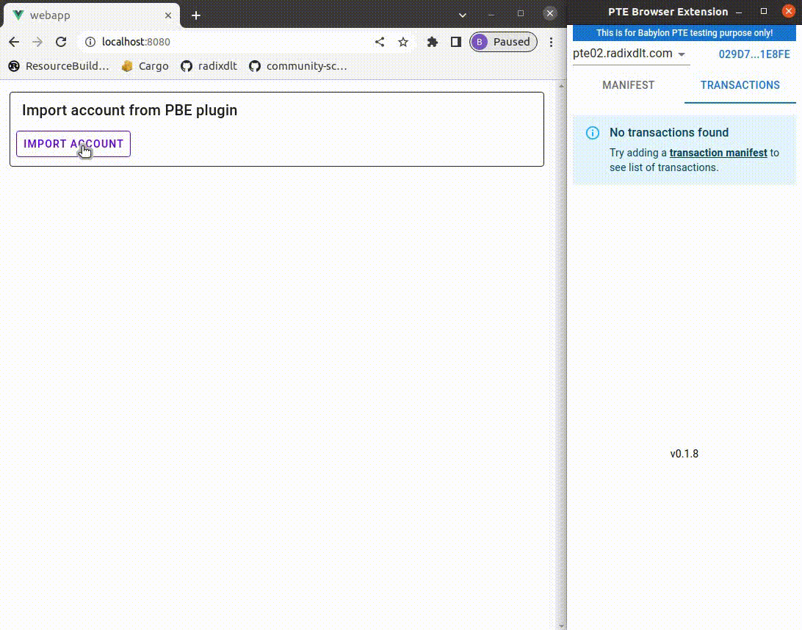

# Lendi - Lending Platform

## Description

Decentralized Lending Platform build on Radix using Scrypto and Vue3

## Demo
### User Experience

### Admin Experience

## Features
- Create a Lendi component (blueprint instance)
- Add assets/tokens to the platform using an admin badge
- Create accounts on the lending platform
- Deposit multiple types of assets/tokens as 'deposits'
- Withdraw deposited assets
- Borrow against deposited assets
- Repay loans

## Directories

- `scrypto`
    - Scrypo blueprint
- `webapp`
    - User interface for Lendi
    - Vue3 Web Application
    - Utilizes Vuetify3

## Usage

Each directory has their own README.md detailing how to use each piece of the application