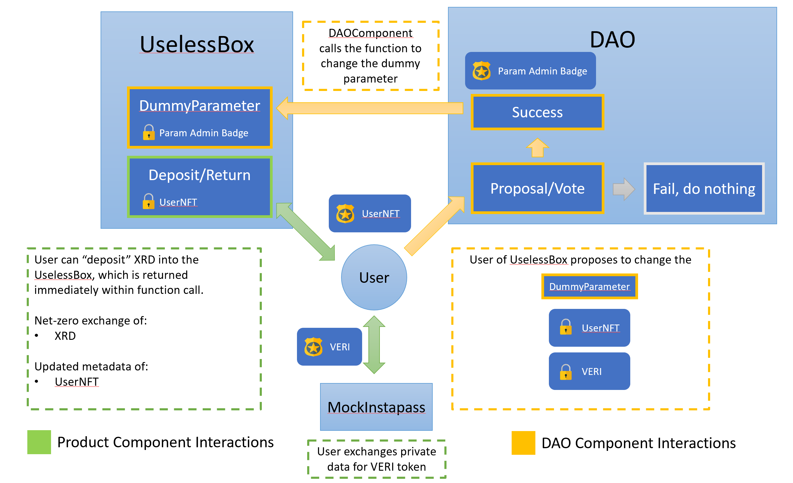

# DAOComponent
An incomplete entry into the DAO Scrypto Challenge from RadixWorks. Took on more 
than I could chew but nevertheless a satisfying learning experience. 

Shoutout to Clement and Jake for Discord help during this learning process. 

## For judges:
Incomplete aspects of the entry: 

1) Alphanet frontend (barely started)
2) Voting mechanism (Proposal and Voting, Vote token distribution)
3) DAO is mainly a shell :(

### Testing in resim 
Inside `scrypto` folder,  run `. run_smoke_test.sh` for local simulator interaction testing.

## Package Design Description 

I approached the design of the DAO with a simple case in which a component needs 
one of its parameters changed. 

The design intention is demonstrated in the figure above, using 3 separate components: 
- UselessBox: 
    - has method `deposit` that allows user to deposit `$XRD` but returns it directly to user after function call (like a real-world useless box)
    - dispenses `$UserNFT` to users (each user can only have 1 per account)
    - records aggregated usage of component  
    - records individual usage of component on updateable metadata inside `$UserNFT`
    - the separation of aggregated and individual usage measures allows computation of 
    usage share of the component which can be optionally used to distribute voting 
    tokens according to stakeholder weightage.
- MockInstapass: 
    - Dispenses `$VERI` token after an arbitrary proof-of-person process. 
    - A "mocked" way to eliminate Sybil attacks. 
- DAOComponent: 
    - (ACCESS RULES FAILURE) can call a "proposal" function to manipulate the UselessBox component that it is in charge of. 
    - (NOT IMPLEMENTED): Can leverage `$UserNFT` token metadata to 
    dispense  
    - in general not implemented yet 

### Conceptual Issues I Considered: 
- Not all votes are alike, different decisions have different stakeholders. In 
terms of achieving an issue resolution via voting, a generic component DAO 
should offer the capability to:
    1) propose different types of votes (initial stage) 
    2) vote settings evolution based on vote results (stakeholder weightage, voting type, new poll for options)
- Active users of a component/product/platform should naturally have more vote 
weightage in certain cases. However, existing approaches via governance tokens 
leave much to be desired (purchaseable and transferrable), and impose a 
preference on the usage of the component for token accumulation (i.e., passive stakers 
accumulate governance tokens and overpower active traders in a vote on trading 
fees).

## Some Problems I Faced (Unsolved)
### 1) Verifying a 1st time caller to a component
I wanted to issue an NFT/Badge with updateable metadata (for usage analytics) only to 1st time users, very similar to real world (USA) grocery store membership cards but encountered difficulties to check if user already has no NFT/Badge. 

This required either: 
- probing into caller's wallet to check for presence of the resource (bad pattern)
- ProofOfAbsence of said resource. 

The latter is currently impossible as `create_proof` panics if the probed resource is absent. I couldn't quite overcome this, so conceptually introduced 2 methods:

- `fn use_component_method(proof)` - (Restricted access - only 1 UserNFT) 
- `fn register_new_user`: (Unrestricted access) register as new user and get 1 UserNFT, a user could do this infinitely.

I thought of adding an additional "`merge_nfts`" method to combine user data 
across different wallets, however, updating historical/sequential data 
(i.e., user count) would also mean recalling other user nfts - too much of a book-keeping
mess.

When used in tandem with a non-transferrable token, a ProofOfAbsence would eliminate the need for combining NFT data via `merge_nfts` since the `register_new_user` would be able to detect if a wallet already has an existing NFT for a recurring user.