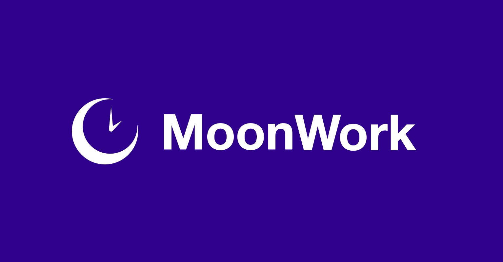

# MoonWork - Decentralised Freelancer Platform



## Whats The Problem and Usecase?
Freelancer platforms have been very popular allowing people to work from anywhere and likewise for those that want work done quickly, freelancer platforms are a quick solution.
Lets imagine some work was done for a project but in the end, the client refused to pay out.
This is an all too common problem we have. What if, as a contractor, you were also judged unfairly due to external reasons.
Reviews are also hard to completely judge on your own, can be spoofed, made up etc. This presents a few problems with freelancer platforms.
Now lets have a look at what use cases NFTs would have in this space for what `MoonWork` provides.

## Why use NFTs and Decentralise Freelancer Platforms?
NFTs (in my opinion) are the perfect use case for this, the advantages of using these are:
1. Transparency - NFTs are public resources anyone can look into the ledger for.
2. Verification - You can verify NFT metadata by verifying resource NFTs (more on this later).
3. Immutability - NFTs can have some fields completely immutable and others mutable, this gives us confidence metadata is not able to be changed.

## What is MoonWork?
Taking the features above, what `MoonWork` does are the following, split by contractors, clients and disputes and the use of NFTs:

### Contractors
1. User registers as a contractor and receives a Contractor NFT which represents their MoonWork identity
2. Newly registered contractors also get a ContractorAccolades NFT. Which all contractors get initially

When work gets completed, the following happens:
1. For every successfully created work, a contractor's total worth increases, their Contractor NFT gets updated
2. Contractors get rewarded a `WorkCompleted` NFT minted and is a **souldbound** NFT
3. For every 10 `WorkCompleted`, Contractor gets a new `ContractorAccolades` NFT minted with all work non fungible id they completed to achieve it
4. You can verify a Contractor's work by looking at their wallet balance for `WorkCompleted` and `ContractorAccolades` and verify the jobs completed matches the corresponding resources

When a dispute occurs and is completed:
1. Contractors will get a `DisputeOutcome` NFT
2. Contractor NFT also gets updated with the number of disputes they've been involved in
3. In the same way, we can also verify the number of disputes by verifying it matches the balance of their `DisputeOutcome` NFT

### Clients
1. User registers as a client.
2. Clients can create new work based on a category (Development & IT, Accounting & Finance etc.)
3. Contractors then request to take a Client's work
4. Client then accepts a Contractor they wish to work with
5. For a completed work, the Client's identity gets updated alongside the work they raised

When a dispute occurs and is completed:

1. Clients will get a `DisputeOutcome` NFT
2. Client NFT also gets updated with the number of disputes
3. In the same way, we can also verify the number of disputes by verifying it matches the balance of their `DisputeOutcome` NFT

### Dispute System
1. A dispute is created with a participant criteria. In this case, for MoonWork, we have specific criteria:
    1. Participant limit - this is a limit of `Client` **AND** `Contractor` that can join and decide a dispute. For example, if participant limit is 2, we allow 2 clients and 2 contractors to join and decide a dispute
    2. Client criteria - this is a criteria a client has to meet, in this case, the number of jobs paid out
    3. Contractor criteria - this is a criteria a contractor has to meet, in this case, the number of jobs completed

2. Either a Client or Contractor can raise a dispute for work that has been assigned to them.
    1. Disputes can be cancelled by the one who raised it
3. The client and contractor present their case by submitting `DisputeDocument` NFT which is viewable to the public. Its at their discretion to censor private information from documents.
4. Participants join and decide based on the documents submitted
5. Disputes can be completed if either:
    1. The time has expired and there is a majority vote
    2. If the majority vote has been given with participant limit reached
6. In cases where both those conditions above do not apply, i.e. an undecided decision due to split votes, the admin then takes over and has final decision

### Promotion System
This is a promotion system for contractors, where given their efforts of using the platform, they can, for a period of time,
promote themselves which would appear on a "recommended" section on a frontend. 
The purpose of this system is really to show off the utility of the NFTs as a result of work being completed. 
The WorkCompleted and ContractorAccolades NFTs form the contractor's identity.

### Enough Talk! I Want To See It In Action!

#### Work Scenario - Completed Work
Run through a happy path for work raised which does the following:
- Creates the MoonWork service as an Admin
- Registers an account as a Contractor
- Registers an account as a Client
- Creates a bunch of work categories as an Admin
- Client creates a bunch of work in each cateogry as a Client
- Contractor requests for said work raised by Client
- Client accepts contractor for work
- Client & Contractor accept to finish work
- Finally Contractor can claim their compensation

```bash
resim reset
source ./transactions/run_full_flow.sh
```

#### Dispute Scenario - Completed Dispute
Run through disputes being completed successfully. The above steps must be run for disputes flow to work correctly:
- Creates a dispute as a Client
- Contractor and client submits documents
- Other contractors and clients join and decide on the dispute
- Majority vote is given and the dispute is completed as a Contractor

```bash
source ./transactions/dispute/run_full_flow.sh
```

#### Promotion Scenario - Promote Contractor
Once again, like the above, run the Work Scenario first before running promotion flow:
- Creates a promotion service as an admin
- Contractor promotes themselves as a Contractor
- Sets epoch and removes expired promotion

```bash
source ./transactions/promotion/run_full_flow.sh
```

### Thats Great, What About Alternative Cases?

We got you covered on this front luckily! So this is easy to test, instead of messing around with a bunch of bash environment variables, just run tests instead!

**Spoiler, there are 52 integration tests in total :D**

#### Running Tests
```
scrypto test
```

## Read Documentation
You can generate docs by running:

Install http and run a local server that serves the docs locally:
```
cargo install https
cargo doc && target/doc
```
### Components

1. <a href="http://localhost:8000/moonwork/moonwork/MoonWorkService_impl/struct.MoonWorkService.html" target="_blank">MoonWorkService</a>
2. <a href="http://localhost:8000/moonwork/work/WorkService_impl/struct.WorkService.html" target="_blank">WorkService</a>
3. <a href="http://localhost:8000/moonwork/dispute/DisputeService_impl/struct.DisputeService.html" target="_blank">DisputeService</a>
4. <a href="http://localhost:8000/moonwork/promotion/PromotionService_impl/struct.PromotionService.html" target="_blank">PromotionService</a>
