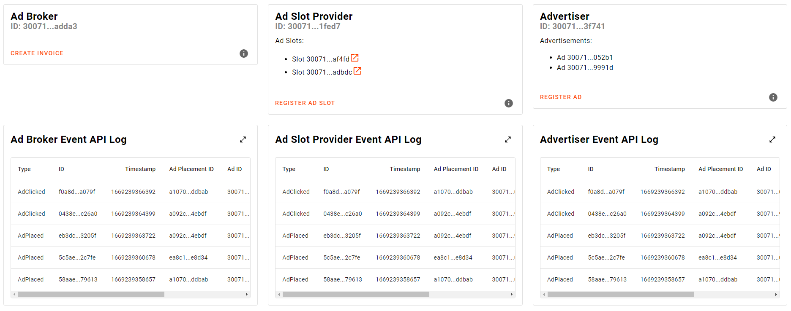

# RadSense

RadSense is a proof of concept (PoC) for a decentralised version of Google's
[AdSense](https://de.wikipedia.org/wiki/Google_AdSense). It brings together *advertisers*, people that have a product or
service to advertise, with *ad slot providers*, people who have a website on which advertisements may be displayed.
A third group of users called *ad brokers* takes on the important task of matching up the *ads* of *advertisers* with
the *ad slots* of *ad slot providers*. They do this by selecting which advertisements are to be displayed in which ad
slots. Advertisers incur a cost every time on of their ads is clicked. Ad slot providers earn money every time an ad
that is displayed in one of their slots is clicked. Finally, ad brokers are also paid a percentage for every ad
clicked, as they provide an absolutely vital service to the platform. Very importantly the RadSense platform allows the
settling of all payments between advertisers, ad slot providers and ad brokers on the network.

# Caveats

As a PoC, the feature set is obviously much smaller of what the original AdSense service offers to its user. Many
concepts have been simplified or omitted and while AdSense features a quite involved bidding mechanism that takes into
account the cost per click (CPC) and the click-through-rate (CTR) of an ad, RadSense uses a much simpler approach where
users can only set a CPC for an ad and ad brokers then have to decide how to prioritise ads at their own discretion.

# NFRs (NFTs)

RadSense is the entry to the Scrypto NFT Challenge and as such features NFTs in some prominent places of its
architecture. While the term NFT broadly refers to any kind of non-fungible token, it is now mostly used in the context
of art that is represented by a token on-chain. A term that is historically less burned is that of a non-fungible
resource (NFR). This term will be used in lieu of NTFs throughout this document and the code base.

## Ad

Every ad on the RadSense platform is represented by a NFR that (among some other fields) has a media item (i.e. link to
an image or video), an url to where users should be directed when clicking the ad and some size constraints that
describe the size and shape of the ad. It also has tags, describing its content (e.g. finance, blockchain, bitcoin), a
cost per click (CPC) and a cost budget. Additionally, the NFR has a field for one single ad broker who is allowed to
handle this ad and assign it to ad slots.
Advertisers can publish new ads by simply calling a single method that creates a new ad NFR. The NFR is returned to the
advertiser who created it and can be used when interacting with RadSense, e.g. when increasing the budget for the ad.

## Ad Slots

Similar to ads, ad slots are also represented as NFRs. Broadly speaking, an ad slot is any identifiable space on a
website where ads may be displayed. Ad slots have a set of tags that describe the content of their surrounding website
(e.g. news, finance, crypto) and some size constraints that indicate which ads can be placed inside them. Additionally,
every ad slot stores a list of ad brokers that are allowed to place ads inside it.  
Ad slots are also created by calling a single method on the RadSense component.

## Users

Every user of RadSense is represented by a unique NFR. For all three kinds of users this NFR stores whether a user is
KYCed (which can increases a user's trust level in the eyes of other users). Additionally, depending on a user's role,
some further information is stored.

### Ad Brokers

Ad brokers have the important task of bringing together advertisers and ad slot providers. They have to decide which ad
should be displayed in which ad slot. They also have to track the costs and revenues that are generated by ads and ad
slots respectively and publish invoices which can then be settled on the network.

For each ad broker the user NFR stores:

- `broker_api_url`: An URL pointing to the broker's operational REST API. This API is invoked every time an ad slot is
  about to be displayed and now needs to know which ad it should render.
- `tracking_api_url`: An URL pointing to the broker's tracking REST API. This API is invoked every time an ad has been
  rendered in an ad slot (i.e. the ad has been placed) or an ad is clicked by a user.
- `fee_ratio`: A value between 0 and 1 that controls how much the broker can claim from the amount that is paid from
  advertisers to ad slot providers for each click on an ad.

### Advertisers

Advertisers are the financiers of RadSense. They pay ad slot providers and ad brokers for the ad space resp. the service
they provide. For each advertiser the user NFR only stores an optional `tracking_api_url`. This is analogous to the
tracking API of ad brokers. Because it is the responsibility of broker to track ad costs and to create invoices, this
field is optional. However, advertisers might still be interested in receiving this data, so that they can verify
invoices and see how their ads perform.

### Ad slot providers

Ad slot providers offer their website (and traffic) to advertisers and allow ad brokers to choose which ads should
be placed on tit. Just as with advertisers, the ad slot provider NFR also stores an optional `tracking_api_url`.

## Invoices

Invoices are created by ad brokers so that advertisers can safely pay the ad slot providers for the ad space they have
provided. Invoices themselves are not represented as NFRs because they are likely too big to be encapsulated in a single
NFR. Given enough users, thousands of ads can be placed in thousands of ad slots, for which the costs and revenues have
to be tracked properly and transparently. Therefore, invoices have been designed as components, which act as a wrapper
for *ad cost items* on the one side of the invoice and *ad slot revenue items* on the other side. Both items are
represented as NFRs.  
Please see the [code documentation](scrypto/src/invoice.rs) for a more in-depth description of invoices.

### Ad Costs

Ad costs make up the one side of an invoice. For every ad that has been clicked, an advertiser must pay a certain amount
of XRD to the ad slot provider in whose ad slot the ad was displayed. Ad brokers must track this cost data, add it up
per ad and then list it in an invoice. They do so, by creating an `AdCost` NFR, which is then stored in a vault of the
invoice component. The NFR has fields that store the ID of the `Ad` NFR, to which the cost item belongs to, the cost
amount and whether the cost item has been confirmed by the advertiser. Advertiser are required to confirm each cost item
on an invoice before the invoice can be settled.

### Ad Slot Revenues

Ad slot revenues make up the other side of an invoice. Here ad brokers must sum up the revenues that have been generated
by the individual ad slots. Having done that, they create a `AdSlotRevenue` NFR and also put that into a vault of the
invoice. This NFR stores the ID of the `AdSlot` NFR it belongs to as well as the revenue amount. Additionally, this NFR
also keeps track of whether the ad slot provider has already claimed their earning.

# Working mechanism

Implementing a decentralised form of advertising on the web comes with many requirements and challenges. Even when
starting out small, possibly thousands of different ads must be displayed on thousands of websites to possibly millions
of visitors. Each advertisement must be carefully chosen to match the content of the websites on which it is about to be
displayed as well as to the interests of the visitor who is going to see it. Running the required matching logic on the
Radix network would be sheer impossible. Furthermore, it is of course unreasonable to expect visitors to sign a
transaction every time an advertisement is to be displayed to them. Many of the visitors may not even be crypto users at
all. Circumventing this problem by assigning ads statically to ad slots would be a very meager solution. It would
make for a weired user experience, where every visitor of a website would see the exact same ad every time, regardless
of their interests.

RadSense overcomes this challenge by having ad brokers as a third party next to advertisers and ad slot providers. Ad
brokers operate off-line (not on ledger) services that are vital for the operation of the platform. They offer a highly
available API that can respond instantly whenever an ad slot is about to be rendered and an ad must be chosen to be
displayed to a website visitor. It is at the sole discretion of the ad broker which ad they assign to an ad slot, but
it is of course in their best interest to choose one that is likely to be clicked. After all, they are paid a
percentage for every ad that is clicked and nothing if an ad is only displayed but never clicked.

## How an ad slot is registered and placed on a website

Registering an ad slot and getting it to display on a website only requires two easy to perform steps by an ad slot
provider:

1. First, the ad slot provider has to register the ad slot as an `AdSlot` NFR with the RadSense component by calling the
   appropriate method. They must supply all the relevant data, i.e. the slots tags (e.g. finance, news, etc.) and the
   slots size constraints, as it makes quite the difference whether the slot is a horizontal banner on top of a website
   of a vertical column on the side.
2. Next, the ad slot provider must embed an `AdSlotWebComponent` on their page in the appropriate place and link this
   to the `AdSlot` NFR. This is achieved by simply initializing the `AdSlotWebComponent` with the
   NFRs `NonFungibleAddress` (or equivalently it's resource address + non fungible id). The `AdSlotWebComponent` would
   be a pre-made component that is published to a registry (e.g. the npm registry) for everyone to use.

## How an ad slot is rendered

The `AdSlotWebComponent` performs the following steps when it is rendered in the browser of a website visitor. It only
requires interaction with a Gateway of the Radix Network and with the operational API and the tracking API of the ad
broker. It can also interact with the tracking APIs of the advertiser whose ad is being displayed and the ad slot
provider in whose slot the ad is rendered but this is strictly optional.

1. The `AdSlotWebComponent` loads the data of its associated `AdSlot` NFR from the Radix network Gateway. It also loads
   the data of the associated ad slot provider and then the data of one of the ad brokers that are allowed to serve the
   ad slot. This data contains the broker's operational API URL.
2. The component calls the broker's operational API and requests an ad for the slot. It sends the slot's ID and also a
   tracking cookie that identifies the user.
3. It receives the ID of an `Ad` NFR as a response and loads the data of this NFR via the Radix network gateway.
4. It takes the data of the `Ad` NFR (e.g. the URL of the media, which should be rendered and the URL of to the page to
   which the visitor should be redirected upon clicking the ad) and renders the ad accordingly.
5. It sends an event to the tracking API of the ad broker indicating that the event has been placed. It sends the same
   event to the tracking APIs of the advertiser and ad slot provider if they have provided one.
6. If the ad is clicked, the `AdSlotWebComponent` sends an event to the tracking API of the ad broker. It sends the same
   event to the tracking APIs of the advertiser and ad slot provider if they have provided one.

## How an ad is registered

Registering an ad is simple and only requires that an advertiser registers an `Ad` NFR with the RadSense component by
calling the appropriate method. The advertiser of course has to make sure that the media they have linked in the NFR is
always available, as it is not stored on chain.

## Incentive structure and freedom of choice

One of the central guiding principles of RadSense is, to give all users a free choice who to work/interact with.
Advertiser must choose a single broker per ad, who then handles it, but they can choose different brokers for different
ads. If a broker does not perform well (an ad e.g. doesn't generate a lot of site visits), advertisers can easily choose
another broker for another ad.

Ad slot providers can allow multiple brokers to serve each of their slots. If a broker does not work in the best
interest of the ad slot provider e.g. by displaying ads with NSFW content on a family friendly site, the ad slot
provider can move away from that broker and offer their slots to other brokers who behave appropriately.

Finally, ad brokers can also decide to deny service to ad slot providers or advertisers if they are acting
maliciously. For example, if an ad slot provider generates fake clicks on their own ad slots, brokers must be able to
detect such behavior and prevent it. If they don't, advertisers that are now being defrauded, will move on to brokers
who offer them better protections.
It seems logical that ad brokers are going to build a database of all ad slots (and their surrounding websites), all ads
and all users they are serving. This data will help them to identify good and bad actors and last but not least to
provide good and targeted ad placements.

## Dealing with conflict

As described above, RadSense is built around a positive incentive structure. It also employs an optimistic strategy when
handling the transfer of payments from advertisers to ad slot providers. This is described in greater detail in the code
documentation of the [Invoice component](scrypto/src/invoice.rs). Nevertheless, conflict will be unavoidable. For this
reason RadSense uses an arbitration DAO that springs into action whenever a broker's invoice is being disputed by any of
the involved users. The members of this DAO (called arbitrators) have to check every invoice that is being disputed and
give a verdict to either reject or approve the invoice. In the current design there is no incentive for arbitrators to
provide their services. Instead, it is assumed that arbitrators do this work nonsalaried.

The arbitration DAO is built using [dao-kit](https://github.com/radixdlt/scrypto-challenges/tree/main/5-DAO/dao-kit)
from the last Scrypto challenge. I would have loved to use the `import!` macro, but sadly it still contains a bug which
forced me to copy the code over to this project.

# Alphanet demo

To prove the viability of the above described design/working mechanism I created a small [demo frontend](alphanet-demo).
This demo also contains an implementation prototype of the above-mentioned `AdSlotWebComponent`. While I did not
implement it as a proper web component but rather as a simple svelte component, it is still conceptually self-sufficient
and does not need to be served from a web server.

The demo frontend enables a user to

- instantiate a new RadSense component
- register an ad broker, an ad slot provider and an advertiser
- register ad slots for the ad slot provider (including specifying their constraints)
- register ads for the advertiser (including specifying an image to be displayed as well as a URL to a landing page)
- open up a demo page on which ad slots are rendered. If the ads that are rendered in the slots are clicked, an event is
  sent to mocks of the tracking APIs of all users. These events are also displayed in the front end.

