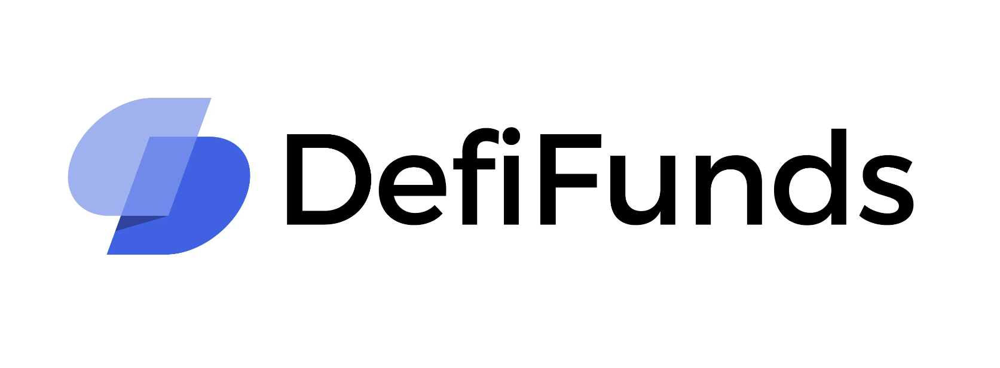

# DefiFunds on Betanet V2

DefiFunds is a decentralized application focused on providing a straightforward and secure way for users to invest in cryptocurrency funds. The primary goal is to streamline the process of investing in decentralized finance by connecting individuals with skilled fund managers. Currently, investing in cryptocurrency can be a challenging and complex process. DefiFunds aims to simplify this aspect, making it easier for everyone to participate in the world of decentralized finance.

### Key features of DefiFunds:
1. Effortless Investing: 
A user-friendly platform that allows users to easily invest in a fund without needing to trade themselves, leveraging the expertise of experienced fund managers to handle the trading process.
2. Trustless System:
Assets are securely held in a vault protected by a smart contract. The smart contract ensures that only the investor has the ability to withdraw their share of the fund. No one else, including the fund manager and the creators of DefiFunds, are able to withdraw that share of the fund.

The dapp is currently under development, and as a result, the user interface is very poor when testing. To get a glimpse of the intended final design, visit this [link](https://www.figma.com/file/dxSKJUxvfyQ3e2wKqYOtJT/Tobias_eth?node-id=0%3A1&t=imOUxtVIg1waaQtM-1). 

DefiFunds is also being developed as a part of my master's thesis, with the goal of having it ready for use when smart contracts go live on mainnet. Last semester I wrote about this dapp in my specialization project, which you can find by following this [link](https://github.com/tobben1998/scrypto/blob/master/defi_fund/DefiFunds_-_A_proof_of_concept_Dapp_built_on_Radix.pdf)

# Test DefiFunds locally
## Pre-requisites

1. Node >= 12.17.0
2. The Betanet wallet & Radix-connector browser extension installed. Instructions [here](https://docs-babylon.radixdlt.com/main/getting-started-developers/wallet-and-connector.html)

## Interacting with DeFiFunds

1. Clone this github repo
2. In a terminal go to the to the "DefiFunds" folder
3. Install the npm dependencies: `npm install`
4. Start the local server with `npm start`
5. Open up your browser at the provided url if it doesn't open automatically.
6. Make sure you created an account on the wallet and added funds via the faucet by clicking on account name and then the three dots a button to get XRD from faucet should open.
7. Click on the connect button to fetch your wallet address. Confirm login with your phone. You should see your address appearing. (If you don't see the connect button try refreshing the page.)
8. You can now start testing the different functions and methods on the blueprint

## The Basics

### New Fund

If you want to test being a fund manager, you can create a new fund using the new Fund method. Fill in the fields, and press the Create Fund button.

### Choose what fund you interact on

Scroll down to "Get Funds in DefiFunds". Press the get button to see all the created funds.
Select the fund you want to interact on by setting Fund, FundManger and Sharetoken.

### Trade Beakerfi

This method is only for the fund manager. When you use this method you will trade with the tokens in the fund.
Select the amount you want to trade. The token you want to trade from, and the pool you want to trade with. You will trade using the pools from beaker.fi

### Deposit tokens to fund

If you want to buy part of a fund you can call this method. The method will buy up tokens equal to the ratio in the fund using beaker.fi, and deposit those tokens into the fund.
You will receive sharetokens in return.

### Withdraw tokens from fund

When you want to sell your share of the fund you can use this method. By calling this method you will take out your share of all the different tokens in the fund, and then use beaker.fi to swap those tokens into the specific token you want.
