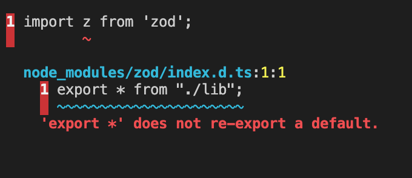

# What is RadInsurance ?

RadInsurance is a simplified version of a decentralized insurance protocol. The objective of this protocol is to improve the implementation of insurance by providing a more robust protocol in the future. The simplified protocol has several features that are explained in details.

Firstly, the protocol involves insurers investing in an insurance policy and being rewarded based on the contributions made by the insured. The rate of reward for insurers is equal to the rate of contributions made by the insured. This means that the more the insured contribute, the more the insurers will be rewarded.

Secondly, the maximum coverage for the insurance policy is equal to the amount invested by insurers. This means that the coverage provided by the insurance policy is directly proportional to the investment made by the insurers.

Thirdly, insurers cannot withdraw their investment but can sell it on the marketplace of insurers in case of liquidity needs. This provides flexibility to insurers who might need liquidity in the future.

Lastly, fixed service fees are deducted during the investment of insurers and the subscription of the insured. 

In summary, the main idea is to propose a simplified version of a decentralized insurance protocol that has certain features that can improve the implementation of insurance. These features include rewards for insurers based on contributions made by the insured, a coverage directly proportional to the investment made by the insurers, flexibility for insurers to sell their investment on the marketplace and fixed service fees for both insurers and the insured.

If you are an insurance professionnal or if you have extensive knowledge of insurance topics, feel free to join us, you are welcome to the team ! :smiley:
    

## Quick start

Open a terminal window

Build scrypto project :  
    
    ./scrypto/build.sh

### This application allows to :

An administrator to create an insurance policy : 
    
    cd ./scrypto/rad_insurance/demo && ./create_policy.sh

Anonymous users to invest liquidity in an insurance policy and thus become an insurer : 

    cd ./scrypto/rad_insurance/demo && ./invest_as_insurer.sh

Insurers to withdraw their rewards :
     
    cd ./scrypto/rad_insurance/demo && ./rewards_withdrawal.sh

Anonymous users to subscribe to an insurance policy and thus become insured : 

    cd ./scrypto/rad_insurance/demo && ./subscribe_to_insurance_policy.sh

Insured to report a claim : 

    cd ./scrypto/rad_insurance/demo && ./report_a_claim.sh

The administrator to accept the claim report and allow the insured to withdraw the amount : 

    cd ./scrypto/rad_insurance/demo && ./make_claim_as_accepted.sh

The administrator to refuse the claim report : 

    cd ./scrypto/rad_insurance/demo && ./make_claim_as_refused.sh

Insurers to claim withdraw : 

    cd ./scrypto/rad_insurance/demo && ./claim_withdraw.sh

Insurers to get rewards : 

    cd ./scrypto/rad_insurance/demo && ./get_rewards.sh  

Insurers to withdraw sale amount : 

    cd ./scrypto/rad_insurance/demo && ./withdrawal_sale_amount.sh  

Insurers to buy on marketplace :

    cd ./scrypto/rad_insurance/demo && ./buy_on_marketplace.sh

Insurers to list on marketplace :

    cd ./scrypto/rad_insurance/demo && ./list_on_marketplace.sh  

Insurers to delist on marketplace :

    cd ./scrypto/rad_insurance/demo && ./delist_on_marketplace.sh      

# Run front application

Open a new terminal window 

Go to scrypto-frontend folder and install packages

    cd ./scrypto-frontend && npm install

The frontend application is developed in Angular. You can therefore launch the application with this command :   

    ng serve

Navigate to `http://localhost:4200/`. The application will automatically reload if you change any of the source files.    

##### :warning: We encountered compilation errors from the @radixdlt/radix-dapp-toolkit module
the following error occurs: 
    

The file containing the bug is located in the following path : 
` node_modules/@radixdlt/wallet-sdk/dist/IO/schemas.d.ts`

To fix this error, you can just add the missing braces around `z` in the import :

    import { z } from 'zod';
