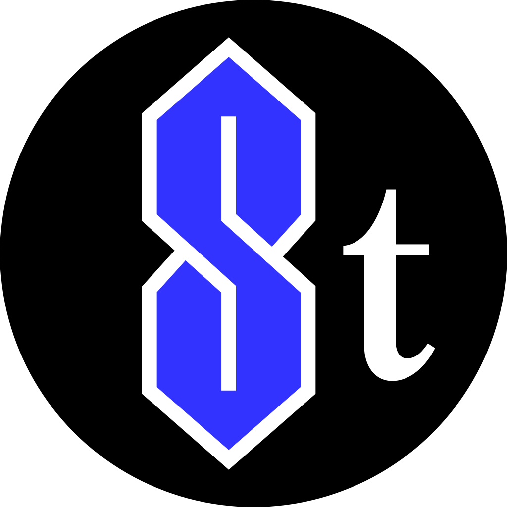
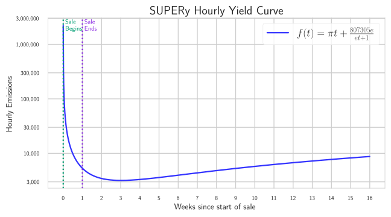
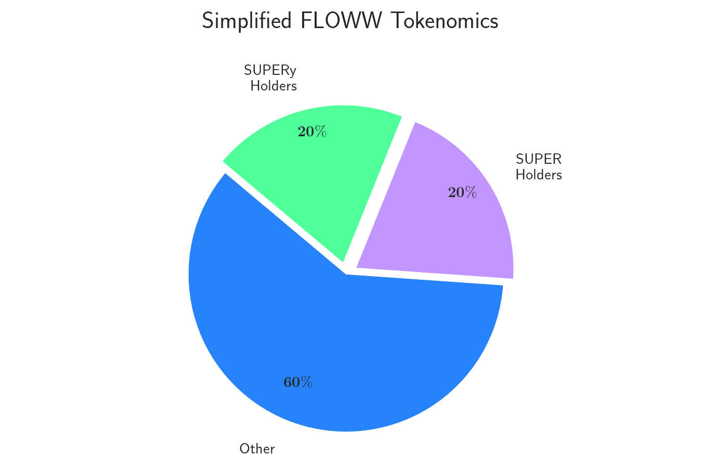

> [!NOTE]
> This document explains the concept of the project.  
> - [How do I run the DApp?](./Website/README.md)
> - [Scrypto Docs](./Smart%20Contract/README.md)
> - [Front End Docs](./Website/Front%20End/README.md)
> - [Back End Docs](./Website/Back%20End/Server/README.md)  

# What is an Initial Yield Offering?
Over the years, raising capital in a decentralized manner has seen many iterations, such as:
* **ICO** (Initial Coin Offering)
* **IEO** (Initial Exchange Offering)
* **IFO** (Initial Farm Offering)

A shortfall with the above is that after the token sale is complete, developers no longer have an incentive to
maintain trust with investors, incentivizing scammers to do whatever they want. The IYO attempts to solve 
this issue by leveraging the capabilities of the Radix Wallet to maintain trust with investors.

Introducing the <tooltip term="IYO">IYO</tooltip>, a unique way for developers to raise capital while simultaneously exposing
early supporters to yield derivatives, the latest invention in decentralized finance.

## Strategy
The strategy for raising capital through an initial yield offering revolves around the idea of
* Opportunity cost
* Establishing trust between users and developers, trustlessly
* Active Yield management strategies

## Participants
The Initial Yield Offering has been built with the following four actors in mind:

> [!IMPORTANT]
> ### Participants / People / You / Users
> A market participant in the initial yield offering
>> - All names used in examples come from the [most common names in the world](https://x.com/TheGlobal_Index/status/1670344326130565121)   
>> - Topics with questions using "I" refers to this group of people

> [!IMPORTANT]
> ### Owner / Developer
> Although the smart contract has only 1 owner, it can be easily configured for [multiple developers](https://github.com/radixdlt/scrypto-examples/blob/5b8454df9b8c80fef92b7bca79733c218be9228b/core/vesting/README.md#L21).

> [!IMPORTANT]
> ### Component
> The Initial Yield Offering component itself, which manages state.

> [!IMPORTANT]
> ### Database Updater
> A bot that works on behalf of the component to keep component state up to date, built with the Radix Engine Toolkit (RET).

## The SUPER Tokens
Super uses 4 tokens, SUPER, SUPERt, SUPERy, and SUPER Yield NFT. All fungible tokens start with an initial supply of 0.

| Token       | Symbol   | Icon                                                             | Type     | Max Supply                               |
|-------------|----------|------------------------------------------------------------------|----------|------------------------------------------|
| SUPER       | SUPER    |      | Fungible | <tooltip term="infinite">**∞**</tooltip> |
| SUPER Trust | SUPERt   |    | Fungible | <tooltip term="infinite">**∞**</tooltip> |
| SUPER Yield | SUPERy   |    | Fungible | 20 Million                               |
| SUPER NFT   | SUPERnft |  | NFT      | **∞**                                    |

## How do I get all the SUPER tokens?
> [!TIP]
> ### Go SUPER
> 1. Open the [DApp](https://www.super.floww.fi) and navigate to _SUPER_ > _BUY_.
> 2. Enter an XRD amount, which will be rounded down to the nearest multiple of 10. For example, 119 XRD rounds to 110 XRD, and 9 XRD is returned to you.
> 3. For every 10 XRD sent, you receive 10 SUPER, 6 SUPERt, and 1 SUPER NFT. Following the above example with 119 XRD, you receive back 9XRD, 110 SUPER, 66 SUPERt and 1 SUPER NFT.

### How do I get SUPERy?
The number of SUPERy you receive is re-calculated every hour and is based on 3 key factors:
* Amount of SUPER purchased
* <tooltip term="hour">Hour</tooltip> of purchase
* <tooltip term="hour">Hour</tooltip> when SUPERy is claimed

When you purchase SUPER, the amount you purchased and the <tooltip term="hour">hour</tooltip> of purchase are recorded
within the DApp and in your SUPER NFT.  
  
### The SUPER NFT
The SUPER NFT contains four metadata fields:

| NFT Metadata Field | Description                                                                                     |
|--------------------|-------------------------------------------------------------------------------------------------|
| ID                 | The ID of the NFT, related to the <tooltip term="second">second</tooltip> the NFT was minted at |
| HOUR_OF_MINT       | <tooltip term="hour">Hour</tooltip> of purchase                                                 |
| N_SUPER_MINTED     | Amount of SUPER purchased                                                                       |
| N_TRUST_MINTED     | Amount of SUPERt purchased should be 60% of N_SUPER_MINTED                                      |

  
    

Yield generates on your SUPER NFT from the hour[^1] of your purchase to the hour[^1] that you claim, or the end of the development period[^2], whichever comes first.

[^1]: The hour since the start of the token sale, if the token sale begins on June 30 at midnight, 1 day later, hour = 24
[^2]: Time over which FLOWW is developed, and yield is generated, FLOWW development period = 16 weeks.
  

The yield generated by your NFT is a function of:
* The fraction of SUPER you purchased to the amount of SUPER all participants purchased
* The yield curve above.
  

#### How do I claim yield?

> [!TIP]
> #### Claim SUPERy
> 1. Open the [DApp](https://www.super.floww.fi) and navigate to _SUPER_ > _MANAGE_.
> 2. Choose the NFT you want to claim yield for.
> 3. Ensure that you have enough SUPERt to claim yield on your chosen NFT. This will be the n_trust_miinted field in your NFT's metadata.
> 4. Press the 'Claim Yield' button. Note: This will exchange your SUPER NFT + SUPERt for the appropriate amount of SUPERy generated.

## How does SUPERt create trust?
The SUPER Trust token leverages 
[Native Pool Blueprints](https://www.radixdlt.com/blog/using-native-pools-and-pool-units-for-intuitive-liquidity-provider-ux) 
to guarantee a partial refund of committed XRD.  
When users purchase SUPER with their XRD, 40% is linearly vested over 16 weeks, while 60% of it is placed in a 
[`OneResourcePool`](https://docs.rs/radix-engine/latest/radix_engine/blueprints/pool/v1/substates/one_resource_pool/index.html).  
  
The amount committed to the `OneResourcePool` is **guaranteed** by the Radix Wallet to return 60% of the XRD you 
originally committed by exchanging your SUPERt against it.  
  
Once the project is complete, you trade your SUPER NFT with its corresponding amount of SUPERt in for SUPERy, 
giving up your claim to the 60% of funds in the pool, signaling your satisfaction with the project's development.  
  
If you aren't satisfied with the project's development, or just want a refund, your refund is guaranteed by the 
Radix Wallet.

## What do I do with my SUPER and SUPERy?
Once the <tooltip term='devPeriod'>development period</tooltip> ends, your SUPER and SUPERy can be excanged for FLOWW.

### FLOWW
You're funding the development of the first decentralized stablecoin on Radix, [FLOWW](FLOWW.md).  
  
40 million FLOWW tokens will be distributed at the end of the **development period** in two pools, which we'll refer to as **FLOWW Pool A** and **FLOWW Pool B**.  

| Pool | # of tokens | Received when   | Burn Exchange Rate |
|------|-------------|-----------------|--------------------|
| A    | 20,000,000  | SUPER is burnt  | Variable           |
| B    | 20,000,000  | SUPERy is burnt | 1 SUPERy : 1 FLOWW |

The above pie chart is simplified to explain FLOWW Pools A and B. For detailed tokenomics information, see [floww tokenomics](FLOWW.md#floww_tokenomics)

By purchasing SUPER during the token sale duration, you automatically qualify to receive tokens from both FLOWW Pool A 
and FlOWW Pool B, provided you keep all the tokens you receive.  
  
_Examples are given at the end._

### How do the FLOWW Pools work?
FLOWW Pools A and B have seperate claim functionality, explained below.

#### FLOWW Pool A
SUPER can only be minted during the 7-day token sale. After this period, no more SUPER can EVER be created.
Each SUPER is assigned a weight to the total and the tokens in Pool A are distributed to everyone as a fraction of the 
SUPER they own.

#### Pool A - Example

1. The following purchase SUPER (S):
   - Moe (M) purchases 10 SUPER - $S_M = 10$
   - Nushi (N) purchases 20 SUPER - $S_N = 20$
   - Jose (J) purchases 30 SUPER - $S_J = 30$
   - Wei (W) purchases 40 SUPER - $S_W = 40$

2. The total SUPER purchased is:
   - $S_{\text{total}} = S_M + S_N + S_J + S_W = 10 + 20 + 30 + 40$
   - $S_{\text{total}} = 100 \text{ SUPER}$

3. Once the token sale ends, each participant's fraction of total SUPER is calculated:
   - Moe: $f_M = \frac{S_M}{S_{\text{total}}} = \frac{10}{100} = 0.1$
  
   - Nushi: $f_N = \frac{S_N}{S_{\text{total}}} = \frac{20}{100} = 0.2$
  
   - Jose: $f_J = \frac{S_J}{S_{\text{total}}} = \frac{30}{100} = 0.3$
  
   - Wei: $f_W = \frac{S_W}{S_{\text{total}}} = \frac{40}{100} = 0.4$

4. Pool A contains 20,000,000 FLOWW (F) so each participant receives:
   - Moe:
  
     $F_M = f_M \times F_{\text{total}} = 0.1 \times 20,000,000$
     
     $F_M = 2,000,000 \text{ FLOWW}$

   - Nushi:
  
     $F_N = f_N \times F_{\text{total}} = 0.2 \times 20,000,000$
     
     $F_N = 4,000,000 \text{ FLOWW}$

   - Jose:
  
     $F_J = f_J \times F_{\text{total}} = 0.3 \times 20,000,000$
     
     $F_J = 6,000,000 \text{ FLOWW}$

   - Wei:
  
     $F_W = f_W \times F_{\text{total}} = 0.4 \times 20,000,000$
     
     $F_W = 8,000,000 \text{ FLOWW}$

#### FLOWW Pool B
The tokens in FLOWW Pool B are exchanged 1:1 against SUPERy; 1 SUPERy = 1 FLOWW from Pool B.

## How do developers access the funds raised?
XRD committed to the token sale are divided into two pools, one, which can be used to fund immediate development, 
and the other, which is accessible to the owner(s) once the development period ends (if users agree).  
  
40% of the funds are released linearly to the developer over the <tooltip term='devPeriod'>development period</tooltip> 
while the other 60% are placed in a `OneResourcePool`, and SUPERt is minted against them.  
  
Developers can only access the XRD in the `OneResourcePool` if users choose to redeem their NFT and SUPERt for SUPERy. 
For more details, see the [SUPERt explanation](Understand_IYO.md#super_trust_explanation).