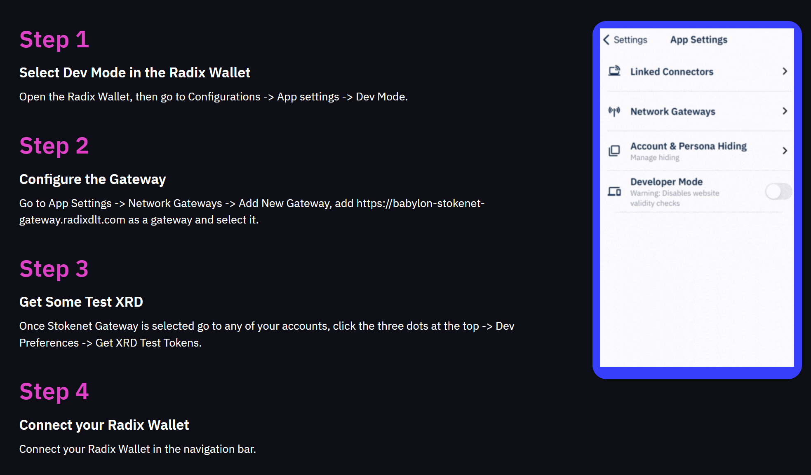
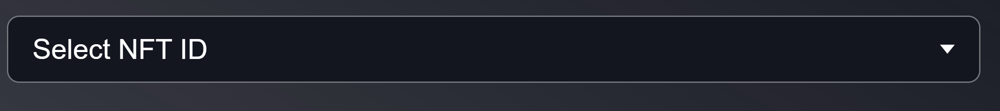
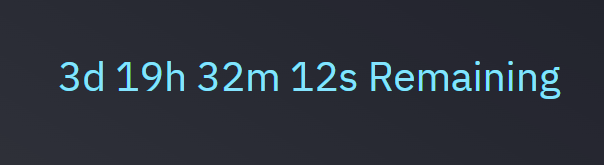

> [!NOTE]
> This is documentation for the frontend, of the SUPER DApp
> - [How do I run the DApp?](Website%2FREADME.md)
> - [What are you making?](Smart%20Contract%2FREADME.md)
> - [Scrypto Docs](Smart%20Contract%2FREADME.md)
> - [Front End Docs](Website%2FFront%20End%2FREADME.md)

# SUPER Frontend (Vanilla React + Vite)

This frontend uses the ReactJS template provided [here](https://github.com/radixdlt/official-examples/tree/main/getting-started/react-js-dapp).
It utilizes the Radix dApp Toolkit to interact with the Radix Ledger via the Gateway API and the Radix Wallet. It also uses an express backend to
store data for faster fetching as opposed to relying entirely on the GatewayAPI.

In the `react-js-dapp` directory: run `npm install` to install the dependencies
and then `npm run dev` to start the development server.

## What is Included

- `index.html` - The main HTML file for the dApp.
- `src/index.jsx` - The main JS file where the React app is initialized and the
  root component `src/App.jsx` is mounted to the DOM.
- `src/App.jsx` - The root component that holds other components
- `src/App.css` - The main CSS file for the dApp.
- `src/pages/` - Pages folder (combinations of different `sections`)
- `src/sections/` - Sections folder (combinations of different `components`)
- `src/components/` - Components folder
- `src/hooks/` - Hooks folder
- `src/manifests/` - Manifests folder
- `src/api/` - API folder (for communicating with backend)
- `src/context/` - Contexts and providers for various things

The project is bootstrapped with a React JS Vite project. This gives you a hot
reload development server out of the box and we add the preconfigured Radix dApp
toolkit, a walk through demonstrating how to set the Radix Wallet for Dev mode,
and a pre-deployed scrypto component to interact with on stokenet (the Radix
Public Test Network).

## `index.html`

It functions as the primary entry point when the application is loaded in a
browser. This file is crucial for setting up the basic structure of the
application.

For styling purposes, `index.html` includes links to Google Fonts, allowing us
to incorporate the `IBM Plex Sans` font family. Also, there's a reference to a
favicon `hello-token-fav.svg`. The core of `index.html` is the `<div>` element
with `id="root"` that acts as the mounting point for our entire React
application. When React starts, it latches onto this div and renders the app's
components within it. At the end of the body section, index.html includes a
script tag that imports the `index.jsx` file. This script is the entry point for
the React JavaScript code, kicking off the React application's execution.

> [!NOTE]
> I have purposely removed import and export statements for the sake of clarity
> here where I felt necessary

## `src/index.jsx`
This JavaScript file, serves as the main entry point for initializing and
rendering the React application. The file begins by setting up the
RadixDappToolkit with a specific dApp ID.

It uses the Radix dApp Toolkit to interact with the Radix Wallet and the Gateway
API to interact with the Radix Ledger. You can find examples of how to connect
to the Radix Ledger and send tokens. These examples provide core building blocks
for creating a dApp on the Radix Ledger. Key Features of the Radix dApp Toolkit
include:

- User persona and account information
- Constructing and sending transactions
- Listening for transaction status updates & retrieving comitted transaction
  details.

```javascript
import {GatewayApiClient} from "@radixdlt/babylon-gateway-api-sdk";
import {RadixDappToolkit, RadixNetwork} from "@radixdlt/radix-dapp-toolkit";
import React from "react";
import ReactDOM from "react-dom/client";
import App from "./App.jsx";
import {GatewayApiProvider} from "./context/providers/GatewayApiProvider.jsx";
import {RdtProvider} from "./context/providers/RdtProvider.jsx";
import {AccountProvider} from "./AccountContext.jsx";
import {SaleDetailsProvider} from "./context/providers/SaleDetailProvider.jsx";
import {UpdateTriggerProvider} from "./context/providers/UpdateTriggerProvider.jsx";


// Import dApp ID from environment variables
const dAppId = import.meta.env.VITE_DAPP_ID;

// Initialize the Gateway API for network queries and the Radix Dapp Toolkit for connect button and wallet usage.
const applicationVersion = "1.0.0";
const applicationName = "Super IYO";
const networkId = RadixNetwork.Stokenet; // network ID 2 for the stokenet test network, 1 for mainnet

// Instantiate Gateway API
const gatewayApi = GatewayApiClient.initialize({
                                                   networkId,
                                                   applicationName,
                                                   applicationVersion,
                                               });
console.log("gatewayApi: ", gatewayApi);

// Instantiate DappToolkit
const rdt = RadixDappToolkit({
                                 dAppDefinitionAddress: dAppId,
                                 networkId,
                                 applicationName,
                                 applicationVersion,
                             });

console.log("dApp Toolkit: ", rdt);
```

The configured `rdt` (RadixDappToolkit instance) and `gatewayApi` are then
passed as a value to the their respective providers. These providers are React
context providers that makes the toolkit and API accessible to any component
within the app, facilitating a seamless integration of Radix Network
functionalities throughout the application. The root React component, App, is
rendered into the DOM within the `<div>` with the id root. This is done using
the ReactDOM.createRoot method, encapsulated within React's StrictMode for
highlighting potential problems in an application.

```javascript
// Render the React application and provide context providers
ReactDOM.createRoot(document.getElementById("root")).render(
    <React.StrictMode>
        <GatewayApiProvider value={gatewayApi}>
            <RdtProvider value={rdt}>
                <AccountProvider>
                    <UpdateTriggerProvider>
                        <SaleDetailsProvider>
                            <App/>
                        </SaleDetailsProvider>
                    </UpdateTriggerProvider>
                </AccountProvider>
            </RdtProvider>
        </GatewayApiProvider>
    </React.StrictMode>
);
```

## `src/App.jsx`
This is the main component file for the application. It imports various
pages like `HomePage`, `DocsPage`, `BuySuperPage`, `ManageSuperPageV2` and
`OwnerPage` into a React `BrowserRouter`. These pages within the router
form the primary structure of the app's user interface.

```javascript
function App() {

    return (
        <Router>
            <Routes>

                {/* Home page route */}
                <Route path="/" element={<HomePage />} />

                {/* Docs page route */}
                <Route path="Docs" element={<DocsPage/>}/>

                {/* Super page with nested routes */}
                <Route path="/super" element={<SuperPage />}>
                    {/* Default route redirects to /super/buy */}
                    <Route index element={<Navigate to="/super/buy" />} />
                    {/* Buy Super page route */}
                    <Route path="buy" element={<BuySuperPage />} />
                    {/* Manage Super page route */}
                    <Route path="manage" element={<ManageSuperPageV2/>}/>
                </Route>

                {/* Owner/Developer page route */}
                <Route path="DevsOnly" element={<OwnerPage/>}/>

            </Routes>
        </Router>
    );
}
```

##
<details>
<summary style="font-size: 1.8em; font-weight: bold;">Contexts</summary>

## Contexts (`src/context`)
Contexts (created using React's `createContext`) and providers that fill in
those contexts' values.

### [AccountContext.jsx](src%2FAccountContext.jsx)
The AccountProvider component is a React context provider that manages
account-related state and functionality using the useRdt hook to interact
with the Radix Dapp Toolkit. It initializes accounts and selectedAccount
states, and subscribes to wallet updates to keep the account list current.
The context value, including account data and setters, is memoized for
performance and provided to child components. The children prop is validated
with PropTypes to ensure it's always provided and renderable.
```javascript
import {DataRequestBuilder} from "@radixdlt/radix-dapp-toolkit";
import {useRdt} from './hooks/useRdt.js';

// Create a context with a default value of null
export const AccountContext = createContext(null);

const AccountProvider = ({ children }) => {
    const [accounts, setAccounts] = useState([]);
    const [selectedAccount, setSelectedAccount] = useState(null);

    const rdt = useRdt();

    useEffect(() => {
        // Set the request data to get at least one account
        rdt.walletApi.setRequestData(DataRequestBuilder.accounts().atLeast(1));

        // Subscribe to wallet data updates
        const subscription = rdt.walletApi.walletData$.subscribe((walletData) => {
            console.log("subscription wallet data: ", walletData);

            // Update the accounts state with the received wallet data
            setAccounts(walletData && walletData.accounts ? walletData.accounts : []);
        });

        // Unsubscribe from the wallet data updates on cleanup
        return () => subscription.unsubscribe();
    }, [rdt]);

    // Memoizing the context value to optimize performance
    const contextValue = useMemo(() => ({
        accounts,
        setAccounts,
        selectedAccount,
        setSelectedAccount
    }), [accounts, selectedAccount, setAccounts, setSelectedAccount]);

    return (
        <AccountContext.Provider value={contextValue}>
            {children}
        </AccountContext.Provider>
    );
};
```

### [src/context/xrdAddressContext.jsx](src%2Fcontext%2FxrdAddressContext.jsx)
Defines a context for the XRD Address using React's `createContext` hook.
```javascript
export const XrdAddressContext = createContext("resource_tdx_2_1tknxxxxxxxxxradxrdxxxxxxxxx009923554798xxxxxxxxxtfd2jc");
```

### `null` contexts
The following files are initialized with a null value instead of the XRD Resource Address above:
- [src/context/gatewayApiContext.jsx](src%2Fcontext%2FgatewayApiContext.jsx)
- [src/context/updateTriggerContext.jsx](src%2Fcontext%2FupdateTriggerContext.jsx)
- [src/context/rdtContext.jsx](src%2Fcontext%2FrdtContext.jsx)

### Contexts from Environment (`.env`) variables - `src/context/fromEnv/`
This folder contains 4 files:
- [DappDefinitionCaddy.jsx](src%2Fcontext%2FfromEnv%2FDappDefinitionCaddy.jsx)
- [NewSuperTxID.jsx](src%2Fcontext%2FfromEnv%2FNewSuperTxID.jsx)
- [PackageAddy.jsx](src%2Fcontext%2FfromEnv%2FPackageAddy.jsx)
- [SaleLength.jsx](src%2Fcontext%2FfromEnv%2FsaleLength.jsx)

All 4 take variables from the .env file and export them as contexts using the  
React `createContext` hook, so they can be used throughout the entire code.
`DappDefinitionCaddy.jsx` is provided below as an example:
```javascript
export const DappDefinitionCaddy = createContext(import.meta.env.VITE_DAPP_ID);
```

### Context Providers - `src/context/providers/`
This folder contains various provider components that wrap their children components,
allowing them to access the context values.

### [src/context/providers/RdtProvider.jsx](src%2Fcontext%2Fproviders%2FRdtProvider.jsx)
Uses the RdtContext from nullContexts.jsx to provide a React context. RdtProvider takes
a value prop and wraps its children components, allowing them to access the context's value.
```javascript
import { RdtContext } from "../rdtContext.jsx";

export const RdtProvider = ({ value, children }) => (
    <RdtContext.Provider value={value}>{children}</RdtContext.Provider>
)
```

### [src/context/providers/GatewayApiProvider.jsx](src%2Fcontext%2Fproviders%2FGatewayApiProvider.jsx)
It uses the RdtContext from GatewayApiContext.jsx to provide a React context.
GatewayApiProvider takes a value prop and wraps its children components, allowing them
to access the context's value.
```javascript
import {gatewayApiContext} from "../gatewayApiContext.jsx";

export const GatewayApiProvider = ({ value, children }) => (
    <gatewayApiContext.Provider value={value}>
        {children}
    </gatewayApiContext.Provider>
);
```

### [src/context/providers/SaleDetailProvider.jsx](src%2Fcontext%2Fproviders%2FSaleDetailProvider.jsx)
It uses the SaleDetailContext from rdtContext.jsx to provide a React context.
SaleDetailProvider takes a value prop and wraps its children components, allowing them
to access the context's value.
```javascript
import {UpdateTriggerContext} from "../updateTriggerContext.jsx";
import {getLatestSaleDetails} from "../../api/get.js";

export const SaleDetailsContext = createContext(null);

export const SaleDetailsProvider = ({ children }) => {
    const [saleDetails, setSaleDetails] = useState(null);
    const { trigger } = useContext(UpdateTriggerContext);

    useEffect(() => {
        const fetchSaleDetails = async () => {
            try {
                const response = await getLatestSaleDetails();
                setSaleDetails(response);
            } catch (error) {
                console.error('Error fetching sale details:', error);
            }
        };

        fetchSaleDetails();
    }, [trigger]);

    return (
        <SaleDetailsContext.Provider value={saleDetails}>
            {children}
        </SaleDetailsContext.Provider>
    );
};
```

### [UpdateTriggerProvider.jsx](src%2Fcontext%2Fproviders%2FUpdateTriggerProvider.jsx)
The UpdateTriggerProvider component provides the UpdateTriggerContext with a trigger state
and an update function that increments the trigger state. It ensures that any component
consuming this context can access and update the trigger value, thereby facilitating
controlled state updates.
```javascript
import {UpdateTriggerContext} from "../updateTriggerContext.jsx";


// Provider component
// eslint-disable-next-line react/prop-types
export const UpdateTriggerProvider = ({ children }) => {
    const [trigger, setTrigger] = useState(0); // initial value 0

    const update = () => {
        console.log("Update trigger pulled, bullet left the chamber");
        setTrigger(prev => prev + 1); // increment to trigger update
    };

    return (
        <UpdateTriggerContext.Provider value={{ trigger, update }}>
            {children}
        </UpdateTriggerContext.Provider>
    );
};
```

##
</details>

<details>
<summary style="font-size: 1.8em; font-weight: bold;">API</summary>

## API (`src/api`)
API Opener Para

### [get.js](src%2Fapi%2Fget.js)
This file contains functions to fetch data from the backend using HTTP GET requests. It utilizes the `axios` library for making these requests.

#### Environment Variables

- `VITE_BACKEND_BASE_URL`: The base URL for the backend API, loaded from environment variables.

#### Functions

##### `getLatestSaleDetails`

Fetches the latest sale details from the backend.
```javascript
export const getLatestSaleDetails = async () => {
    // Make a GET request to the backend to fetch the latest sale details
    const response = await axios.get(`${backendBaseUrl}/sale/latest`);
    const data = response.data[0];

    // Log the fetched sale details for debugging purposes
    console.log("From latest sale details", response.data[0]);

    return data; // Return the data from the response
}
```

##### `getNftDataFromMongo`
Fetches NFT data from MongoDB based on the given ID.
```javascript
export const getNftDataFromMongo = async (id) => {

    // Log the ID of the NFT being fetched for debugging purposes
    console.log(`Getting data for NFT ${id} MongoDB:`);

    try {
        // Make a GET request to the backend to fetch NFT data
        const response = await axios.get(`${backendBaseUrl}/nft/${id}`);
        return response.data;
    } catch (error) {
        // Log the error message if the request fails
        console.error('Error fetching sale details:', error.message);

        throw error; // Throw the error so it can be caught by the caller
    }
}
```


### [posts.js](src%2Fapi%2Fposts.js)

This file contains functions to send data to the backend using HTTP POST requests. The backend then processes the data and sends it to MongoDB. It utilizes the `axios` library for making these requests.

#### Environment Variables

- `VITE_BACKEND_BASE_URL`: The base URL for the backend API, loaded from environment variables.

#### Functions

##### `UpdateSaleDetailsToMongo`

Sends updated sale details to the backend, which then processes and sends them to MongoDB.

```javascript
export const UpdateSaleDetailsToMongo = async (SaleDetailEvent) => {

    const saleDetails = SaleDetailEvent[0];
    console.log("Sending SaleDetailEvent to MongoDB: ", saleDetails);

    // Make a POST request to the backend to update sale details
    const response = await axios.post(`${backendBaseUrl}/sale/add`, saleDetails);

    console.log(response);
}
```

- **Parameters**:
    - `SaleDetailEvent` (Array): The sale detail event array.
- **Returns**: A promise that resolves when the request is complete.

##### `NewSaleDetailsToMongo`

Sends new sale details to the backend, which then processes and sends them to MongoDB.

```javascript
export const NewSaleDetailsToMongo = async (SaleDetailEvent) => {

    const saleDetails = SaleDetailEvent[0];
    console.log("Sending SaleDetailEvent to MongoDB: ", saleDetails);

    // Make a POST request to the backend to add new sale details
    const response = await axios.post(`${backendBaseUrl}/sale/add`, saleDetails);

    console.log(response);
}
```

- **Parameters**:
    - `SaleDetailEvent` (Array): The sale detail event array.
- **Returns**: A promise that resolves when the request is complete.

##### `SendNewNftToMongo`

Sends new NFT creation event to the backend, which then processes and sends it to MongoDB.

```javascript
export const SendNewNftToMongo = async (CreateYieldNftEvent) => {

    console.log("Sending NFTCreationEvent to MongoDB: ", CreateYieldNftEvent[0]);

    try {
        // Make a POST request to the backend to add new NFT data
        const response = await axios.post(`${backendBaseUrl}/nft/buy`, CreateYieldNftEvent[0]);
        console.log(response);
    } catch (error) {
        console.error('Error fetching sale details:', error.message);
        throw error; // Throw the error so it can be caught by the caller
    }
}
```

- **Parameters**:
    - `CreateYieldNftEvent` (Array): The NFT creation event array.
- **Returns**: A promise that resolves when the request is complete.

All functions log relevant information to the console for debugging purposes and handle errors appropriately by logging them and rethrowing them to be caught by the caller.

##
</details>

<details>
<summary style="font-size: 1.8em; font-weight: bold;">Manifests</summary>

## Manifests (`src/manifests`)
This file exports a function that generates a manifest for ending a sale.
The manifest is a string template filled with the provided parameters.
The manifests folder is currently (2024-06-08) incomplete, as there are
functions it should have manifests for but currently don't exist.

### [endSaleManifest.js](src%2Fmanifests%2FendSaleManifest.js)
Generates a manifest for ending a token sale.

```javascript
export const endSaleManifest = (
    accountAddress,
    componentAddress,
    ownerBadgeAddress
) => {
    return String.raw`
        CALL_METHOD
        Address("${accountAddress}")
        "create_proof_of_non_fungibles"
        Address("${ownerBadgeAddress}")
        Array<NonFungibleLocalId>(
            NonFungibleLocalId("#0#")
        )
        ;
        CALL_METHOD
        Address("${componentAddress}")
        "end_sale"
        ;
        CALL_METHOD
        Address("${accountAddress}")
        "try_deposit_batch_or_refund"
        Expression("ENTIRE_WORKTOP")
        Enum<0u8>()
        ;
`;}
```

### [newSuperManifest.js](src%2Fmanifests%2FnewSuperManifest.js)
This file exports a function that generates a manifest for instantiating a SUPER component.
The manifest is a string template filled with the provided parameters.
Generates a manifest for instantiating a SUPER component.

```javascript
export const newManifest = (
           ownerAddress,
           DappDefinition,
           PackageAddy,
           testMode
       ) => `
  CALL_FUNCTION
  Address("${PackageAddy}")
  "Super"
  "new"
  Address("${DappDefinition}")
  ${testMode}u32
  ;
  CALL_METHOD
  Address("${ownerAddress}")
  "deposit_batch"
  Expression("ENTIRE_WORKTOP")
;`
;
```

### [splitNftManifest.js](src%2Fmanifests%2FsplitNftManifest.js)
This file exports a function that generates a manifest for splitting an NFT.
The manifest is a string template filled with the provided parameters.
```javascript
export const splitNftManifest = (
    accountAddress,
    componentAddress,
    yieldNftAddress,
    NftId, // WITH HASHTAGS
    numSplits
) => {
    return String.raw`
        CALL_METHOD
            Address("${accountAddress}")
            "withdraw_non_fungibles"
            Address("${yieldNftAddress}")
            Array<NonFungibleLocalId>(
                NonFungibleLocalId("${NftId}")
            )
        ;
        TAKE_NON_FUNGIBLES_FROM_WORKTOP
            Address("${yieldNftAddress}")
            Array<NonFungibleLocalId>(
                NonFungibleLocalId("${NftId}")
            )
            Bucket("bucket1")
        ;
        CALL_METHOD
            Address("${componentAddress}")
            "split_yield_nft"
            Bucket("bucket1")
            ${numSplits}u64
        ;
        CALL_METHOD
            Address("${accountAddress}")
            "deposit_batch"
            Expression("ENTIRE_WORKTOP")
        ;
`;}
```

### [startSaleManifest.js](src%2Fmanifests%2FstartSaleManifest.js)
This file exports a function that generates a manifest for starting a sale.
The manifest is a string template filled with the provided parameters.

```javascript
export const startSaleManifest = (
    accountAddress,
    componentAddress,
    xrdAddress,
    ownerBadgeAddress
) => String.raw`
    
CALL_METHOD
    Address("${accountAddress}")
    "create_proof_of_non_fungibles"
    Address("${ownerBadgeAddress}")
    Array<NonFungibleLocalId>(
        NonFungibleLocalId("#0#")
    )
;
CALL_METHOD
    Address("${accountAddress}")
    "withdraw"
    Address("${xrdAddress}")
    Decimal("1")
;
TAKE_FROM_WORKTOP
    Address("${xrdAddress}")
    Decimal("1")
    Bucket("bucket1")
;
CALL_METHOD
    Address("${componentAddress}")
    "start_sale"
    Bucket("bucket1")
;
CALL_METHOD
    Address("${accountAddress}")
    "deposit_batch"
    Expression("ENTIRE_WORKTOP")
;
`;
```

##
</details>

<details>
<summary style="font-size: 1.8em; font-weight: bold;">Hooks</summary>

## Hooks (`src/hooks`)
This folder contains custom hooks that encapsulate reusable logic,
making it easier to manage state and side effects in your React components.
These hooks help streamline interaction with contexts and other shared functionalities.

### [useGatewayApi.js](src%2Fhooks%2FuseGatewayApi.js)
This hook provides access to the gateway API,
allowing components to consume the Gateway API-related state and functionality provided by GatewayApiProvider.

```javascript
import { useContext } from "react";
import {gatewayApiContext} from "../context/gatewayApiContext.jsx";

/**
 * Custom hook to access the Gateway Api.
 *
 * @returns {Object} The value of the gatewayApiContext.
 */
export const useGatewayApi = () => useContext(gatewayApiContext);
```

### [useRdt.js](src%2Fhooks%2FuseRdt.js)
This hook provides access to Radix Dapp Toolkit through`RdtContext`, allowing components to consume the
RDT-related state and functionality provided by `RdtProvider`.

```javascript
import { useContext } from "react";
import { RdtContext } from "../context/rdtContext.jsx";

/**
 * Custom hook to access RDT
 *
 * @returns {Object} The value of the RdtContext.
 */
export const useRdt = () => useContext(RdtContext);
```

### [useAccount.jsx](src%2Fhooks%2FuseAccount.jsx)
Provides access to the `AccountContext`,
allowing components to consume the account-related state and functionality provided by `AccountProvider`.

```javascript
import {useContext} from "react";
import {AccountContext} from "../AccountContext.jsx";

export const useAccount = () => useContext(AccountContext);
```

### [useSaleDetails.js](src%2Fhooks%2FuseSaleDetails.js)
This hook provides access to the `SaleDetailsContext`,
allowing components to consume the sale details state and functionality provided by `SaleDetailsProvider`.

```javascript
import { useContext } from "react";
import {SaleDetailsContext} from "../context/providers/SaleDetailProvider.jsx"

export const useSaleDetails = () => useContext(SaleDetailsContext);
```

### [useComponentDetails.js](src%2Fhooks%2FuseComponentDetails.js)
This file creates hooks from both environment variables and sale details.
#### Hooks from Environment Variables

The following hooks are created from environment variables:

- `useNewSuperTxID`
- `useSaleLength`
- `usePackageAddy`
- `useXrdAddy`

Example:
```javascript
import { useContext } from "react";
import { newSuperTxID } from "../context/fromEnv/NewSuperTxID.jsx";

/**
 * Custom hook to access the newSuperTxID context.
 *
 * @returns {Object} The value of the newSuperTxID context.
 */
export const useNewSuperTxID = () => {
    return useContext(newSuperTxID);
}
```

#### Hooks from Sale Details

The following hooks are created from sale details:
- `useComponentAddy`
- `useDappDefinitionCaddy`
- `usePoolCaddy`
- `useOwnerBadgeRaddy`
- `useComponentBadgeRaddy`
- `useDbUpdaterRaddy`
- `useSuperRaddy`
- `useSuperYRaddy`
- `useSuperTRaddy`
- `useYieldNftRaddy`
- `useSaleStarted`
- `useSaleCompleted`
- `useStartTimeUnix`
- `useStartTimeUtc`
- `useEndTimeUnix`
- `useEndTimeUtc`

Example:
```javascript
import { useEffect, useMemo } from "react";
import { useSaleDetails } from "./useSaleDetails.js";

/**
 * Custom hook to access the component address from sale details.
 *
 * @returns {string|null} The component address or null if not available.
 */
export const useComponentAddy = () => {
    const saleDetails = useSaleDetails();

    useEffect(() => {
        if (saleDetails) {
            // Log the component address for debugging purposes
            console.log("component_caddy:", saleDetails.component_caddy);
        }
    }, [saleDetails]);

    return saleDetails ? saleDetails.component_caddy : null;
}
```

### [useCombinedNftData.jsx](src%2Fhooks%2FuseCombinedNftData.jsx)
Fetches and processes NFT data from the Radix Dapp Toolkit and the backend.
```javascript
export const useCombinedNftData = (YieldNftRaddy) => {

    // State to hold the enhanced NFT data
    const [enhancedNfts, setEnhancedNfts] = useState([]);
    const { accounts } = useAccount();
    const gatewayApi = useRdt().gatewayApi;

    useEffect(() => {
        const fetchAndProcessAccounts = async () => {
            if (!gatewayApi || !accounts || accounts.length === 0 || !YieldNftRaddy) {
                setEnhancedNfts([]);
                return;
            }

            try {
                // Get addresses from accounts
                const addresses = accounts.map(account => account.address);

                // Fetch account details from the Gateway API
                const accountInfos = await gatewayApi.state.getEntityDetailsVaultAggregated(addresses, {
                    nonFungibleIncludeNfids: true
                });

                if (accountInfos.length > 0) {

                    const preProcessedAccounts = accountInfos.map(account => ({
                        address: account.address,
                        non_fungible_resources: account.non_fungible_resources
                    }));

                    // Process each account to fetch NFT data and combine with backend-fetched data
                    const processedAccounts = await Promise.all(preProcessedAccounts.map(async (account) => {
                        const nfts = account.non_fungible_resources.items
                                            .filter(item => item.resource_address === YieldNftRaddy)
                                            .flatMap(nft =>
                                                         nft.vaults && nft.vaults.items.length > 0
                                                         ? nft.vaults.items.flatMap(vault =>
                                                                                        vault.items.map(id => ({
                                                                                            label: id.replace(/#/g, ''),
                                                                                            value: id
                                                                                        }))
                                                         )
                                                         : []
                                            );

                        // Fetch additional data from backend for each NFT
                        const nftsWithData = await Promise.all(
                            nfts.map(async nft => {
                                const additionalData = await getNftDataFromMongo(nft.label);
                                return {
                                    ...nft,
                                    data: {
                                        hour_of_mint: additionalData.hour_of_mint,
                                        n_super_minted: additionalData.n_super_minted,
                                        n_trust_minted: additionalData.n_trust_minted["$numberDecimal"],
                                        createdAt: additionalData.createdAt
                                    }
                                };
                            })
                        );

                        return { address: account.address, nfts: nftsWithData };
                    }));

                    setEnhancedNfts(processedAccounts);
                } else {
                    setEnhancedNfts([]);
                }
            } catch (error) {
                console.error("Error in fetching or processing account information:", error);
            }
        };

        fetchAndProcessAccounts();
    }, [accounts, YieldNftRaddy, gatewayApi]);

    return enhancedNfts;
};
```

### [useSendTransaction.js](src%2Fhooks%2FuseSendTransaction.js)
This hook provides a function to send transactions using the Radix Dapp Toolkit
and fetch transaction details from the Gateway API. It allows components to
initiate and manage blockchain transactions.

Returns a function to send transactions, handle signing via the wallet extension,
and fetch transaction details from the Gateway API.

```javascript
import { useCallback } from "react";
import { useRdt } from "./useRdt.js";
import { useGatewayApi } from "./useGatewayApi.js";

export const useSendTransaction = () => {
    const rdt = useRdt();
    const gatewayApi = useGatewayApi();

    const sendTransaction = useCallback(
        // Send manifest to extension for signing
        async (transactionManifest, message) => {
            const transactionResult = await rdt.walletApi.sendTransaction({
                                                                              transactionManifest,
                                                                              version: 1,
                                                                              message,
                                                                          });

            if (transactionResult.isErr()) throw transactionResult.error;
            console.log("transaction result:", transactionResult.value.status);

            // Get the details of the transaction committed to the ledger
            const CommitedDetails = await gatewayApi.transaction.getCommittedDetails(
                transactionResult.value.transactionIntentHash, {receiptEvents: true}
            );

            const events = CommitedDetails.transaction.receipt.events;
            console.log("events:", events);

            return {transactionResult: transactionResult.value, events};
        },
        [gatewayApi, rdt]
    );

    return sendTransaction;
};
```

#### Example Use of useSendTransaction
Here's an example that shows how to construct and send a transaction to
the Radix wallet, and then fetch the results committed to the ledger from the
gateway API:

```javascript
const sendTransaction = useCallback(
    // Send manifest to extension for signing
    async (transactionManifest, message) => {
        const transactionResult = await rdt.walletApi.sendTransaction({
                                                                          transactionManifest,
                                                                          version: 1,
                                                                          message,
                                                                      });

        if (transactionResult.isErr()) throw transactionResult.error;
        console.log("transaction result:", transactionResult);

        // Get the details of the transaction committed to the ledger
        const receipt = await gatewayApi.transaction.getCommittedDetails(
            transactionResult.value.transactionIntentHash
        );
        return { transactionResult: transactionResult.value, receipt };
    },
    [gatewayApi, rdt]
);
```

### [useGetEventInReceipt.js](src%2Fhooks%2FuseGetEventInReceipt.js)
This hook is used to find an event in the events received from `useSendTransaction` by the name of the event.
It extracts and filters events by name from the receipt events
and optimizes performance using `useMemo` to avoid unnecessary computations.

```javascript
const useGetEventInReceipt = (receipt, eventName) => {
    return useMemo(() => {
        if (!receipt) return null;

        // Filter events by name
        const filteredEvents = receipt.filter(event => event.name === eventName);

        // Map to extract field names and values, with special handling for arrays
        return filteredEvents.map(event =>
                                      event.data.fields.reduce((acc, field) => {
                                          if (field.kind === "Array" && field.field_name === "dapp_definition_caddy") {
                                              // Handle a single-element array directly as the value
                                              if (field.elements.length === 1) {
                                                  acc[field.field_name] = field.elements[0].value;
                                              } else {
                                                  // If more than one element, return the whole array of values
                                                  acc[field.field_name] = field.elements.map(element => element.value);
                                              }
                                          } else {
                                              // Handle normal fields
                                              acc[field.field_name] = field.value;
                                          }
                                          return acc;
                                      }, {})
        );
    }, [receipt, eventName]); // Dependencies to recompute if they change
};

export default useGetEventInReceipt;
```

### [useUpdateSaleDetails.js](src%2Fhooks%2FuseUpdateSaleDetails.js)
This hook triggers an update of sale details using the `UpdateTriggerContext`.
When the component using this hook is mounted, it automatically calls the `update`
function from the context to refresh the sale details.

Triggers an update of sale details when the component mounts.

```javascript
export const useUpdateSaleDetails = () => {
    const { update } = useContext(UpdateTriggerContext);

    useEffect(() => {
        update();  // Trigger an update on component mount
    }, []);
};
```

##
</details>

<details>
<summary style="font-size: 1.8em; font-weight: bold;">Pages</summary>

## Pages (`src/pages`)
Every page is the combination of various sections, so we'll go from pages to
sections (from `src/sections`), followed by the components
(from`src/components`) that they employ.

We'll follow the order of the `BrowserRouter` in `src/App.jsx`:
```javascript
<Router>
    <Routes>
    
        {/* Home page route */}
        <Route path="/" element={<HomePage />} />
      
      
        {/* Super page with nested routes */}
        <Route path="/super" element={<SuperPage />}>
            {/* Default route redirects to /super/buy */}
            <Route index element={<Navigate to="/super/buy" />} />
            {/* Buy Super page route */}
            <Route path="buy" element={<BuySuperPage />} />
            {/* Manage Super page route */}
            <Route path="manage" element={<ManageSuperPageV2/>}/>
        </Route>
      
        {/* Owner/Developer page route */}
        <Route path="DevsOnly" element={<OwnerPage/>}/>
      
        {/* Docs page route */}
        <Route path="Docs" element={<DocsPage/>}/>
    
    </Routes>
</Router>
```

### [HomePage](src%2Fpages%2FHomePage)
The `HomePage` component serves as the main landing page of the DApp.
This page includes a primary navigation bar and a section that provides instructions to put the wallet in dev mode.

This component renders the home page with a primary navigation bar and the development mode instructions section.


```javascript
function HomePage() {
    return (
        <>
            <PrimaryNavbar />
            <main>
                <DevModeInstruction />
            </main>
        </>
    );
}

export default HomePage;
```

### [DocsPage](src%2Fpages%2FDocsPage)
This component renders the documentation page with a primary navigation bar and the documentation content section.


```javascript
function DocsPage() {
    return (
        <>
            <PrimaryNavbar />
            <main>
                <DocumentationSection />
            </main>
        </>
    );
}

export default DocsPage;
```

### [SuperPage](src%2Fpages%2FSuperPage)
The `SuperPage` component serves as a container for the `ManageSuperPage` and `BuySuperPage` sub-pages related to "Super" 
functionality in the DApp. This page includes a primary navigation bar, a secondary navigation bar, 
and a placeholder (`Outlet`) for rendering child routes.  

This component renders the "Super" page with a primary navigation bar, 
a secondary navigation bar, and a placeholder for child routes.


```javascript
import PrimaryNavbar from "../../components/PrimaryNavbar.jsx";
import SecondaryNavbar from "../../components/SecondaryNavBar.jsx";
import { Outlet } from "react-router-dom";

function SuperPage() {
    return (
        <>
            <PrimaryNavbar />
            <SecondaryNavbar />
            <main>
                {/* The Outlet will render child routes */}
                <Outlet />
            </main>
        </>
    );
}

export default SuperPage;
```

### [BuySuperPage](src%2Fpages%2FBuySuperPage)
The `BuySuperPage` serves as a page for purchasing SUPER tokens. 
This page includes the `BuySuperSection` which contains the main content for buying SUPER tokens.


```javascript
function BuySuperPage() {
    return (
        <>
            <main>
                <BuySuperSection />
            </main>
        </>
    );
}

export default BuySuperPage;
```

### [ManageSuperPage](src%2Fpages%2FManageSuperPage%2Findex.jsx)
`ManageSuperPage` component that serves as a page for managing the SUPER yield NFT.
This page includes sections for selecting NFTs and splitting NFTs.


```javascript
const ManageSuperPage = () => {
  const { accounts } = useAccount();
  const [selectedAccount, setSelectedAccount] = useState(null); // State to manage the selected account
  const [enableSelectNft, setEnableSelectNft] = useState(true); // State to enable/disable NFT selection
  const [selectedNft, setSelectedNft] = useState(null); // State to manage the selected NFT
  const [enableInput, setEnableInput] = useState(false); // State to enable/disable inputs
  const [enableButtons, setEnableButtons] = useState(false); // State to enable/disable buttons
  const YieldNftRaddy = useYieldNftRaddy(); // Fetch the resource address of the yield NFT
  
  useEffect(() => {
    // Automatically enable buttons if accounts are available
    setEnableButtons(accounts.length > 0);
    setEnableSelectNft(accounts.length > 0);
  }, [accounts]);

  useEffect(() => {
    // Enable input fields if both an account and an NFT are selected
    if (selectedNft && selectedAccount) {
      setEnableInput(true)
    } else {
      setEnableInput(false)
    }
  }, [selectedNft, selectedAccount]);

  return (
          <div className="manage-super-page">

            <h1>Manage Your Super Assets</h1>

            <SelectNftSection
                    selectedAccount={selectedAccount}
                    setSelectedAccount={setSelectedAccount}
                    enableButtons={enableButtons}
                    enableSelectNft={enableSelectNft}
                    YieldNftRaddy={YieldNftRaddy}
                    setSelectedNft={setSelectedNft}
                    setEnableInput={setEnableInput}
            />

            <SplitNFTSectionV2
                    selectedAccount={selectedAccount}
                    selectedNft={selectedNft}
                    YieldNftRaddy={YieldNftRaddy}
                    enableInput = {enableInput}
            />

          </div>
  );
};

export default ManageSuperPage;
```

### [OwnerPage](src%2Fpages%2FDevPage)
The `OwnerPage` component is a page that combines several sections to provide functionality for the owner of the DApp.
This page includes a primary navigation bar and three main sections: `SelectOwnerSection`, `InstantiateSection`, and `SaleStatusSection`.


```javascript
function OwnerPage() {
  const { accounts } = useAccount();
  const [selectedAccount, setSelectedAccount] = useState(null);
  const [enableButtons, setEnableButtons] = useState(true);

  useEffect(() => {
    // Automatically enable buttons if accounts are available
    setEnableButtons(accounts.length > 0);
  }, [accounts]);

  return (
          <>
            <PrimaryNavbar />

            <main>

              {/* Section to select the owner account */}
              <SelectOwnerSection
                      selectedAccount={selectedAccount}
                      setSelectedAccount={setSelectedAccount}
                      enableButtons={enableButtons}
              />

              {/* Section to instantiate an instance of the DApp */}
              <InstantiateSection selectedAccount={selectedAccount}
                                  enableButtons={enableButtons}
              />

              {/* Section to display and manage sale status */}
              <SaleStatusSection selectedAccount={selectedAccount}
                                 enableButtons={enableButtons}
              />

            </main>
          </>
  );
}

export default OwnerPage;
```

##
</details>

<details>
<summary style="font-size: 1.8em; font-weight: bold;">Sections</summary>

## Sections (`src/sections`)

### [DevModeInstruction.jsx](src%2Fsections%2FDevModeInstruction.jsx)

This component renders the instructions for setting up Dev Mode in the Radix Wallet, including step-by-step guidance and a visual gif.

### [DocumentationSection.jsx](src%2Fsections%2FDocumentationSection.jsx)
The `DocumentationSection` component provides links to external documentation resources.
This section includes a heading, a brief description,
and buttons that direct users to the Radix and dApp Toolkit documentation.  

**TO BE REPLACED BY SUPER DOCS**
```javascript
function DocumentationSection() {

  return (
          // <!-- Explore the Docs Start -->
          <div className="heading-section">
            <h2>Explore further Documentation</h2>
            <p className="head-text semi-bold">
              Find additional resources and detailed guides to help you navigate the
              setup process
            </p>
            <div className="docs-button-container">
              <a
                      href="https://docs.radixdlt.com/docs"
                      className="btn-radix-blue"
                      target="_blank"
                      rel="noreferrer"
              >
                View Radix Docs
              </a>
              <a
                      href="https://www.npmjs.com/package/@radixdlt/radix-dapp-toolkit"
                      className="btn-dark"
                      target="_blank"
                      rel="noreferrer"
              >
                View dApp Toolkit
              </a>
            </div>
          </div>
          // <!-- Explore the Docs End -->
  );
}

export default DocumentationSection;
```

### [BuySuperSection.jsx](src%2Fsections%2FBuySuperSection.jsx)
The `BuySuperSection` component provides a section for users to purchase SUPER tokens.
This section includes dropdowns for selecting an account, input fields for entering XRD amounts,
and components to display exchange rates and handle the purchase process.

#### Components Used:
- **BuySuper**: Handles the purchase of SUPER
- **ExchangeRatePic**: Wrapper for images showing the exchange rate
- **AccountDropdown**: Allows the user to select an account from a dropdown menu.

#### Hooks Used:
- **useAccount**: Provides access to the account information.

```javascript
const BuySuperSection = () => {
  const { accounts } = useAccount();
  const [selectedAccount, setSelectedAccount] = useState(null); // State to manage the selected account
  const [enableButtons, setEnableButtons] = useState(false); // State to enable/disable buttons
  const [xrdAmount, setXrdAmount] = useState(''); // State to manage the XRD amount input
  const [error, setError] = useState(''); // State to manage input errors

  useEffect(() => {
    // Automatically enable buttons if accounts are available
    setEnableButtons(accounts.length > 0);
  }, [accounts]);

  useEffect(() => {
    // Enable or disable buttons based on account availability
    if (accounts.length > 0) {
      setEnableButtons(true);
    } else {
      setEnableButtons(false);
    }
  }, [accounts]);

// Helper function to check if a value is numeric
  const isNumeric = num => !isNaN(num);

  const handleChange = (e) => {
    const val = e.target.value.trim();
    if (val === '' || (isNumeric(val))) {
      setXrdAmount(val);
      setError('');
    } else {
      setError('Please enter a numeric value.');
    }
  };

  return (
          <>

            <div className="buy-super-container">

              <div className="go-buy-super">

                <h2>Go</h2> <h2 className='h2-cyan'>SUPER</h2>

              </div>

              <ExchangeRatePic/>

              <div className='buy-super-input-container'>

                <AccountDropdown
                        selectedAccount={selectedAccount}
                        setSelectedAccount={setSelectedAccount}
                        enableDropdown={enableButtons}
                />

                <div className="buy-super-input-wrapper">

                  <input
                          type={"text"}
                          id={"buy-super-input"}
                          onChange={handleChange}
                          value={xrdAmount}
                          placeholder="Enter XRD Amount"
                          style={{marginBottom: '0.625rem'}}
                  />

                  <p id={'input-suffix'}>
                    XRD
                  </p>

                </div>

                <BuySuper
                        selectedAccount={selectedAccount}
                        enableButtons={enableButtons}
                        xrdAmount={xrdAmount}
                        error={error}
                />

              </div>


            </div>

          </>
  );
};

export default BuySuperSection;
```

### [SelectNFTSection.jsx](src%2Fsections%2FSelectNFTSection.jsx)

The `SelectNftSection` component allows users to select an account and the SUPER Yield NFT they want to manage.
This section is commonly used in parts of the application
that require the user to operate under an account with specific NFTs.

#### Components Used:

- **AccountDropdown**: Allows the user to select an account from a dropdown menu.
- **YieldNFTDropdown**: Allows the user to select an NFT from a dropdown menu.

#### Props:

- **selectedAccount**: The currently selected account.
- **setSelectedAccount**: Function to update the selected account.
- **enableButtons**: Flag to enable or disable interaction with the account dropdown.
- **enableSelectNft**: Flag to enable or disable interaction with the NFT dropdown.
- **YieldNftRaddy**: The resource address of the yield NFT.
- **setSelectedNft**: Function to update the selected NFT.
- **setEnableInput**: Function to enable or disable input fields based on the selected account and NFT.

#### `SelectNftSection`

This component renders the "Select Account and NFT" section with functionalities for selecting the account and the SUPER Yield NFT to manage.

```javascript

const SelectNftSection = ({ selectedAccount, setSelectedAccount, enableButtons, enableSelectNft, YieldNftRaddy, setSelectedNft, setEnableInput }) => {
    return (
        <>
            <div className="choose-owner-container">

                <div className="choose-owner-heading-section">
                    <p className="head-text">Select the account and the SUPER Yield NFT you want to manage.</p>
                </div>

                <div className="choose-owner-dropdown-container">

                    <AccountDropdown
                        selectedAccount={selectedAccount}
                        setSelectedAccount={setSelectedAccount}
                        enableDropdown={enableButtons}
                    />
                </div>

                <div className="select-nft-dropdown-container">

                <YieldNFTDropdown
                        selectedAccount={selectedAccount}
                        enableSelectNft={enableSelectNft} // This might control the dropdown enable state based on NFT specifics
                        YieldNftRaddy={YieldNftRaddy}
                        setSelectedNft={setSelectedNft}
                        setEnableInput={setEnableInput}
                    />

                </div>

                <div className="manage-button-container">
                    
                </div>

            </div>
        </>
    );
};

SelectNftSection.propTypes = {
    selectedAccount: PropTypes.string,
    setSelectedAccount: PropTypes.func.isRequired,
    enableButtons: PropTypes.bool,
    enableSelectNft: PropTypes.bool,
    YieldNftRaddy: PropTypes.string,
    setSelectedNft: PropTypes.func.isRequired,
    setEnableInput: PropTypes.func.isRequired
};

export default SelectNftSection;

```

### [SplitNFTSectionV2.jsx](src%2Fsections%2FSplitNFTSectionV2.jsx)
The `SplitNftSectionV2` component provides a section for users to split an NFT into multiple equivalent NFTs.
This section includes input fields for specifying the number of splits,
displaying the selected NFT label, and a button to initiate the split process.

#### Components Used:

- **SplitNftButton**: Handles the logic and action for splitting the NFT.

#### Props:

- **selectedAccount**: The selected account.
- **selectedNft**: The selected NFT object.
- **YieldNftRaddy**: The resource address of the yield NFT.
- **enableInput**: Boolean to enable or disable the input fields.

#### `SplitNftSectionV2`

This component renders the "Split NFT" section with functionalities for inputting the number of splits and initiating the split action.

```javascript
const SplitNftSectionV2 = ({ selectedAccount, selectedNft, YieldNftRaddy, enableInput }) => {

  const [numSplits, setNumSplits] = useState(0); // Tracks the number of splits specified by the user.
  const [error, setError] = useState(''); // Stores error messages related to user input.
  const [enableButton, setEnableButton] = useState(false); // Controls the activation state of the split button.
  const [input, setInput] = useState(""); // Holds the current value of the input field.
  const [nftLabel, setNftLabel] = useState(""); // Displays the label of the selected NFT.

  // Updates the NFT label whenever the selected NFT changes.
  useEffect(() => {
    if (selectedNft) {
      setNftLabel(selectedNft.label)
    }
    else {
      setNftLabel("")
    }
  }, [selectedNft]);

  // Utilities to check inputted values
  const isNumeric = num => !isNaN(num);
  const isInteger = num => Number.isInteger(num);
  const isLowerThan50 = num => num <= 50;

  // Validates the user input and updates relevant states accordingly.
  useEffect(() => {
    if (input !== "") {
      const val = parseFloat(input);
      if (val === '' || (isNumeric(val) && isInteger(val) && isLowerThan50(val))) {
        setNumSplits(val);
        setEnableButton(true);
        setError('');
      } else {
        setError('Please enter a integer value (Max. 50).');
        setEnableButton(false);
      }
    }
  }, [input]);

  return (
          <>


            <div className="buy-super-container">

              <div className="go-buy-super">
                <h2>Split NFT</h2>
              </div>

              <div className="split-nft-input-container">

                <div className="split-nft-input-first-line">


                  <p id="nft-prefix">Split NFT {nftLabel}</p>


                </div>

                <div className="split-nft-input-second-line">

                  <p id="split-input-prefix">into </p>
                  <input
                          type={"text"}
                          id={"split-input"}
                          value={input}
                          onChange={e => setInput(e.target.value)} // Added onChange handler
                          disabled={!enableInput}
                          placeholder="# of Splits"
                          style={{marginBottom: '0.625rem'}}
                  />
                  <p id='split-input-suffix'>
                    equivalent NFTs
                  </p>

                </div>

                <p> {error} </p>

              </div>

              <SplitNftButton
                      selectedAccount={selectedAccount}
                      enableButton = {enableButton}
                      YieldNftRaddy={YieldNftRaddy}
                      selectedNft={selectedNft}
                      numSplits={numSplits.toString()}
              />
            </div>
          </>
  );
};

SplitNftSectionV2.propTypes = {
  selectedAccount: PropTypes.string,
  selectedNft: PropTypes.object,
  YieldNftRaddy: PropTypes.string,
  enableInput: PropTypes.bool
};

const MemoizedSplitNftSection = React.memo(SplitNftSectionV2);

export default MemoizedSplitNftSection;
```

### [AccountSelectSection.jsx](src%2Fsections%2FAccountSelectSection.jsx)
The `AccountSelectSection` component allows users to select an account that holds SUPER Yield NFTs for management,
or the account they want to buy SUPER with.
This section is commonly used in parts of the application
that require the user to operate under an account with specific assets.

#### Components Used:

- **AccountDropdown**: Allows the user to select an account from a dropdown menu.

#### Props:

- **selectedAccount**: The currently selected account.
- **setSelectedAccount**: Function to update the selected account.
- **enableButtons**: Flag to enable or disable interaction with the dropdown.

#### `AccountSelectSection`

This component renders the "Select Account to Manage"
section with functionalities for selecting the account with SUPER Yield NFTs.

```javascript
yo
```

### [InstantiateSection.jsx](src%2Fsections%2FInstantiateSection.jsx)
The `InstantiateSection` component provides a section for users to instantiate a SUPER component.
This section includes a heading, a brief description, and a button to initiate the instantiation process.

#### Components Used:

- **InstantiateSuper**: Handles the logic and action for instantiating the SUPER component.

#### Props:

- **selectedAccount**: The currently selected account.

#### `InstantiateSection`

This component renders the "Instantiate SUPER"
section with functionalities for selecting accounts and initiating the instantiation of the SUPER component.

```javascript
const InstantiateSection = ({ selectedAccount }) => {

  return (
          <>
            <div className="owner-page-container" >

              <div className="choose-owner-heading-section">

                <h2>Instantiate SUPER</h2>

                <p className="head-text">
                  Instantiate <span className="hello-token-pink">SUPER</span> component.
                </p>

                <div className="owner-page-button-container">
                  <InstantiateSuper selectedAccount={selectedAccount} />
                </div>

              </div>

            </div>
          </>
  );
};

InstantiateSection.propTypes = {
  selectedAccount: PropTypes.string,  // It's common to mark this as isRequired if the component cannot function without it
  enableButtons: PropTypes.bool.isRequired  // Making sure to denote the importance of this prop
};

export default InstantiateSection;

```

### [SaleStatusSection.jsx](src%2Fsections%2FSaleStatusSection.jsx)
The `SaleStatusSection` component provides a section for managing and viewing the status of a sale.
This section includes information on whether a sale is active, the countdown to the end of the sale,
and buttons to start or end the sale.

#### Components Used:

- **StartSale**: Handles the logic and action for starting a sale.
- **SaleActiveStatus**: Displays the current status of the sale (active or inactive).
- **EndSale**: Handles the logic and action for ending a sale.
- **EndCountdown**: Displays the countdown to the end of the sale.

#### Props:

- **selectedAccount**: The currently selected account.

#### `SaleStatusSection`

This component renders the "Sale Details"
section with functionalities for viewing the sale status and starting or ending a sale.

```javascript
const SaleStatusSection = ({ selectedAccount }) => {
  const [error, /*setError*/] = useState('');

  return (
          <>
            <div className="owner-page-container">

              <div className="choose-owner-heading-section">
                <h2>Sale Details</h2>
                <div className="head-text">
                  <SaleActiveStatus />
                  <EndCountdown />
                </div>
              </div>

              <div className="sale-status-button-container">
                <StartSale selectedAccount={selectedAccount} />
                <EndSale selectedAccount={selectedAccount} />
                {error && <div style={{ color: 'red', marginTop: '1rem' }}>{error}</div>}
              </div>


            </div>
          </>
  );
};

SaleStatusSection.propTypes = {
  selectedAccount: PropTypes.string, // If `selectedAccount` is required for StartSale to function, consider using `.isRequired`
};

export default SaleStatusSection;

```

### [SelectOwnerSection.jsx](src%2Fsections%2FSelectOwnerSection.jsx)
The `SelectOwnerSection` component allows users to select an account that holds the SUPER owner badge. This section is commonly used in parts of the application that require the user to operate under an account with specific permissions or roles.

#### Components Used:

- **AccountDropdown**: Allows the user to select an account from a dropdown menu.

#### Props:

- **selectedAccount**: The currently selected account.
- **setSelectedAccount**: Function to update the selected account.
- **enableButtons**: Flag to enable or disable interaction with the dropdown.

#### `SelectOwnerSection`

This component renders the "Select Owner" section with functionalities for selecting the account with the SUPER owner badge.

```javascript
const SelectOwnerSection = (props) => {
  const { selectedAccount, setSelectedAccount, enableButtons } = props;

  return (
          <>

            <div className="choose-owner-container" > {/* Using existing CSS class names for styling */}
              <div className="choose-owner-heading-section">
                <h2>Select Owner</h2>
                <p className="head-text">
                  Select the account with <span className="hello-token-pink">SUPER</span> owner badge.
                </p>
              </div>
              <div className="choose-owner-dropdown-container"> {/* Again, reusing the same styling */}
                <AccountDropdown
                        selectedAccount={selectedAccount}
                        setSelectedAccount={setSelectedAccount}
                        enableDropdown={enableButtons}
                />
              </div>
            </div>
          </>
  );
};

SelectOwnerSection.propTypes = {
  selectedAccount: PropTypes.string,
  setSelectedAccount: PropTypes.func,
  enableButtons: PropTypes.bool,
};

export default SelectOwnerSection;

```

### [DevSection.jsx](src%2Fsections%2FDevSection.jsx)
Note: This code is too long to include here, please use the heading as a shortcut to it.

The `DevSection` component provides a section for developers to interact with the DApp.
This section includes a custom account selection dropdown,
an input field for entering XRD amounts, and a button to initiate the purchase of SUPER.
It requires the user to have an Owner Badge to interact with the page.

#### Components Used:

- **BuySuper**: Handles the purchase of SUPER.

#### Hooks Used:

- **useAccount**: Provides access to the account information and selected account state.

#### DevSection

This component renders the "Developer Page" section with functionalities for selecting accounts, entering XRD amounts, and purchasing SUPER.

```javascript
const DevSection = () => {

  const { accounts, selectedAccount, setSelectedAccount } = useAccount();
  const [dropdownOpen, setDropdownOpen] = useState(false);
  const [enableButtons, setEnableButtons] = useState(false);
  const [xrdAmount, setXrdAmount] = useState('');
  const [error, setError] = useState('');
  const [selectStyle, setSelectStyle] = useState({
               width: "100%",
               fontSize: "1.15rem",
               backgroundColor: "var(--grey-2)",
               padding: "0.675em 1em",
               border: "1px solid var(--grey-5)",
               borderRadius: "8px",
               cursor: "pointer",
               display: "flex",
               justifyContent: "space-between",
               alignItems: "center",
             });
  const [active, setActive] = useState(false);

  useEffect(() => {
    // Enable or disable buttons based on account availability
    if (accounts.length > 0) {
      setEnableButtons(true);
    } else {
      setEnableButtons(false);
    }
  }, [accounts]); // Only re-run the effect if count changes
  const isNumeric = num => !isNaN(num);
  const handleChange = (e) => {
    const val = e.target.value.trim();
    if (val === '' || (isNumeric(val))) {
      setXrdAmount(val);
      setError('');
    } else {
      setError('Please enter a numeric value.');
    }
  };
  const toggleDropdown = () => {
    setActive(!active);
    setDropdownOpen(!dropdownOpen);
  };

  const handleSelectAccount = (account) => {
    setSelectedAccount(account.address);
    setSelectStyle({
                     ...selectStyle,
                     background: `var(--account-appearance-${account.appearanceId})`,
                     border: "none",
                   });
    setActive(false);
    setDropdownOpen(false);
  };

  const renderAccountLabel = (account) => {
    const shortAddress = `${account.address.slice(
            0,
            4
    )}...${account.address.slice(-6)}`;
    return `${account.label || "Account"} ${shortAddress}`;
  };

  return (
          <>
            <div className="heading-section">
              <h2>Developer Page</h2>
              <p className="head-text">
                You must have an <span className="hello-token-pink">Owner Badge</span> to interact with this page.
              </p>
            </div>


            <div className="buy-super-container">
              <div className="buy-super-left-col">
                <h3>Have you Setup Dev Mode?</h3>

                {/* <!-- ************ Custom Select ****************** --> */}

                <>

                  <div style={{ display: "inline-flex", justifyContent: "flex-start", width: "60vw" }}>

                    <div className={"custom-select" + (active ? " active" : "")}>
                      <button
                              className={
                                selectedAccount ? "select-button-account" : "select-button"
                              }
                              role="combobox"
                              aria-haspopup="listbox"
                              aria-expanded={dropdownOpen}
                              onClick={toggleDropdown}
                              aria-controls="select-dropdown"
                              disabled={!enableButtons}
                              style={selectStyle}>
                        <span className="selected-value">
                          {!enableButtons
                           ? "Setup Dev Mode to choose an account"
                           : selectedAccount && enableButtons
                             ? renderAccountLabel(
                                                  accounts.find((acc) => acc.address === selectedAccount)
                                          )
                             : "Select an Account"}
                        </span>
                        <span className={selectedAccount ? "arrow-account" : "arrow"}/>
                      </button>

                      { dropdownOpen && (
                              <ul
                                      className="select-dropdown"
                                      role="listbox"
                                      id="select-dropdown">
                                {accounts.map((account) => (
                                        <li
                                                key={account.address}
                                                role="option"
                                                style={{
                                                  background: `var(--account-appearance-${account.appearanceId})`,
                                                }}
                                                onClick={() => handleSelectAccount(account)}>
                                          <label>{renderAccountLabel(account)}</label>
                                          <input
                                                  type="radio"
                                                  name={account.label}
                                                  value={account.address}
                                                  defaultChecked={selectedAccount === account.address}
                                          />
                                        </li>
                                ))}
                              </ul>
                      )}

                      {error && <div style={{color: 'red'}}>{error}</div>}

                    </div>

                    <span style={{display: 'inline-flex', marginLeft: '0.25rem'}}>

                      <input
                              type={"text"}
                              id={"buy-super-input"}
                              onChange={handleChange}
                              value={xrdAmount}
                              placeholder="Enter XRD Amount"
                              style={{marginBottom: '0.625rem', width: '15vw', marginLeft: '0.625rem'}}
                      />

                      <p id={'input-suffix'}>
                        XRD
                      </p>

                    </span>

                  </div>

                  <BuySuper
                          selectedAccount={selectedAccount}
                          enableButtons={enableButtons}
                          xrdAmount={xrdAmount}
                          error={error}
                  />

                </>
              </div>
              <div className="super_s">
                
              </div>
            </div>
          </>
  );
};

export default DevSection;

```

##
</details>

<details>
<summary style="font-size: 1.8em; font-weight: bold;">Components</summary>

## Components (`src/components`)
In this DApp, the various functionalities provided by `src/contexts`,
`src/api`, `src/hooks`, and `src/manifests` are encapsulated within components.
These components serve as the fundamental building blocks of the application,
each responsible for a specific piece of functionality or UI.

The components located in `src/components` are then combined into larger structures called sections,
which are located in `src/sections`. These sections integrate multiple components to create more 
complex and cohesive parts of the application. Finally, the sections are assembled to form complete 
pages, which reside in `src/pages`.

Below, we discuss the various components that constitute the DApp.

### [PrimaryNavbar.jsx](src%2Fcomponents%2FPrimaryNavbar.jsx)
The `PrimaryNavbar` component provides the primary navigation bar for the DApp.
It includes links to different pages of the application and the`radix-connect-button` 
for connecting to the Radix Wallet.
The navbar layout adapts for mobile and desktop views.

#### Components Used:

- **NavLink**: Used from `react-router-dom` to create navigation links.
- **radix-connect-button**: A web component from the Radix dApp Toolkit used to connect the Radix Wallet to the DApp.

#### `PrimaryNavbar`

This component renders the primary navigation bar with responsive design for both mobile and desktop layouts. It includes navigation links and a connect button.

```javascript
const PrimaryNavbar = () => {
  const [isMobile, setIsMobile] = useState(window.innerWidth < 850);

  useEffect(() => {
    // Handler to update the isMobile state based on window width
    const handleResize = () => {
      setIsMobile(window.innerWidth < 850);
    };

    // Attach the resize event listener
    window.addEventListener('resize', handleResize);

    // Cleanup the event listener on a component unmount
    return () => {
      window.removeEventListener('resize', handleResize);
    };
  }, []);

  if (isMobile) {
    // Mobile layout
    return (

            <div id="navbar">

              <div id="navbar-container">

                

                <div id="connect-btn">
                  <radix-connect-button/>
                </div>

              </div>

              <div id="navbar-link-container">
                <ul id="navbar-links">
                  <li><NavLink to="/"> Home </NavLink></li>
                  <li><NavLink to="/super/"> SUPER </NavLink></li>
                  <li><NavLink to="/DevsOnly"> Dev </NavLink></li>
                  <li><NavLink to="/Docs"> Docs </NavLink></li>
                </ul>
              </div>


            </div>
    );
  } else {
    // Desktop layout
    return (

            <div id="navbar">


              

              <div id="navbar-link-container">
                <ul id="navbar-links">
                  <li><NavLink to="/"> Home </NavLink></li>
                  <li><NavLink to="/super/"> SUPER </NavLink></li>
                  <li><NavLink to="/DevsOnly"> Dev </NavLink></li>
                  <li><NavLink to="/Docs"> Docs </NavLink></li>
                </ul>
              </div>

              <div id="connect-btn">
                <radix-connect-button/>
              </div>

            </div>
    );
  }
}

export default PrimaryNavbar;
```

### [SecondaryNavBar.jsx](src%2Fcomponents%2FSecondaryNavBar.jsx)
The `SecondaryNavbar` component provides the secondary navigation bar for the DApp, specifically for navigating within the "SUPER" section of the application. It includes links to the "Buy" and "Manage" pages.

#### Components Used:

- **NavLink**: Used from `react-router-dom` to create navigation links.

#### `SecondaryNavbar`

This component renders the secondary navigation bar with links to the "Buy" and "Manage" pages within the "SUPER" section of the DApp.

```javascript
const SecondaryNavbar = () => {
  return (
          <div id="secondary-navbar">
            <div id="secondary-navbar-link-container">
              <ul id="secondary-navbar-links">
                <li><NavLink to="/super/buy"> Buy </NavLink></li>
                <li><NavLink to="/super/manage"> Manage </NavLink></li>
              </ul>

            </div>
          </div>
  );
};
export default SecondaryNavbar;
```

### [AccountDropdown.jsx](src%2Fcomponents%2FAccountDropdown.jsx)
The `AccountDropdown` component provides a dropdown menu for selecting an account.
It is designed to be used in parts of the application where users need to select an account for various operations.
The dropdown adapts its styling and behavior based on the number of available accounts and whether the dropdown is enabled or disabled.

#### Hooks Used:

- **useAccount**: Provides access to the account information.

#### Props:

- **selectedAccount**: The currently selected account.
- **setSelectedAccount**: Function to update the selected account.
- **enableDropdown**: Flag to enable or disable interaction with the dropdown.

#### `AccountDropdown`

This component renders a dropdown menu for selecting an account, including functionality to handle selection, styling,
and enabling/disabling the dropdown.

```javascript
const AccountDropdown = (props) => {
  const { selectedAccount, setSelectedAccount, enableDropdown } = props;

  const { accounts } = useAccount();
  const [dropdownOpen, setDropdownOpen] = React.useState(false);
  const [selectStyle, setSelectStyle] = React.useState({
                                                         width: "100%",
                                                         fontSize: "1.15rem",
                                                         backgroundColor: "var(--grey-2)",
                                                         padding: "0.675rem 1rem",
                                                         border: "1px solid var(--grey-5)",
                                                         borderRadius: "8px",
                                                         cursor: "pointer",
                                                         display: "flex",
                                                         justifyContent: "space-between",
                                                         alignItems: "center",
                                                       });
  const [active, setActive] = React.useState(false);

  useEffect(() => {
    // Automatically select the account if only one is available
    if (accounts.length === 1) {
      setSelectedAccount(accounts[0].address);
      handleSelectAccount(accounts[0])
    }
  }, [accounts, setSelectedAccount]);

  const toggleDropdown = () => {
    // Toggle the dropdown open/closed state
    setActive(!active);
    setDropdownOpen(!dropdownOpen);
  };

  // Handle selecting an account from the dropdown
  const handleSelectAccount = (account) => {
    setSelectedAccount(account.address);
    setSelectStyle({
                     ...selectStyle,
                     background: `var(--account-appearance-${account.appearanceId})`,
                     border: "none",
                   });
    setActive(false);
    setDropdownOpen(false);
  };

  // Render a label for the account
  const renderAccountLabel = (account) => {
    const shortAddress = `${account.address.slice(0, 4)}...${account.address.slice(-6)}`;
    return `${account.label || "Account"} ${shortAddress}`;
  };

  return (
          <div className={"custom-select" + (active ? " active" : "")}>

            <button
                    className={
                      selectedAccount ? "select-button-account" : "select-button"
                    }
                    role="combobox"
                    aria-haspopup="listbox"
                    aria-expanded={dropdownOpen}
                    onClick={toggleDropdown}
                    aria-controls="select-dropdown"
                    disabled={!enableDropdown}
                    style={selectStyle}
            >
              <span className="selected-value">
                {!enableDropdown
                 ? "Setup Dev Mode to choose an account"
                 : selectedAccount && enableDropdown
                   ? renderAccountLabel(accounts.find((acc) => acc.address === selectedAccount))
                   : "Select an Account"}
              </span>
              <span className={selectedAccount ? "arrow-account" : "arrow"} />
            </button>

            {dropdownOpen && (
                    <ul
                            className="select-dropdown"
                            role="listbox"
                            id="select-dropdown"
                    >

                      {accounts.map((account) => (
                              <li
                                      key={account.address}
                                      role="option"
                                      style={{
                                        background: `var(--account-appearance-${account.appearanceId})`,
                                      }}
                                      onClick={() => handleSelectAccount(account)}
                              >
                                <label>{renderAccountLabel(account)}</label>
                                <input
                                        type="radio"
                                        name={account.label}
                                        value={account.address}
                                        defaultChecked={selectedAccount === account.address}
                                />
                              </li>
                      ))}
                    </ul>
            )}
          </div>
  );
};
AccountDropdown.propTypes = {
  selectedAccount: PropTypes.string,
  setSelectedAccount: PropTypes.func,
  enableDropdown: PropTypes.bool,
};
export default AccountDropdown;

```

### [YieldNFTDropdown.jsx](src%2Fcomponents%2FYieldNFTDropdown.jsx)


The `YieldNFTDropdown` component provides a dropdown menu for selecting a SUPER Yield NFT associated with a selected account. It utilizes the `useCombinedNftData` hook to fetch NFT data and updates the selection state accordingly.

#### Hooks Used:

- **useCombinedNftData**: Fetches and combines NFT data.
- **useCallback**: Memoizes callback functions to optimize performance.
- **useEffect**: Manages side effects such as fetching data and resetting state.

#### Props:

- **selectedAccount**: The currently selected account.
- **enableSelectNft**: Flag to enable or disable the NFT selection dropdown.
- **YieldNftRaddy**: The resource address of the yield NFT.
- **setSelectedNft**: Function to update the selected NFT.
- **setEnableInput**: Function to enable or disable input fields based on NFT selection.

#### `YieldNFTDropdown`

This component renders a dropdown menu for selecting a SUPER Yield NFT, including functionality to handle selection, styling, and enabling/disabling the dropdown.

```javascript
const YieldNFTDropdown = ({ selectedAccount, enableSelectNft, YieldNftRaddy, setSelectedNft, setEnableInput }) => {
  // Fetch combined NFT data for all connected accounts
  const AccountNftsWithData = useCombinedNftData(YieldNftRaddy)

  if (AccountNftsWithData.length > 0 && enableSelectNft) {
    console.log("Account w/ nft data: ", AccountNftsWithData)
  }

  const [selectedAccountNfts, setSelectedAccountNfts] = useState([]);

  useEffect(() => {
    if (selectedAccount && AccountNftsWithData.length > 0) {

      const nftsForSelectedAccount = AccountNftsWithData.filter(address => address.address === selectedAccount);
      if (nftsForSelectedAccount) {
        setSelectedAccountNfts(nftsForSelectedAccount[0]);
        console.log("selectedAccountNfts",selectedAccountNfts);
      }
    } else {
      setSelectedAccountNfts([]); // Reset when selected account is not defined
    }
    // eslint-disable-next-line react-hooks/exhaustive-deps
  }, [selectedAccount]);

  const [selectedNFT, setSelectedNFT] = useState(null);
  const [dropdownOpen, setDropdownOpen] = useState(false);
  const initialStyleState = {
    width: "100%",
    fontSize: "1.15rem",
    background: "var(--grey-2)",
    color: "white",
    padding: "0.675rem 1rem",
    border: "0.0625rem solid var(--grey-5)",
    borderRadius: "0.5rem",
    cursor: "pointer",
    display: "flex",
    justifyContent: "space-between",
    alignItems: "center"
  }
  const [selectStyle, setSelectStyle] = useState(initialStyleState);

  useEffect(() => {
    // Reset the selected NFT when selectedAccount changes
    setSelectedNFT(null);
    setDropdownOpen(false);
    setSelectStyle(initialStyleState);
    setSelectedNft(null);
    setEnableInput(false)
    // eslint-disable-next-line react-hooks/exhaustive-deps
  }, [selectedAccount]);

  const toggleDropdown = useCallback(() => {
    setDropdownOpen(prevOpen => !prevOpen);
  }, []);

  const handleSelectNFT = useCallback((nft, index) => {
    const bgSelector = index % 2 === 0 ? 'even' : 'odd';
    const fontSelector = index % 2 === 0 ? 'white' : 'var(--grey-1)';
    setSelectedNFT(nft);
    setSelectedNft(nft);
    setEnableInput(true);
    console.log("Selected NFT", nft);
    setSelectStyle({
                     ...selectStyle,
                     background: `var(--nft-appearance-${bgSelector}-bg)`,
                     color: `${fontSelector}`,
                     border: "none",
                   });
    setDropdownOpen(false);
    // eslint-disable-next-line react-hooks/exhaustive-deps
  }, [selectStyle]);

  const renderSelectedNFT = () => {
    if (selectedNFT) {
      return (
              <span className="nft-dropdown-option">
                <span className="nft-dropdown-option-label">
                  NFT {selectedNFT.label}
                </span>

                <span className="nft-dropdown-option-data">
                  {`${selectedNFT.data.n_super_minted} SUPER Minted at Hour ${selectedNFT.data.hour_of_mint}`}
                </span>
              </span>
      )
    } else {
      return "Select NFT ID";
    }
  };


  return (
          <div className={"custom-select" + (dropdownOpen ? " active" : "")}>

            <button
                    className="select-button"
                    role="combobox"
                    aria-haspopup="listbox"
                    aria-expanded={dropdownOpen}
                    disabled={!enableSelectNft}
                    onClick={toggleDropdown}
                    style={selectStyle}
            >
              <span className="nft-dropdown-option">{renderSelectedNFT()}</span>
              <span className="arrow" />
            </button>

            {dropdownOpen && (
                    <ul
                            className="select-dropdown"
                            role="listbox"
                            style={{ border: "0.0625rem solid var(--grey-5)", borderRadius: "0.5rem" }}
                    >

                      {selectedAccountNfts.nfts && selectedAccountNfts.nfts.length > 0 ? (
                              selectedAccountNfts.nfts.map((nft, index) => (
                                      <li
                                              key={index}
                                              role="option"
                                              className={index % 2 === 0 ? 'nft-appearance-even' : 'nft-appearance-odd'}
                                              style={{
                                                padding: "0.5rem 0.625rem",
                                                cursor: "pointer"
                                              }}
                                              onClick={() => handleSelectNFT(nft, index)}
                                      >
                                        {<span className="nft-dropdown-option">
                                          <span className="nft-dropdown-option-label">
                                            NFT {nft.label}
                                          </span>

                                          <span className="nft-dropdown-option-data">
                                            {`${nft.data.n_super_minted} SUPER Minted at Hour ${nft.data.hour_of_mint}`}
                                          </span>
                                        </span>}
                                      </li>
                              ))
                      ) : (
                               <li style={{ padding: "1rem 2rem" }}>No NFTs found</li>
                       )}
                    </ul>
            )}
          </div>
  );

};

YieldNFTDropdown.propTypes = {
  selectedAccount: PropTypes.string,
  enableSelectNft: PropTypes.bool,
  YieldNftRaddy: PropTypes.string,
  setSelectedNft: PropTypes.func,
  setEnableInput: PropTypes.func,
};


```

### [BuySuper.jsx](src%2Fcomponents%2FBuySuper.jsx)
The `BuySuper` component provides functionality for purchasing SUPER tokens.
It includes a button to initiate the purchase,
Upon clicking the button, it constructs a transaction
manifest and sends it using the sendTransaction function.
It also handles the
validation to ensure a user account is selected before attempting the
transaction.
Upon successful transaction, it logs the transaction events and sends new NFT data to MongoDB.

#### Hooks Used:

- **useSendTransaction**: Hook to send transactions.
- **useComponentAddy**: Hook to get the component address.
- **useXrdAddy**: Hook to get the XRD address.
- **useGetEventInReceipt**: Hook to extract specific events from the transaction receipt.

#### Props:

- **selectedAccount**: The currently selected account.
- **enableButtons**: Flag to enable or disable the button.
- **xrdAmount**: The amount of XRD to be used in the transaction.
- **error**: Error message to display if there's an issue with the input.

#### `BuySuper`

This component renders a button for buying SUPER tokens and handles the transaction process,
including validating inputs,
sending the transaction, and processing the receipt.

```javascript
function BuySuper(props) {
  const [receipt, setReceipt] = useState(null);

  const {selectedAccount, enableButtons, xrdAmount, error} = props;

  const sendTransaction = useSendTransaction();

  const xrdAddy = useXrdAddy();
  const componentAddy = useComponentAddy();

  const handleBuySuper = async () => {

    if (!selectedAccount) {
      alert("Please select an account first.");
      return;
    }
    if (error) {
      alert("Fix the errors before submitting.");
      return;
    }

    const accountAddress = selectedAccount;
    let manifest = buyManifest(accountAddress, componentAddy, xrdAddy, xrdAmount)

    console.log("manifest", manifest);

    // Send the transaction and get the result and events
    // eslint-disable-next-line no-unused-vars
    const { TxnResult, events } = await sendTransaction(manifest);
    await setReceipt(events);
  };

  // Extract the CreateYieldNFTEvent from the receipt
  const CreateYieldNFTEvent = useGetEventInReceipt(receipt, "CreateYieldNFTEvent");

  useEffect(() => {
    // Check if the receipt is not null and call the function
    if (receipt) {
      if(CreateYieldNFTEvent) {
        // Send the new NFT data to MongoDB
        SendNewNftToMongo(CreateYieldNFTEvent)
      }
    }
  }, [receipt, CreateYieldNFTEvent]); // This hook will re-run whenever receipt changes

  return (
          <div>
            <button
                    id="buy-super-button"
                    onClick={handleBuySuper}
                    disabled={!selectedAccount || !enableButtons}>
              Buy SUPER
            </button>
          </div>
  );
}

export default BuySuper;

```

### [SplitNftButton.jsx](src%2Fcomponents%2FSplitNftButton.jsx)

The `SplitNftButton` component provides functionality for splitting a SUPER Yield NFT into multiple NFTs.
It includes a button to initiate the split process.
Upon clicking the button, it constructs a transaction manifest and sends it using the `sendTransaction` function.
It also handles the validation to ensure a user account is selected before attempting the transaction.
Upon successful transaction, it logs the transaction events and sends new NFT data to MongoDB.

#### Hooks Used:

- **useSendTransaction**: Hook to send transaction manifests to the Radix Wallet.
- **useComponentAddy**: Hook to get the component address.
- **useGetEventInReceipt**: Hook to get specific events from the transaction receipt.
- **useEffect**: Manages side effects such as fetching data and updating state.

#### Props:

- **selectedAccount**: The currently selected account.
- **enableButton**: Flag to enable or disable the split button.
- **YieldNftRaddy**: The resource address of the yield NFT.
- **selectedNft**: The selected NFT object.
- **numSplits**: The number of splits to be made.

#### `SplitNftButton`

This component renders a button for splitting a SUPER Yield NFT, including functionality to handle validation, constructing the transaction manifest, sending the transaction, and processing the transaction receipt.

```javascript
function SplitNftButton(props) {

  const [receipt, setReceipt] = useState(null); // State to store the transaction receipt
  const { selectedAccount, enableButton, YieldNftRaddy, selectedNft, numSplits } = props;
  const sendTransaction = useSendTransaction(); // Hook to send transaction manifests
  const componentAddy = useComponentAddy(); // Hook to get the component address

  // Function to handle the split NFT action
  const handleBuySuper = async () => {
    if (!selectedAccount || !enableButton) {
      alert("Please select an account first.");
      return;
    }

    // Construct the transaction manifest
    let manifest = splitNftManifest(selectedAccount, componentAddy, YieldNftRaddy, selectedNft.value, numSplits);

    console.log("manifest", manifest);

    // Send the transaction and get the result
    // eslint-disable-next-line no-unused-vars
    const { TxnResult, events } = await sendTransaction(manifest);
    await setReceipt(events);
  };

  const SplitNFTEvent = useGetEventInReceipt(receipt, "SplitNFTEvent");

  useEffect(() => {
    // Check if the receipt is not null and call the function
    if (receipt) {
      if(SplitNFTEvent) {
        // Call the function when receipt is updated
        SendNewNftToMongo(SplitNFTEvent)
      }
    }
  }, [receipt, SplitNFTEvent]); // This hook will re-run whenever receipt changes

  return (
          <div>
            <button
                    id="buy-super-button"
                    onClick={handleBuySuper}
                    disabled={!selectedAccount || !enableButton}>
              Split NFT
            </button>
          </div>
  );
}

export default SplitNftButton;

```

### [ExchangeRatePic.jsx](src%2Fcomponents%2FExchangeRatePic.jsx)

The `ExchangeRatePic` component visually represents the exchange rate formula for converting XRD to SUPER tokens and SUPER NFTs. It includes sub-components to display the Radix token, SUPER token, SUPERt token, and SUPER Yield NFT.

#### Sub-Components:

- **RadixLogo**: Displays the Radix token image and its value.
- **SuperLogo**: Displays the SUPER token image and its value.
- **SuperTrustLogo**: Displays the SUPERt token image and its value.
- **SuperYieldNFTLogo**: Displays the SUPER Yield NFT image and its value.

#### `ExchangeRatePic`

This component renders a visual representation of the exchange rate formula, including images and values for XRD, SUPER, SUPERt, and SUPER Yield NFTs.
```javascript
function ExchangeRatePic() {

    /**
     * RadixLogo component displays the Radix token image and its value.
     *
     * @returns {JSX.Element} The rendered RadixLogo component.
     */    const RadixLogo = () => {
        return (
            <span className='exchange-amount-container'>

                

                <h2> 10 XRD </h2>

            </span>
        );
    };

    /**
     * SuperYieldNFTLogo component displays the SUPER Yield NFT image and its value.
     *
     * @returns {JSX.Element} The rendered SuperYieldNFTLogo component.
     */
    const SuperYieldNFTLogo = () => {
        return (
            <span className='exchange-amount-container'>

                

                <h2>SUPER Yield NFT </h2>

            </span>
        )
    }

    /**
     * SuperLogo component displays the SUPER token image and its value.
     *
     * @returns {JSX.Element} The rendered SuperLogo component.
     */
    const SuperLogo = () => {
        return (
            <span className='exchange-amount-container'>

                

                <h2> 10 SUPER </h2>

            </span>
        )
    }

    /**
     * SuperTrustLogo component displays the SUPERt token image and its value.
     *
     * @returns {JSX.Element} The rendered SuperTrustLogo component.
     */
    const SuperTrustLogo = () => {
        return (
            <span className='exchange-amount-container'>

                

                <h2>6 SUPERt</h2>

            </span>

        )
    }

    return (
        <span className="ExchangeRateFormula">

            <RadixLogo/>
            <h2 className='exchange-symbols'>=</h2>
            <SuperLogo/>
            <h2 className='exchange-symbols'>+</h2>
            <SuperTrustLogo/>
            <h2 className='exchange-symbols'>+</h2>
            <SuperYieldNFTLogo/>

        </span>
    )

}

```

### [SaleActiveStatus.jsx](src%2Fcomponents%2FSaleActiveStatus.jsx)

The `SaleActiveStatus` component provides a visual indicator of the current sale status.
It displays whether the sale is completed, active,
or not yet started by utilizing two custom hooks: `useSaleCompleted` and `useSaleStarted`.

#### Hooks Used:

- **useSaleCompleted**: Fetches the status of whether the sale is completed.
- **useSaleStarted**: Fetches the status of whether the sale has started.

#### `SaleActiveStatus`

This component renders a span element with the sale status text
and applies appropriate styles based on the current sale status.

```javascript
const SaleActiveStatus = () => {
  const saleCompleted = useSaleCompleted(); // Hook to check if the sale is completed
  const saleStarted = useSaleStarted(); // Hook to check if the sale has started

  /**
   * Determines the CSS class for the status text based on the sale state.
   * @returns {string} The CSS class for the status text.
   */
  const getStatusColor = () => {
    if (saleCompleted) {
      return "pink-text"; // Sale completed
    } else if (saleStarted) {
      return "aqua-text"; // Sale in progress
    } else {
      return "cyan-text"; // Sale not yet started
    }
  };

  /**
   * Determines the status text based on the sale state.
   * @returns {string} The status text.
   */
  const getStatusText = () => {
    if (saleCompleted) {
      return "DONE";
    } else if (saleStarted) {
      return "ACTIVE";
    } else {
      return "THOON";
    }
  };

  return (
          <span className="sale-active-status" style={{display:"inline-flex"}}>
            <p>Sale Active Status:</p>
            <p className={`${getStatusColor()}`}>{getStatusText()}</p>
          </span>
  );
};

export default SaleActiveStatus;

```

### [EndCountdown.jsx](src%2Fcomponents%2FEndCountdown.jsx)
The `EndCountdown` component provides a countdown timer that shows the time remaining until the end of a sale.
It uses custom hooks to fetch the sale end time and sale completion status, and updates the countdown every second.

#### Hooks Used:

- **useEndTimeUnix**: Fetches the Unix timestamp of the sale end time.
- **useSaleCompleted**: Fetches the status of whether the sale is completed.
- **useState**: Manages the component's state.
- **useEffect**: Handles side effects, such as setting and clearing the timer.

#### `EndCountdown`

This component renders a countdown timer that displays the remaining time until the end of the sale.
It updates every second and stops when the sale is completed or the time is up.


```javascript
function EndCountdown() {
  const endUnix = useEndTimeUnix(); // Hook to get the Unix timestamp of the sale end time
  const saleCompleted = useSaleCompleted(); // Hook to get the sale completion status
  const [timeLeft, setTimeLeft] = useState(''); // State to store the remaining time

  // Update the countdown every second
  useEffect(() => {
    // Update the countdown every second
    const timer = setInterval(() => {
      const now = new Date();
      const endDate = new Date(endUnix * 1000); // Convert Unix time to Date object
      const difference = endDate - now;

      if (difference > 0) {
        // Time calculations for days, hours, minutes and seconds
        const days = Math.floor(difference / (1000 * 60 * 60 * 24));
        const hours = Math.floor((difference % (1000 * 60 * 60 * 24)) / (1000 * 60 * 60));
        const minutes = Math.floor((difference % (1000 * 60 * 60)) / (1000 * 60));
        const seconds = Math.floor((difference % (1000 * 60)) / 1000);

        // Display the result in the format: 2d 10h 34m 56s
        setTimeLeft(`${days}d ${hours}h ${minutes}m ${seconds}s`);
      } else {
        setTimeLeft('Time is up!');
        clearInterval(timer); // Clear timer when countdown is over
      }
    }, 1000);

    // Clean up the timer when the component is unmounted
    return () => clearInterval(timer);
  }, [endUnix]); // Only rerun the effect if endDateUnix changes

  // Return null if there is no end time, time is up, or the sale is completed
  if (!endUnix || timeLeft === 'Time is up!' || timeLeft==='' || saleCompleted) {
    return null;
  }

  return (
          <p className="countdown-text">{timeLeft} Remaining</p>

  );
}

export default EndCountdown;
```

### [StartSale.jsx](src%2Fcomponents%2FStartSale.jsx)
The `StartSale` component provides functionality for initiating a sale.
It includes a button to start the sale,
and upon clicking the button, it constructs a transaction manifest and sends it using the `sendTransaction` function.
It also handles the validation to ensure a user account is selected before attempting the transaction.
Upon successful transaction, it logs the transaction events and updates sale details in MongoDB.

#### Hooks Used:

- **useSendTransaction**: Hook to send transaction manifests to the Radix Wallet.
- **useComponentAddy**: Hook to get the component address.
- **useOwnerBadgeRaddy**: Hook to get the owner badge resource address.
- **useXrdAddy**: Hook to get the XRD resource address.
- **useGetEventInReceipt**: Hook to get specific events from the transaction receipt.
- **useUpdateSaleDetails**: Hook to update sale details.
- **useEffect**: Manages side effects such as fetching data and updating state.

#### Props:

- **selectedAccount**: The currently selected account.

#### `StartSale`

This component renders a button to start the sale, including functionality to handle validation,
constructing the transaction manifest, sending the transaction, and processing the transaction receipt.

```javascript
function StartSale(props) {
  const { selectedAccount } = props;
  const sendTransaction = useSendTransaction(); // Hook to send transaction manifests
  const xrdAddy = useXrdAddy(); // Hook to get the XRD resource address
  const componentAddress = useComponentAddy(); // Hook to get the component address
  const ownerBadgeAddress = useOwnerBadgeRaddy(); // Hook to get the owner badge resource address

  const [receipt, setReceipt] = useState(null); // State to store the transaction receipt

  /**
   * Handles the action to start the sale by constructing and sending the transaction manifest.
   */
  const handleStartSuper = async () => {
    if (!selectedAccount) {
      alert("Please select an account first.");
      return;
    }

    const account = selectedAccount;

    const manifest = startSaleManifest(account, componentAddress, xrdAddy, ownerBadgeAddress);

    console.log("manifest", manifest);

    // eslint-disable-next-line no-unused-vars
    const { TxnResult, events } = await sendTransaction(manifest);

    await setReceipt(events);

  };

  const SaleDetailEvent = useGetEventInReceipt(receipt, "SaleDetailEvent");

  useEffect(() => {
    // Check if receipt is not null and call the function
    if (receipt) {
      if(SaleDetailEvent) {
        // Call the function when receipt is updated
        UpdateSaleDetailsToMongo(SaleDetailEvent)
      }
    }
  }, [receipt, SaleDetailEvent]); // This hook will re-run whenever receipt changes

  useUpdateSaleDetails(); // Hook to update sale details

  return (
          <div>
            <button
                    id="sale-status-button"
                    onClick={handleStartSuper}
                    disabled={!selectedAccount}>
              Start Sale
            </button>
          </div>
  );
}

export default StartSale;

```

### [EndSale.jsx](src%2Fcomponents%2FEndSale.jsx)
The `EndSale` component provides functionality for ending a sale.
It includes a button to end the sale,
and upon clicking the button, it constructs a transaction manifest and sends it using the `sendTransaction` function.
It also handles the validation to ensure a user account is selected before attempting the transaction.
Upon successful transaction, it logs the transaction events and updates sale details in MongoDB.

#### Hooks Used:

- **useSendTransaction**: Hook to send transaction manifests to the Radix Wallet.
- **useComponentAddy**: Hook to get the component address.
- **useOwnerBadgeRaddy**: Hook to get the owner badge resource address.
- **useGetEventInReceipt**: Hook to get specific events from the transaction receipt.
- **useUpdateSaleDetails**: Hook to update sale details.
- **useState**: Manages the component's state.
- **useEffect**: Handles side effects, such as fetching data and updating state.

#### Props:

- **selectedAccount**: The currently selected account.

#### `EndSale`

This component renders a button to end the sale, including functionality to handle validation,
constructing the transaction manifest, sending the transaction, and processing the transaction receipt.

```javascript
function EndSale(props) {

  const {selectedAccount} = props;
  const sendTransaction = useSendTransaction(); // Hook to send transaction manifests
  const componentAddress = useComponentAddy(); // Hook to get the component address
  const ownerBadgeAddress = useOwnerBadgeRaddy(); // Hook to get the owner badge resource address

  const [receipt, setReceipt] = useState(null); // State to store the transaction receipt

  /**
   * Handles the action to end the sale by constructing and sending the transaction manifest.
   */
  const handleStartSuper = async () => {
    if (!selectedAccount) {
      alert("Please select an account first.");
      return;
    }

    const manifest = endSaleManifest(selectedAccount, componentAddress, ownerBadgeAddress);

    console.log("manifest", manifest);

    // eslint-disable-next-line no-unused-vars
    const { TxnResult, events } = await sendTransaction(manifest);

    await setReceipt(events);

  };

  const SaleDetailEvent = useGetEventInReceipt(receipt, "SaleDetailEvent");

  useEffect(() => {
    // Check if receipt is not null and call the function
    if (receipt) {
      if(SaleDetailEvent) {
        // Call the function when receipt is updated
        UpdateSaleDetailsToMongo(SaleDetailEvent)
      }
    }
  }, [receipt, SaleDetailEvent]); // This hook will re-run whenever receipt changes

  useUpdateSaleDetails(); // Hook to update sale details

  return (
          <div>
            <button
                    id="sale-status-button"
                    onClick={handleStartSuper}
                    disabled={!selectedAccount}>
              End Sale
            </button>
          </div>
  );
}

export default EndSale;

```

### [instantiateSuper.jsx](src%2Fcomponents%2FinstantiateSuper.jsx)
The `InstantiateSuper` component provides functionality for instantiating a new SUPER component. It includes a button to initiate the instantiation, and upon clicking the button, it constructs a transaction manifest and sends it using the `sendTransaction` function. It also handles the validation to ensure a user account is selected before attempting the transaction. Upon successful transaction, it logs the transaction events and updates sale details in MongoDB.

#### Hooks Used:

- **useSendTransaction**: Hook to send transaction manifests to the Radix Wallet.
- **useDappDefinitionCaddy**: Hook to get the dApp definition address.
- **usePackageAddy**: Hook to get the package address.
- **useGetEventInReceipt**: Hook to get specific events from the transaction receipt.
- **useUpdateSaleDetails**: Hook to update sale details.
- **useState**: Manages the component's state.
- **useEffect**: Handles side effects, such as fetching data and updating state.

#### Props:

- **selectedAccount**: The currently selected account.

#### `InstantiateSuper`

This component renders a button to instantiate the SUPER component, including functionality to handle validation, constructing the transaction manifest, sending the transaction, and processing the transaction receipt.

```javascript
function InstantiateSuper(props) {

  const {selectedAccount} = props;
  const sendTransaction = useSendTransaction(); // Hook to send transaction manifests
  const DappDefinition = useDappDefinitionCaddy(); // Hook to get the dApp definition address
  const PackageAddy = usePackageAddy(); // Hook to get the package address

  const [receipt, setReceipt] = useState(null); // State to store the transaction receipt

  /**
   * Handles the action to instantiate the SUPER component by constructing and sending the transaction manifest.
   */
  const handleStartSuper = async () => {
    if (!selectedAccount) {
      alert("Please select an account first.");
      return;
    }


    let manifest = newManifest(selectedAccount, DappDefinition, PackageAddy);

    console.log("manifest", manifest);

    // eslint-disable-next-line no-unused-vars
    const { TxnResult, events } = await sendTransaction(manifest);

    await setReceipt(events);

  };

  const SaleDetailEvent = useGetEventInReceipt(receipt, "SaleDetailEvent");

  useEffect(() => {
    // Check if receipt is not null and call the function
    if (receipt) {
      if(SaleDetailEvent) {
        // Call the function when receipt is updated
        // eslint-disable-next-line react-hooks/rules-of-hooks
        NewSaleDetailsToMongo(SaleDetailEvent).then()
      }
    }
  }, [receipt, SaleDetailEvent]); // This hook will re-run whenever receipt changes

  useUpdateSaleDetails(); // Hook to update sale details

  return (
          <div>
            <button
                    id="owner-page-button"
                    onClick={handleStartSuper}
                    disabled={!selectedAccount}>
              Instantiate SUPER
            </button>
          </div>
  );
}

export default InstantiateSuper;
```

##
</details>

## License

The Radix Scrypto Challenges code is released under Radix Modified MIT License.

    Copyright 2024 Radix Publishing Ltd

    Permission is hereby granted, free of charge, to any person obtaining a copy of
    this software and associated documentation files (the "Software"), to deal in
    the Software for non-production informational and educational purposes without
    restriction, including without limitation the rights to use, copy, modify,
    merge, publish, distribute, sublicense, and to permit persons to whom the
    Software is furnished to do so, subject to the following conditions:

    This notice shall be included in all copies or substantial portions of the
    Software.

    THE SOFTWARE HAS BEEN CREATED AND IS PROVIDED FOR NON-PRODUCTION, INFORMATIONAL
    AND EDUCATIONAL PURPOSES ONLY.

    THE SOFTWARE IS PROVIDED "AS IS", WITHOUT WARRANTY OF ANY KIND, EXPRESS OR
    IMPLIED, INCLUDING BUT NOT LIMITED TO THE WARRANTIES OF MERCHANTABILITY, FITNESS
    FOR A PARTICULAR PURPOSE, ERROR-FREE PERFORMANCE AND NONINFRINGEMENT. IN NO
    EVENT SHALL THE AUTHORS OR COPYRIGHT HOLDERS BE LIABLE FOR ANY CLAIM, DAMAGES,
    COSTS OR OTHER LIABILITY OF ANY NATURE WHATSOEVER, WHETHER IN AN ACTION OF
    CONTRACT, TORT OR OTHERWISE, ARISING FROM, OUT OF OR IN CONNECTION WITH THE
    SOFTWARE OR THE USE, MISUSE OR OTHER DEALINGS IN THE SOFTWARE. THE AUTHORS SHALL
    OWE NO DUTY OF CARE OR FIDUCIARY DUTIES TO USERS OF THE SOFTWARE.