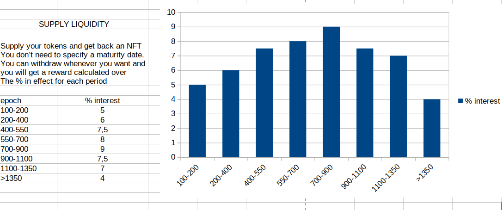
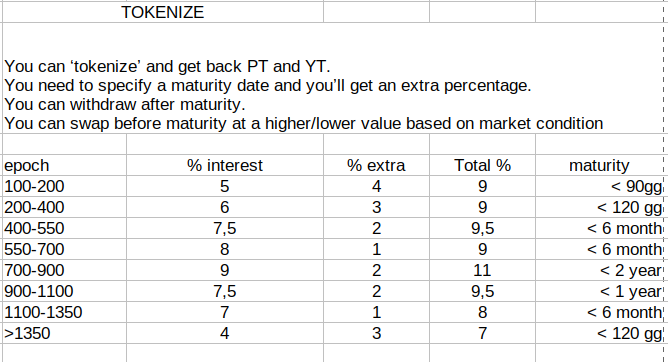

# Tokenizer

This application is to participate in the Scrypto Challenge about Yield Derivaties

This dApp is composed by:

    - blueprint
    - frontend 
    - transaction manifest files
    - bash script for testing
    - unit test

This dApp allows users to provide liquidity and is initially configured to handle only two types of resource addresses. Additional token addresses can be added later.

This dApp defines a reward percentage for those who provide liquidity which can be varied by the account in possession of the appropriate badge (Admin Badge) and therefore this means that suppliers will be rewarded with a variable percentage.

Liquidity providers are rewarded with a variable percentage, which can be adjusted by an account holding the Admin Badge. 
This means the reward percentage can vary over time.

Each account that provides liquidity will be rewarded according to the percentages in effect during the periods in which they maintain their deposited liquidity. 
Rewards are received upon withdrawal of liquidity.

The next graph illustrates how the reward percentage can change over different epochs. For example, an account that deposits liquidity from epoch 100 to epoch 500 will be rewarded with 5% from epochs 100 to 200, 6% from epochs 200 to 400, and 7.5% from epochs 400 to 500, and so on.

Does this remind you of something similar in traditional finance (TradFi) ?

  

Each account can execute a liquidity freeze operation, specifying the duration for which they want to block their liquidity.

This liquidity block, called tokenizing, guarantees the account an additional reward calculated at the percentage in force at the time of the block. 
The Tokenizer will return a Principal Token (fungible) and a Yield Token (non-fungible) that can be released after the specified date or traded independently of each other.

Before expiry, the tokenized tokens can be traded on the market, as their value will fluctuate based on changes in the reward percentages in force.

If the interest rate changes after the liquidity freeze, the value of the tokenized tokens will also change. 
This opens up opportunities for trading by those speculating on future price movements.

  

# Tokenizer Implementation

This blueprint can handle multiple tokens. Two tokens need to be defined at the beginning, and later the administrator can add new address resources.

Tokens are managed through a data structure like this:

    collected: HashMap<ResourceAddress, FungibleVault>

Each account that provides liquidity is rewarded with an amount calculated at the moment the liquidity is withdrawn. 
An important detail is that the rewards are variable over time, which necessitates memorizing interest rates and their changes over epochs. 
This has been done using an AVL-Tree data structure to ensure efficient interest calculation.

The data structure is defined as: 

    interest_for_suppliers: AvlTree<Decimal, Decimal>

Every time the reward changes, the epoch in which this occurs is recorded.

When an account withdraws the provided liquidity, the calculation is performed using all the intervals within which the liquidity was provided. This means that liquidity provision is subject to variable interest over time. 
Additionally, liquidity can be locked through the 'tokenize' function, and the extra rewards will be applied for the duration of time specified.

After this operation, the account can wait for the end of the locking period or execute a swap, which will be rewarded with a higher or lower value based on the current interest rate.

This swap can be performed both on this platform and other platforms, as both the fungible and non-fungible tokens can be withdrawn by the account.

Every account interacting with this dApp will receive an NFT containing both liquidity data and tokenized data.

The data structure is defined as:

    liquidity_position: HashMap<ResourceAddress, LiquidityData>
    
    yield_token_data: HashMap<ResourceAddress, YieldTokenData>

It worth have a look at this data structures:

LiquidityData

    start_supply_epoch: Epoch -> time in which the liquidity was provided

    end_supply_epoch: Epoch -> period in which the liquidity was withdrawn

    amount: Decimal -> number of tokens supplied

Every time an account withdraws everything then the end_supply_epoch is updated, this is because the provision of additional liquidity is not allowed.
Each account wishing to add new liquidity must first withdraw everything and then add the full new amount.

YieldTokenData 

    extra_reward: Decimal -> stores the extra-reward fixed at the time of tokenize (useful in 
    case the account decides to perform a swap)
    
    underlying_amount: Decimal -> stores the tokenized amount
    
    interest_totals: Decimal -> stores the extra reward total amount calculated at the time of the tokenize
    
    yield_claimed: Decimal -> stores the amount of yield claimed 
    
    maturity_date: Decimal -> stores the epoch when the liquidity block will end 
    
    principal_returned: bool -> stores if the principal token has been returned

This data structure contains information about an account's tokenized liquidity. The 'extra_reward' is crucial because it determines the value of an account's tokenized position when trading.

When an account wants to trade its tokenized position, the 'extra_reward' is compared to the current 'extra_reward'. If the current 'extra_reward' has increased, the account will receive a lower value. Conversely, if it has decreased, the account will receive a higher value. This dynamic opens up numerous trading opportunities on the market.

## Owner, Admin and Staff Badges

The component manages three types of profiles: Owner, Admin, and Staff, each with different functionalities.

The Staff Badge is particularly noteworthy. An Admin can mint a Staff Badge and send it to a staff member using the Radix Wallet. 
Once received, the staff member can perform their allowed actions.

In this component, a Staff Member can configure the dApp, including setting the reward for suppliers, the minimum and maximum supply limits, the maximum allowed tokenize epoch length, and more.

Staff member can also be removed because the badge is recallable!

# dApp Architecture

The frontend is composed of a web interface built with HTML and JavaScript.

It leverages the Radix Connect Button for user authentication and includes a development and build process managed by Vite. 

The application also includes server-side components built with Express.

This project uses the `@radixdlt/connect-button` package for user authentication.

## Scripts

The following npm scripts are available:

    - dev: Starts the development server with Vite.
    - build: Builds the project for production.
    - preview: Previews the built project.

## Project Structure

The frontend is composed by the following directory structure:

    client/
    ├── index.html          # Main Page (HTML file)
    ├── admin.html          # Admin and Staff Page (HTML file)
    ├── css/
    │   └── style.js        # Css file 
    ├── js/
    │   ├── gateway.js      # JavaScript file using the RadixDappToolkit, the function for changing the token addresses and the calls to Radix API Gateway
    │   ├── index.js        # Main JavaScript for the Home web page (contains all the tx manifest for interacting with the dApp)
    │   ├── script.js       # JavaScript file for the function that changes the token address used on the web page
    │   └── admin.js        # JavaScript file for the Admin web page (contains all the tx manifest for Admins/Staff for interacting with the dApp)
    ├── public/
    │   └── images/         # Backgroung images 
    ├── .env                # Environment variables
    ├── package.json        # NPM dependencies and scripts
    ├── vite.config.js      # Vite configuration file
    └── dist/               # Production-ready files


# Documenting & Building & Testing

## Documentation 

You can run `cargo doc --no-deps --open --document-private-items` from the `scrypto` directory to create the documentation in the directory `scrypto\target\doc`, and `cargo doc --open` to have it opened it in your web browser

You can run `jsdoc js -d docs` from the `client` directory to create the documentation in the directory `client\docs` about the Javascript functions

## Package building

You can run `scrypto build` from the `scrypto` directory for building the packages for deploy

## Unit test

You can run `scrypto test` from the `scrypto` directory for testing the main functions


# Interacting with the Tokenizer

Below we provide a detailed tutorial on how to use the transaction manifest, in the meantime here you can have a look at the bash scripts that have been prepared to simulate some of the possible use-case for this blueprint:

 - scrypto/supply.sh : A simple test that executes the supply, tokenize and withdraw functions
 - scrypto/tokenize.sh: A simple test that executes the supply, tokenize and redeem/claim after maturity date
 - scrypto/swap_case1.sh : A simple test that executes the supply, tokenize and swap before maturity date in a scenario where the interest rate has dropped 
 - scrypto/swap.sh : A complex test that executes the supply, tokenize and swap before maturity date in two scenario, one where interest rates rise and one where interest rates fall

By the way you can also use the Resim tool to play with the local deployed Tokenizer blueprint
You have to use `resim` with some of the most used command like `resim reset`,`resim new-account` and so on

You can find many examples in the shell scripts just mentioned above, and for example and for a better understanding you could have a look at how the calculations is beeing performed

### Calculate reward for suppliers

This is a supply of 10.000 tokens for 9500 epochs, where the rates have been changed several times

    ├─ [INFO] 
    ├─ [INFO] Adding accumulated_interest 0.00071 for the period, totalling 0.00071 from epoch 1 until epoch 2
    ├─ [INFO] epoch: 100, interest %: 4, length of the period: 98
    ├─ [INFO] Adding accumulated_interest 0.05594 for the period, totalling 0.05665 from epoch 2 until epoch 100
    ├─ [INFO] epoch: 1000, interest %: 8, length of the period: 900
    ├─ [INFO] Adding accumulated_interest 1.02775 for the period, totalling 1.0844 from epoch 100 until epoch    1000
    ├─ [INFO] epoch: 2500, interest %: 12, length of the period: 1500
    ├─ [INFO] Adding accumulated_interest 2.57069 for the period, totalling 3.65509 from epoch 1000 until epoch  2500
    ├─ [INFO] epoch: 6000, interest %: 6, length of the period: 3500
    ├─ [INFO] Adding accumulated_interest 2.99957 for the period, totalling 6.65466 from epoch 2500 until epoch 6000
    ├─ [INFO] epoch: 7000, interest %: 3, length of the period: 1000
    ├─ [INFO] Adding accumulated_interest 0.42814 for the period, totalling 7.0828 from epoch 6000 until epoch 7000
    ├─ [INFO] Adding accumulated_interest 1.07059 for the last period, totalling 8.15339 from epoch 7000 until epoch 9500

### Calculate value for trading blocked liquidity

This is an exchange of 10,000 blocked tokens, closed early because it became convenient following the change in the underlying reference rate

    ├─ [INFO] Swap tokens, amount locked 10000 until 8001, now is epoch 1000
    ├─ [INFO] Tokenized amount 10000 and Extra reward at maturity 76.39379
    ├─ [INFO] total at maturity 9160.35799090909089993
    ├─ [INFO] maucalay duration 0.916035799090909089
    ├─ [INFO] modified duration 0.832759817355371899
    ├─ [INFO] Extra reward at the time of tokenize 10%, actual extra_reward 5%, diff_reward 5%
    ├─ [INFO] returned value is higher/lower of about 4.163799086776859495 %
    └─ [INFO] tokens returned 10495.954582608060181311

## Interacting with the Tokenizer (Stokenet)

If you want you can interact with the Tokenizer that is already deployed in Stokenet and this means that it is possible to test it right away just by running the included frontend in your local environment.

You have to start the webserver by running 'npm run dev' from the client directory and then point your browser to localhost:5173

Otherwise you can interact with it by using the transaction manifest files.


## Deploy your own Tokenizer package (Stokenet) 

Some shortcut are available for testing, deploying and managing the dApp

You can run the following to deploy on Stokenet:

 - `npm install` to install all the packages

 - `npm run` to look for all the available command

 - `scrypto build` to build the WASM

 - Fill your seed phrase in the `.env` file in the main directory in key `MNEMONIC` and fill the derivationIndex in the typescript/config.ts (it should be the position of your account in your wallet)

 - `npm run tokenizer:deploy-tokenizer` to deploy the package to stokenet (a new file `entities.properties` will be written with the new component and resource addresses created)

 - `node .\replaceValues.js` to have the dapp_definition transaction manifest files ready to be executed on the console (https://stokenet-console.radixdlt.com/transaction-manifest)

## Interacting with your own Tokenizer component with your local frontend dApp (Stokenet) 

You can then run the frontend application, follow this step:

 - move to the `client` directory

 - `npm install` to install all the packages

 - fill the variables from the file `entities.properties` to the file `env.staging`
     
 - `npm run` to look for all the available command

 - `npm run dev` to run the application and then browse to `localhost:5173`

You can also admin the dApp

 - point your browser to `localhost:5173/admin.html` 

 - config the dApp with your Owner or Admin Badge

## Interacting with your own Tokenizer component by using the Transaction Manifest (Stokenet)     

At this point you should have already deployed the package and you should have the `entities.properties` filled with valid component/resource addresses.

that file has the following content, that is, it contains all the addresses of what it has been created:

    VITE_COMP_ADDRESS=component_tdx_2_1czdgxj72a3ezsfu9fva2x0dtly9l6ltdfz98tcsgle9msjdyztaef0
    VITE_OWNER_BADGE=resource_tdx_2_1t5cjuv5trq784tg3q7dgqnlzguvuf7jxudqw0kpkeg3ul3la43kc3k
    VITE_ADMIN_BADGE=resource_tdx_2_1t4eu9x3sj8hnqp5sjpr5lwq9heclr0pnf6zp964qr0q4y045r56r49
    VITE_TOKENIZER_TOKEN_ADDRESS=resource_tdx_2_1thsdjmsque3ahhj6xjpl2gakxkmm5pmuya80pjd2jlfj4fq24nw6mq
    VITE_USERDATA_NFT_RESOURCE_ADDRESS=resource_tdx_2_1ngdmnv3jk6qlcl3scc4ufr2723vynr2zxr9c9zu3mu09t20sq674kk
    VITE_PT_RESOURCE_ADDRESS=resource_tdx_2_1t5j3f0jck2vefea3ew7ax5p7ev5e6tunv8xx09zjhr594t5z24nq73
    VITE_STAFF_BADGE=resource_tdx_2_1nff9awqz6p0vwrpsc3yh2me78any7y4ex9732dh508yvzu9mmc7lca

Then, you can execute all the following transaction manifest:

- [add token](scrypto/stokenet/add_token.rtm) -> add token resource address

- [claim yield](scrypto/stokenet/claim_yield.rtm) -> claim yield from the tokenize operation

- [extend pool](scrypto/stokenet/extend_lending_pool.rtm) -> extend the pool for increase max amount suppliable

- [fund pool](scrypto/stokenet/fund.rtm) -> fund the main pool

- [instantiate](scrypto/stokenet/instantiate_tokenizer.rtm) -> instantiate

- [redeem from pt](scrypto/stokenet/redeem_from_pt.rtm) -> redeem from principal token

- [swap](scrypto/stokenet/redeem.rtm) -> swap principal token and yield

- [register](scrypto/stokenet/register.rtm) -> register account

- [set extra reward](scrypto/stokenet/set_extra.rtm) -> set 'interest rate' for tokenize

- [set extra reward](scrypto/stokenet/set_reward.rtm) -> set 'interest rate' for suppliers

- [supply](scrypto/stokenet/supply_high.rtm) -> supply

- [withdraw](scrypto/stokenet/takes_back.rtm) -> withdraw

- [tokenize](scrypto/stokenet/tokenize_yield.rtm) -> tokenize and get back a principal token and an updated nft

- [unregister](scrypto/stokenet/unregister.rtm) -> unregister account

Here, in detail, we explain getting two of those for example.

Let's say your an administrator and you wanna add a token to the managed ones, so you'd need the [scrypto/stokenet/add_token.rtm](scrypto/stokenet/add_token.rtm)

```
CALL_METHOD
    Address("${owner_account}")       -> replaces the ${owner_account} key with the value of the account that did deploy the blueprint
    "create_proof_of_amount"    
    Address("${admin_badge}")         -> replaces the ${admin_badge} key with the value of key VITE_ADMIN_BADGE from the `entities.properties`
    Decimal("1");
CALL_METHOD
    Address("${component}")           -> replaces the ${component} key with the value of key VITE_COMP_ADDRESS from the `entities.properties`
    "add_token"
    Address("${token}")               -> replaces the ${token} key with the value of the new resource address you want to add
;
CALL_METHOD
    Address("${owner_account}")       -> replaces the ${owner_account} key with the value of the account that did deploy the blueprint
    "try_deposit_batch_or_refund"
    Expression("ENTIRE_WORKTOP")
    Enum<0u8>()
;
```

Or let's say your an user already register and you want to supply some tokens, so you'd need the [scrypto/stokenet/supply_high.rtm](scrypto/stokenet/supply_high.rtm) 

```
CALL_METHOD
    Address("${account}")                -> replaces the ${account} key with the value of your account
    "withdraw"
    Address("${resource_address}")       -> replaces the ${resource_address} key with the resource address you want to supply
    Decimal("${amount}")                 -> replaces the ${amount} key with the amount you want to supply
;
TAKE_FROM_WORKTOP
    Address("${resource_address}")       -> replaces the ${resource_address} key with the resource address you want to supply
    Decimal("${amount}")                 -> replaces the ${amount} key with the amount you want to supply
    Bucket("bucket1")
;
CALL_METHOD
    Address("${account}")                -> replaces the ${account} key with the value of your account
    "withdraw"
    Address("${userdata_nft_manager}")   -> replaces the ${userdata_nft_manager} key with the value of key VITE_USERDATA_NFT_RESOURCE_ADDRESS from the `entities.properties`
    Decimal("1")
;
TAKE_FROM_WORKTOP
    Address("${userdata_nft_manager}")   -> replaces the ${userdata_nft_manager} key with the value of key VITE_USERDATA_NFT_RESOURCE_ADDRESS from the `entities.properties`
    Decimal("1")
    Bucket("bucket2")
;
CALL_METHOD
    Address("${component}")              -> replaces the ${component} key with the value of key VITE_COMP_ADDRESS from the `entities.properties`
    "supply"
    Bucket("bucket1")
    Bucket("bucket2")
    Address("${resource_address}")       -> replaces the ${resource_address} key with the resource address you want to supply
;
CALL_METHOD
    Address("${account}")                -> replaces the ${account} key with the value of your account
    "try_deposit_batch_or_refund"
    Expression("ENTIRE_WORKTOP")
    Enum<0u8>()
;
```


# Let's finally have a look at the Online demo dApp 

You can also try the deployed dApp here https://zerocollateral.eu/

# License

The Radix Scrypto Challenges code is released under Radix Modified MIT License.

Copyright 2024 Radix Publishing Ltd

Permission is hereby granted, free of charge, to any person obtaining a copy of
this software and associated documentation files (the "Software"), to deal in
the Software for non-production informational and educational purposes without
restriction, including without limitation the rights to use, copy, modify,
merge, publish, distribute, sublicense, and to permit persons to whom the
Software is furnished to do so, subject to the following conditions:

This notice shall be included in all copies or substantial portions of the
Software.

THE SOFTWARE HAS BEEN CREATED AND IS PROVIDED FOR NON-PRODUCTION, INFORMATIONAL
AND EDUCATIONAL PURPOSES ONLY.

THE SOFTWARE IS PROVIDED "AS IS", WITHOUT WARRANTY OF ANY KIND, EXPRESS OR
IMPLIED, INCLUDING BUT NOT LIMITED TO THE WARRANTIES OF MERCHANTABILITY, FITNESS
FOR A PARTICULAR PURPOSE, ERROR-FREE PERFORMANCE AND NONINFRINGEMENT. IN NO
EVENT SHALL THE AUTHORS OR COPYRIGHT HOLDERS BE LIABLE FOR ANY CLAIM, DAMAGES,
COSTS OR OTHER LIABILITY OF ANY NATURE WHATSOEVER, WHETHER IN AN ACTION OF
CONTRACT, TORT OR OTHERWISE, ARISING FROM, OUT OF OR IN CONNECTION WITH THE
SOFTWARE OR THE USE, MISUSE OR OTHER DEALINGS IN THE SOFTWARE. THE AUTHORS SHALL
OWE NO DUTY OF CARE OR FIDUCIARY DUTIES TO USERS OF THE SOFTWARE.