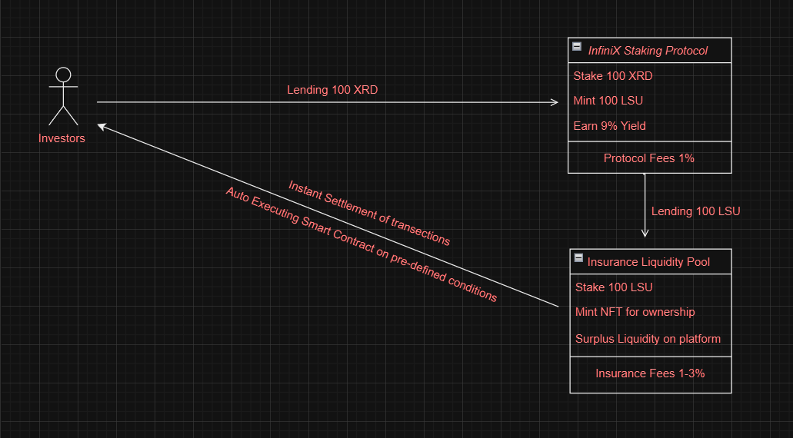

## InfiniX - **Yield Derivative Protocol**

Welcome to InfiniX, a revolutionary DeFi protocol on the Radix blockchain, engineered to transform staking and parametric insurance. InfiniX is being crafted to tackle significant challenges faced by stakers and validators, such as losses due to validator downtime or underperformance, risks of slashing from malicious activities, and the liquidity issues associated with unstaking delays. With features like instant liquidity, rapid fund settlements (No need to wait for 14 Days LSU Settlement Period), and customizable loss limits, InfiniX introduces strategic innovations to enhance security and flexibility for investors. Our protocol not only addresses these concerns but also includes safeguards against smart contract failures, ensuring a resilient and efficient investment environment. By transforming staked assets into tradable NFTs, InfiniX not only secures investments with insurance but also enhances their liquidity and yield potential. By providing these solutions, InfiniX stands as a thoughtfully designed platform poised to redefine risk management in decentralized finance.

---

**Noteworthy Achievement**: The InfiniX team is proud to announce our recent triumph at the Radix Global Hackathon organized by Radix.wiki held in London, where we clinched the first prize in the advanced track.

- **Watch Our Presentation Video**: [Click Here](https://youtu.be/zNV2ufQnZTQ?si=qLCiPtSXjH1Qq3-L)

---

For more details on each insurance product and why it is important in the Radix ecosystem, visit the links provided (Some of the products are still in the development stage):

### Validator Performance Insurance

- **Purpose**: Covers losses related to validator downtime or underperformance, encouraging diversification across validators.
- **Read**: [Radix Staking and Incentive Rewards Guide](https://www.radixdlt.com/post/radix-staking-and-incentive-rewards-guide)

### Slashing Risk Coverage

- **Purpose**: Protects stakers against financial losses due to slashing if a validator acts maliciously.
- **Read**: [Radix Knowledge Base on Staking](https://learn.radixdlt.com/article/how-does-staking-work-on-radix)

### Unstaking Delay and Liquidity Risk Insurance

- **Purpose**: Covers potential market volatility losses during the unstaking delay period, enhancing liquidity.
- **Read**: [Radix Unstaking Process](https://learn.radixdlt.com/article/how-to-unstake-xrd)

### Emissions Variability Insurance

- **Purpose**: Offers a guaranteed minimum return or covers shortfalls in emissions, making staking returns more predictable.
- **Read**: [Radix Emissions Information](https://www.radixdlt.com/post/radix-emissions-reward-amounts)

### Smart Contract Failure Insurance

- **Purpose**: Safeguards against losses due to smart contract failures or bugs, boosting confidence in Radix staking.
- **Read**: [Radix DeFi Ecosystem](https://developers.radixdlt.com/docs/introduction)

---

### Link to Canva Presentation

- **Click to See Presentation**: [Here](https://www.canva.com/design/DAGDCJiRn0g/jvYaaVqe4WQasc20wUjRYw/edit?utm_content=DAGDCJiRn0g&utm_campaign=designshare&utm_medium=link2&utm_source=sharebutton)

---

## Workflow Overview

InfiniX is a pioneering DeFi protocol on the Radix blockchain designed to integrate staking, insurance, and yield derivatives into a cohesive ecosystem. Here's how it works:

### Investment and Staking Process

1. **Initial Investment**: Investors start by lending 100 XRD tokens to the InfiniX staking protocol.
2. **Token Staking**: The lent XRD tokens are staked within the InfiniX protocol, which is the first step in generating returns for the investor.
3. **LSU Minting**: In return for staking their XRD, 100 LSU Tokens are minted. Unlike traditional protocols where LSU would be directly returned to investors as a guarantee of their stake, InfiniX takes a novel approach.
4. **Yield Generation and Fees**:
    - Investors earn a 9% yield annually on their staked XRD.
    - A protocol fee of 1% is deducted from the yield as compensation for the platform's services.

### Integration with Insurance Liquidity Pool

1. **Lending LSU to Insurance Pool**: Instead of returning the LSU to investors, these units are lent to an insurance liquidity pool.
2. **Surplus Liquidity Creation**: The staked LSUs in the insurance pool generate surplus liquidity. This liquidity is crucial as it supports the platform's capability for instant transaction settlements and enhances overall financial stability.

### Insurance and Yield Derivatives

1. **Insurance Product Integration**: Investors can utilize their LSU holdings to purchase insurance products, adding a layer of security to their investments.
2. **NFT Issuance**: As proof of their LSU stake and the associated rights, investors are issued NFTs. These NFTs represent ownership and can be traded or utilized within the ecosystem, introducing a yield derivative component.
3. **Trading NFTs**: The NFTs serve as yield derivatives that can be traded on secondary markets. This allows investors to manage their investment exposure and participate in the broader DeFi market dynamics.

---

# Getting Started with Create React App

This project was initiated using Create React App, providing a set of pre-configured tools and practices to help kick-start your React application development.

### Available Scripts

Within the project directory, you can run several commands:

#### `npm install`
This command will download and install all the required packages defined in the package.json file into the node_modules folder, setting up everything needed to run the application successfully.

#### `npm start`
This command runs your app in development mode. Visit [http://localhost:3000](http://localhost:3000) to view it in the browser. The page will reload if you make edits. You will also see lint errors in the console.

#### `npm test`
Executes the test runner in the interactive watch mode. For more details on running tests, refer to the [testing documentation](https://facebook.github.io/create-react-app/docs/running-tests).

#### `npm run build`
Builds the app for production to the `build` folder. It correctly bundles React in production mode and optimizes the build for the best performance - the build is minified, and filenames include the hashes. After building, your app is ready to be deployed. For deployment instructions, see the [deployment documentation](https://facebook.github.io/create-react-app/docs/deployment).

#### `npm run eject`
**Note**: This is a one-way operation. Once you `eject`, you cannot go back! If you are not satisfied with the build tool and configuration choices, you can eject at any time. This command will remove the single build dependency from your project and copy all the configuration files and transitive dependencies (webpack, Babel, ESLint, etc.) into your project so that you have full control over them. All commands except `eject` will still work, but they will point to the copied scripts so you can tweak them. This feature is provided for advanced customization and is not required for small to middle deployments.

### Learn More

For an in-depth guide on how to make the most out of Create React App, consult the [official documentation](https://facebook.github.io/create-react-app/docs/getting-started). 

To learn more about React and its capabilities, visit the [React documentation](https://reactjs.org/docs/getting-started.html).

### Advanced Configuration

For more complex setups, you might need to tweak additional settings. For guidance on advanced configurations, refer to the [advanced configuration documentation](https://facebook.github.io/create-react-app/docs/advanced-configuration).

### Additional Resources

- **Code Splitting**: This can help reduce your app's bundle size and improve load time. Details are available in the [code splitting guide](https://facebook.github.io/create-react-app/docs/code-splitting).
- **Analyzing the Bundle Size**: Learn how to measure and optimize the size of your application bundle in the [bundle analysis guide](https://facebook.github.io/create-react-app/docs/analyzing-the-bundle-size).
- **Making a Progressive Web App**: Turn your React app into a PWA by following the steps outlined in the [PWA setup guide](https://facebook.github.io/create-react-app/docs/making-a-progressive-web-app).
- **Troubleshooting**: If you encounter issues during the build process, refer to the [troubleshooting guide](https://facebook.github.io/create-react-app/docs/troubleshooting#npm-run-build-fails-to-minify).

---

## License

**Radix Official Examples Code - Radix Modified MIT License**

**Copyright 2024, Radix Publishing Ltd.**

Permission is granted, free of charge, to any person obtaining this software and associated documentation files (the "Software"), to use the Software for non-commercial, informational, and educational purposes only. This includes the rights to use, copy, modify, merge, publish, distribute, and sublicense, and to allow others to whom the Software is furnished to do the same, under the following conditions:

The above copyright notice and this permission notice must be included in all copies or substantial portions of the Software.

**Disclaimer**:
The Software is provided "as is", without warranty of any kind, express or implied, including but not limited to warranties of merchantability, fitness for a particular purpose, or non-infringement. In no event shall the authors or copyright holders be liable for any claim, damages, or other liability, whether in an action of contract, tort, or otherwise, arising from, out of, or in connection with the Software or the use or other dealings in the Software. The authors do not owe any fiduciary duties or duty of care to users of the Software.
