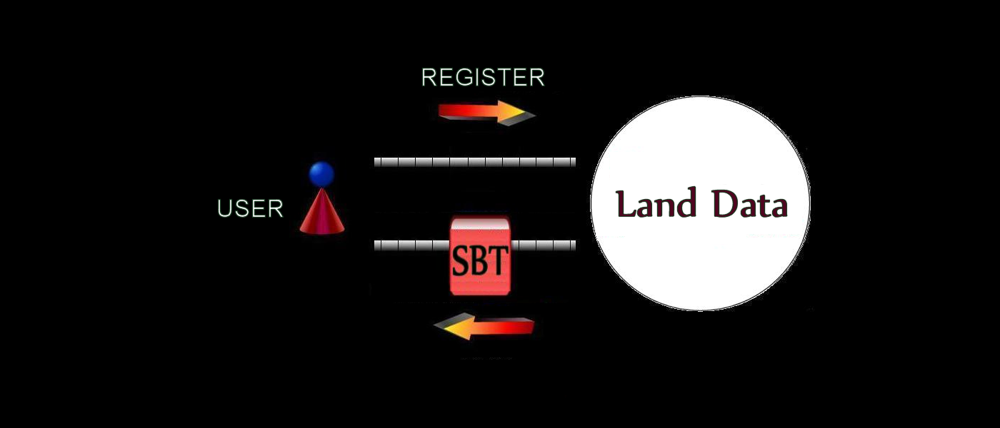
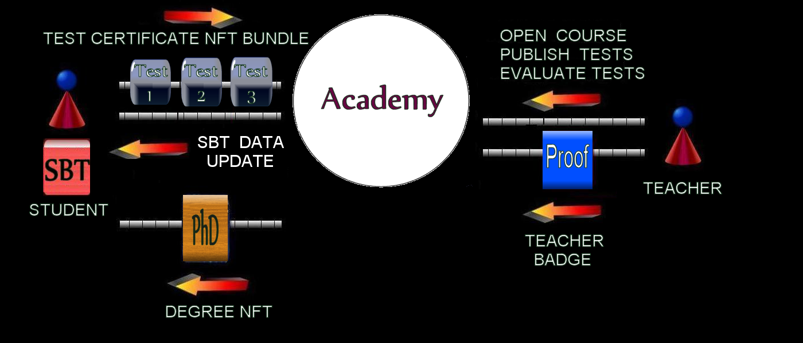
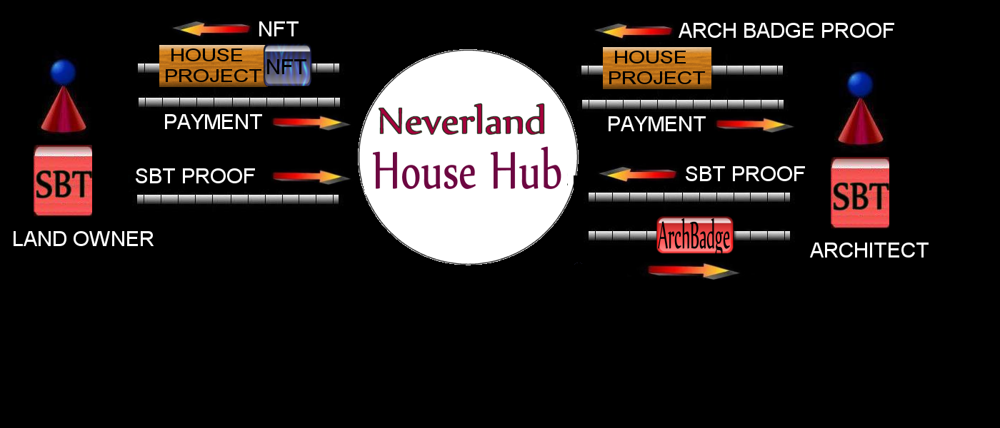
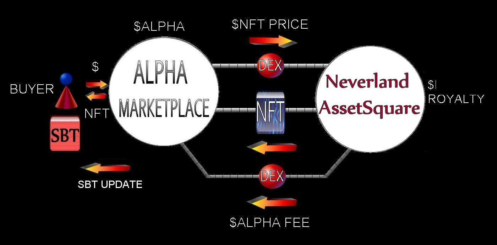
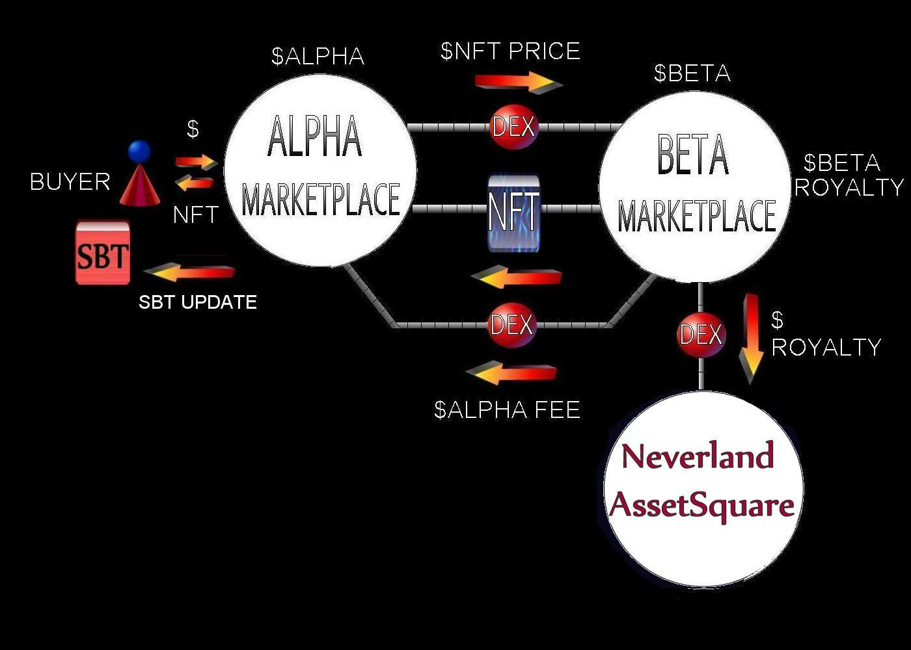
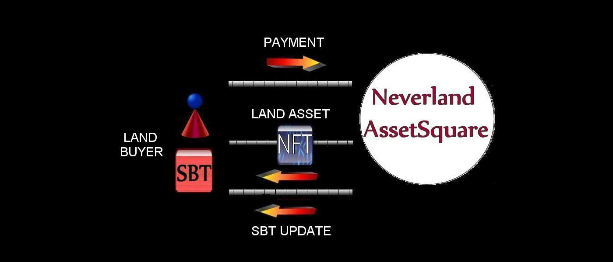
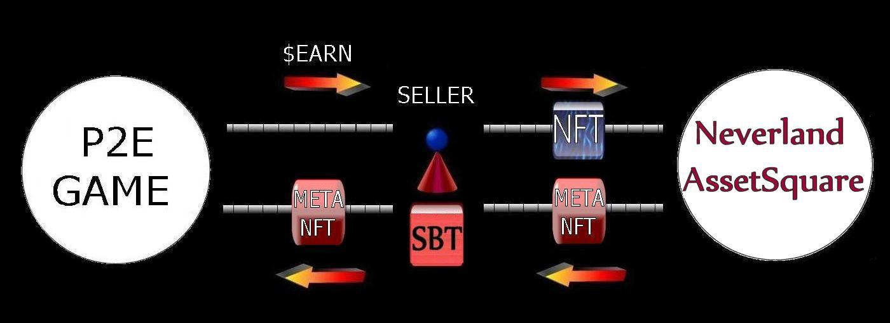
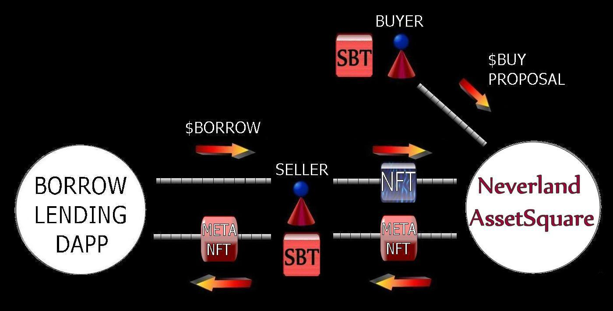

	

-------------------------------------------------------------------------------------------
### Index  
-------------------------------------------------------------------------------------------	
>
> [Part_1](#part_1) . Neverland NFT environment overview description
> 
> [Part_2](#part_2) . Land Data Blueprint overview description
>
> [Part_3](#part_3) . Academy Blueprint overview description
>
> [Part_4](#part_4) . HouseHub Blueprint overview description
>
> [Part_5](#part_5) . LandAuction Blueprint overview description
>
> [Part_6](#part_6) . AssetFarm Blueprint overview description
>
> [Part_7](#part_7) . AssetSquare Blueprint overview description		
>
> [Part_8](#part_8) . AssetSquare aggregative AssetNFT buy/selling
>
> [Part_9](#part_9) . Dex integration
>
> [Part_10](#part_10) . Neverland AssetSquare Meta NFT concept

#
### Part_1 
# Neverland NFT environment overview description
----------------------------------------------------------------------- 

Neverland concept aims to explore new ways to connect SBT and NFT virtual assets into Real Estate world.

Surprisingly what results applicable to real estate's assets field is applicable as well to every society field including assets as proof 
of individual property or individual identity, so future fields of application seem wide open.

In Neverland environment whole data concerning registered user's assets are saved within a personal SBT perpetually stored within his personal
account address.  
User's SBT proof is normally required by protocols within Neverland to collect financial assets data as well as educational degrees data to respectively verify 
ownership and titolarity, update data in case of assets mint, merge, buying and selling operations.

Different types of minted NFT are basically used within every Neverland protocol components, from Academy when they're utilized to authorize teachers to open 
courses of study and publish tests, or by students to run an exam, certified a passed test with the purpose of collect an achieved educational degree, to House building Hub component, when they are minted everytime an architect's house project is acquired, a building contract is signed, a new house property is built. 

Every succesfully auctioned parcel of land exterminate with a Land Asset NFT mint by AssetFarm component.  
Within AssetSquare Blueprint, aka Neverland AssetNFT marketplace, buyers NFT are minted and tailored on specific selling instance type: normal buy proposal 
mode, auction mode or raffle mode. In exchange of deposited asset NFT listed on sale within protocol, sellers receive a meta NFT perfectly traceable 
to the deposited entity, even if different in terms of resource address and ID.

This meta NFT approach is thinked to work as a unique proof of asset NFT ownership, utilizable for example in a uncollateralized lending protocol, where it 
can be deposited in exchange of other tokens once the master asset NFT, on sale on marketplace, has received a buy proposal and an adeguate sum of buyer's 
tokens has been locked through his whole duration within marketplace with the purpose of honour it in case of acceptance.
In case a borrower fails to repay his debt by overmentioned timeframe deadline, once triggered by a liquidator, uncollateralized lending protocol swaps 
borrower meta NFT for stored buy proposal's tokens sum, de facto accepting it, while borrower lost master asset NFT ownership, having failed to refund 
contracted debt. 
Neverthenless meta NFT asset concept can be used also in egame contests, or everywhere an asset proof of ownership is required to conduct operations.
More thoughts on this argument below.  

A mechanism of Academy fee contribution has been implemented with some of the Neverland components so when a AssetNFT is mint, merge, or sold under 
certain circumstances, a share of the profits goes directly to Academy contribution vault to substain its expenses as well as to enhance quality of its study offer.

A system of minted badge authorization is also implemented within environment components, allowing them to perform external component calls to invoke methods.
This way once instantiate a Neverland clone environment using its package, you can interconnect Land Data, AssetSquare as well as Assetfarm with twins component 
and create a network of lands where citizens can buy and sell Land Asset Nft, maybe, in future implementations, barter them, or rent them,
or borrow/lending other assets, possibilities are innumerable.  
 

[Back Up](#index)

#
### Part_2 
# Land Data Blueprint overview description
-----------------------------------------------------------------------

Fig.: A user receive a personal non withdrawable SBT once registered within LandData Component 

Every Neverland wannabe resident has to register his account within Land Data protocol, whom returns him an unwithdrawable SBT.
This SBT contains all references to assets owned by citizens within Neverland and within others implementable twin lands too.
References include financial tangible assets like real estate properties as well as financial intangible assets like credits, loans, crypto, etc.
They also include contracts rental properties agreements and educational degrees whom specify citizen competencies within social and working sphere.
Land Data Blueprint also contain its own data registry of tokenized Neverland real estate properties and relative owners, either accessible for 
consultation as well as for data update purpose by external Components previously authorized by a specifically issued badge.  

[Back Up](#index)

#
### Part_3 
# Academy Blueprint overview description
----------------------------------------------------------------------- 

Fig.: On the left student receive his achieved DegreeNFT and has his related SBT data updated once provided right Test Certificate NFTs bundle to Academy Component,
      on the right an authorized teacher use his Teacher NFT Badge as proof to open new study courses, publishing tests and evaluate them. 

Every Neverland resident wishing to improve number and quality of his educational degrees can sign up to Neverland Academy courses of study, where he can 
attempt to pass test exams published by teachers, tokenized within Test NFT where student data, test's assertions and answers remain immutable and are 
stored in a apposite protocol vault, consultable by other external authorized protocol in need to retrieve this kind of info. 
Whenever a test results succesfully passed he's entitled to withdrawal from Academy a specific TestCertificate NFT.
Once A student has collected exact number of passed tests, required by related course of study, upon providing relating TestCertificate NFTs, 
Academy returns him related minted DegreeNFT as proof of achieved educational degree.  
Naturally his SBT data is updated as well to reflect changes.
Teachers are accredited with a specific Teacher badge NFT once hired by Academy upon verification of his educational degrees and his teaching subjects.  

[Back Up](#index)

#
### Part_4 
# HouseHub Blueprint overview description
-----------------------------------------------------------------------

Fig.: House Project AssetNFT workflow: an architect, accredited with an Arch NFT badge once provided his degree title achieved at Academy, lists a house project on sale within HouseHub component, a land owner, once provided proof of his owned land via SBT data check as well as the requested payment amount, buy the house project       and receive a House Project AssetNFT as proof of ownership, architect is then entitled to collect provided payment.

Neverland land owner's citizens can enjoy services offered by accredited professional figures within HouseHub component, like architects and general
contractors gratuated by Academy.
They are entitled to purchase house projects submitted by architects, submit a build call to find a general contractor wishing to build up the house,
collect or pay penalty in case of overtaken deadlines.
A feedback can also be saved on general contractor SBT under "values" field to reflect the quality of the provided work done.   
Once house is built, they can approve the building contract, letting the contractor collect contract's payment amount, they receive a mint Building Property
AssetNFT as proof of ownership and their Land property AssetNFT is upgraded as well as their personal SBT to reflect new asset ownership.

Fig.: Building Property AssetNFT workflow: a land owner submit a build call providing a Land AssetNFT and his SBT proof, a House Project AssetNFT and a deposit.
      a General Contractor, graduated at Academy, subscribe the build call providing a bond, a Building Contract NFT is minted.
      Once delivered the built house he can collect his contract payment, upon client approvation and payment deposit, while the latter receive his Building Property         AssetNFT. 

HouseHub component can also be used by Neverland land owner's citizens to merge their contiguous Land property AssetNFTs into a single one, allowing
them to build bigger projects, malls, skyscrapers and so on. 
  
[Back Up](#index)  
  
#  
### Part_5
# LandAuction Blueprint overview description
----------------------------------------------------------------------- 

Fig.: Land Property AssetNFT minting process scheme triggered once winner bidder honours land auction payment

Neverland administration wishing to sold some land parcels to registered citizens can assign them through auctioning method within this component.
Land auctions follow the classical best bid winner method.
Once winner bidder provide the payment amount required to honour won auction, a Land AssetNFT is mint and returned him and his personal SBT ineherently
real estate properties is updated as well to reflect his new land acquisition.
Minting is handled by AssetFarm Components network, including an Pitia oracle component to retrieve mint codes and a NFT Data component, who provide data to
be minted within NFT.
    
    
[Back Up](#index)

#	
### Part_6
# AssetFarm Blueprint overview description
-----------------------------------------------------------------------	

Fig.: Two other Components are involved within minting NFT farm production chain: an external Oracle who provides minting/merging production codes and a NFT Database 
      Component aimed to retrieve minting data(NFT asset description data, URL, URI, info, etc.) related to specific production codes given by Oracle.

Aside NFT upgrade process, which method is directly handled upon badge verification, mint as well as merge NFT process are handled by AssetFarm calling an external 
Oracle Component to retrieve minting/merging production codes, as well as URL data if required.
Once collected relevant Data from Oracle, AssetFarm Component forward it to an external NFT Database Component where production code is disassembled to retrieve 
correspondant NFT data, stored within Component, and returns it back to AssetFarm, who finally mint or merge the NFT, once checked same one hasn't be minted or 
merged before.

	
Design purpose is to manage a customizable Component capable of interact with a range of other external Component, for instance Land Auctions Components or 
Play2Earn game protocols whom, upon previous authorization, can call AssetFarm methods and mint, merge and upgrade NFTs in a automatic way.
 
Once linked different NFT Database Components with a AssetFarm, users are also entitled to mint NFTs with different characteristics but sharing the same Resource address,
let's think about Institutional certificates with necessity of different data retrievable on different admnistrative protocols around the ledger,  
or maybe electoral pools results to be collected from different Institutional entities, or maybe a game series with different characters needing 
to share same Resource address, be mergeable each other and upgradable upon request.

Fig.:Example of NFT minting and NFT merging processes involving same AssetFarm and Oracle Components and different Data Components, as respectevely used by LandAuction
     and HouseHub Components

Pitia Oracle Component has four different methods callable to pass data, associate and retrieve related production code relevant to NFT minting or merging AssetFarm process, each of abovementioned methods can be specified during NFT minting and merging calls to AssetFarm method allowing, if needed, to mint NFT within same Series in different ways: some randomly generated, some retrieving data from previously arranged code, some other passing directly minting codes.

Another goal, thinking in contests of art and gaming, is to enhance UX of tech unsavvy Creators wishing to instantiate their Component to mint their own NFT 
series directly from Front-end UI, only required to provide some data traits and upload some links or some image files for rendering purpose, using some 
template NFT Databases where relevant data can be injected calling apposite methods.

[Back Up](#index)

#
### Part_7
# AssetSquare Blueprint overview description
-----------------------------------------------------------------------

Neverland AssetSquare is a AssetNFT marketplace with three main trading mode: 

1_ Normal mode where a buyers can directly purchase Asset NFTs at listed price.
	Normal mode where a buyers can make incremental buy proposals on a listed item that seller can accept or refuse.

2_ Auction mode where buyers place incremental bids  on a listed item within a time frame and sale is deemed as concluded once a deadline is reached as well as 
	item reserve price is matched or overtaked.

3_ Raffle mode where buyers purchase tickets within a time frame and sale is deemed as concluded once a deadline is reached, jackpot (consisting of the total
	amount obtained from tickets sale) equals or overtake item reserve price an a ticket number is randomly deemed as raffle winner.
 
Neverland AssetSquare can manage single as well as bundle NFT sales. 
   
Sellers are entitled to change NFT price when a NFT is listed in Normal mode as well as restart an auction or a raffle when a previous auction or raffle 
sale instance ended unsuccesfully.
Obviously if a NFT item is listed in normal mode seller is also entitled to withdrawal it from sale instance at his convenience as long as it results unsolded. 
         			
Seller who put a AssetNFT on sale stacking them within marketplace receive back as proof of ownership a meta AssetNFT carrying data of the provided 
one as well as a tailored seller badge, the latter works as a tool to check seller various AssetNFT sale instances within protocol and retrieve seller's 
sales history as his convenience as long as he provides same badge as id proof whenever he listed a new AssetNFT item within marketplace. 
	
Buyers who make a buy proposal, place a bid within a NFT auction, purchase some tickets to partecipate to a NFT raffle, will receive a relative NFT badge as well,
which they'll use respectively: to collect a NFT once their buy proposal has been accepted or claim back deposited amount once it has been refused and their 
buy proposal deadline reached, claim back their bid bond or honour winning bid and withdraw related NFT in auction mode, collect won AssetNFT in raffle mode or
claim back tickets purchased amount once a raffle instance ended unsuccesfully.

		
[Back Up](#index)

#
### Part_8	
# Aggregative AssetNFT buy/selling
----------------------------------------------------------------------------	
Neverland AssetSquare Blueprint is designed to interconnect with other AssetNFT marketplaces sharing same code and form a AsssetNFT sale network where shared 
AssetNFT listed can be purchased seamless from a marketplace or another with a related customizable fee/royalty system. Currencies conversions are automated 
handled using DEX swap services. 

Fig.: Example scheme where a user buy a NFT on AssetSquare working as gateway while AssetNFT is stored within an external Beta marketplace.
      A royalty is withheld within Beta marketplace as well as NFT sale accrued amount at NFT seller disposal while a fee is transferred to Asset Square whom 
      started the sale. NFT is transferred to buyer account. 

Fig.: Example scheme where a user buy a AssetNFT on an external Alpha marketplace working as gateway while AssetNFT is stored within AssetSquare.
      A royalty is withheld within AssetSquare as well as NFT sale accrued amount at NFT seller disposal while a fee is transferred to Alpha marketplace whom 
      started the sale. AssetNFT is transferred to buyer account.

Fig.: Example scheme where a user buy a AssetNFT on an external Alpha marketplace working as gateway while AssetNFT is stored within an external Beta marketplace.
      A royalty is withheld within an external Beta marketplace as well as AssetNFT sale accrued amount at AssetNFT seller disposal while a fee is transferred to 
      Alpha marketplace whom started the sale. A royalty is transferred to Asset Square as well. NFT is transferred to buyer account.
	

[Back Up](#index)

#
### Part_9
# Dex integration
-----------------------------------------------------------------------	
As Neverland AssetSquare utilize DEX swap services with aggregative AssetNFT buy/selling between Asset Eco marketplaces, so it can accept basically every 
currency available within DEX pools. Anyway protocol native currency is $TKN, so everytime a user utilize another currency to perform buy/selling 
operations within protocol he'll be required to pay DEX swap fee and as well he may experience slippage. 
Neverland AssetFarm utized DEX currency swap services too. 

Fig.: Scheme of a NFT sale instance using $TKN native currency.

Fig.: Scheme of a NFT sale instance using an alternative currency involving DEX swap.

[Back Up](#index)

#	
### Part_10
# Neverland AssetSquare Meta NFT concept
-----------------------------------------------------------------------	
Seller who put NFT on sale stacking them within marketplace receive back as proof of ownership a meta NFT sharing the same traits of the provided one.
To withdrawal an unsolded item or claim a payment due to a succesfull sell or auction, accept a buy proposal claiming an amount provided by the buyer
or a raffle jackpot, sellers are required to return the meta NFT received.
Meta NFT concept aims to mitigate capital inefficiency.
 

Fig.: Example of scheme interaction with a play to earn game where seller, upon properly handled info exchange between involved protocols, is entitled to continue 
      his play experience providing his meta NFT as substitute of original NFT which he start playing with.

	
Fig.: Example of scheme interaction with a borrow/lending external protocol.
      When a NFT is listed on sale in normal mode by a seller and a user interested to purchase it make a buy proposal, he's required to deposit 
      within protocol the full amount of his buy proposal for a certain time frame edged by a deadline. Upon properly handled info exchange between involved 
      protocols, seller is entitled to borrow a certain amount within a certain time frame being covered by buy proposal deposit on Asset Square.

Fig.: Example of liquidation scheme involving a borrow/lending external protocol free to accept NFT buyer buy proposal and redeem deposited sum providing NFT 
      ownership through meta NFT, while buyer become NFT owner.

	
  

[Back Up](#index)	
  
